# 校园学术活动智能推荐平台总体报告

项目主题：校园学术活动智能推荐平台  
任课老师：邓水光  
项目组员：黄晗、宫上珺、孟祥烨、李妍雅、庞星磊、朱致远  
完成时间：2026 年 6 月

---

## 1 需求分析

### 1.1 项目背景

浙江大学校内学术讲座、学院报告、竞赛宣讲、学术沙龙和科研交流活动数量较多，发布渠道覆盖学校官网、学院网站、公众号、通知页面和人工发布群组。多来源发布提升了各学院与组织者的自主性，但也给学生和教师带来了明显的信息获取成本：用户需要反复浏览多个栏目，活动字段格式不统一，报名时间容易错过，活动与课程或组会时间是否冲突也需要人工判断。

本项目面向上述问题，建设“校园学术活动智能推荐平台”。平台以 Web 应用为主要形态，围绕“活动信息聚合、浏览检索、个性化推荐、课表导入、冲突检测、日程管理和后台维护”形成闭环。普通学生用户可以在统一入口中发现活动、筛选活动、查看推荐理由、导入课表并将活动加入个人日程；管理员用户可以维护活动数据、查看爬虫记录、通过 OCR 辅助录入活动信息，并对活动上下架状态进行管理。

### 1.2 用户类及其特征

平台面向学生用户和管理员用户完成核心功能，同时在需求分析中保留教师和组织者等潜在用户类型。不同用户的主要诉求如下表所示。

| 用户类型 | 典型特征 | 主要诉求 | 结项版本定位 |
| --- | --- | --- | --- |
| 学生用户 | 时间碎片化，课程安排密集，关注个人兴趣和活动冲突 | 快速找到感兴趣活动，导入课表，检测冲突，加入日程并导出日历 | 核心用户，主流程已完成 |
| 教师用户 | 关注学术主题质量、活动时间确定性和日程管理 | 筛选高质量讲座，减少信息遗漏，辅助安排学术日程 | 作为普通用户能力的自然扩展 |
| 组织者 | 关注活动曝光、报名转化和信息维护效率 | 发布活动、维护活动字段、提升活动触达率 | 通过管理员后台完成活动维护 |
| 管理员 | 关注平台数据质量、内容合规和系统运行状态 | 审核活动、维护标签、查看统计与爬虫记录 | 核心后台用户，管理流程已完成 |

### 1.3 产品功能

根据需求报告、接口文档和测试报告，平台功能可以概括为四类核心能力：数据采集与处理、智能推荐与检索、日程协同、后台数据管控。结项版本围绕这些核心能力完成了可运行闭环，活动社交、深度笔记沉淀和组队等内容作为产品化拓展方向在总结展望中说明。

| 功能模块 | 主要内容 | 作用说明 | 结项状态 |
| --- | --- | --- | --- |
| 数据采集与处理 | 活动手动录入、爬虫抓取、OCR 辅助识别、数据清洗、去重与结构化存储 | 将分散活动信息整理为可检索、可推荐、可维护的数据资产 | 已完成 |
| 智能推荐与检索 | 关键词搜索、分类筛选、校区筛选、标签筛选、热门排序、规则推荐和推荐理由 | 降低用户从大量活动中筛选目标活动的成本 | 已完成 |
| 日程协同 | 课程导入、课程展开、活动加入日程、时间冲突检测、自定义日程、ICS 导出 | 帮助用户判断活动与课程或已有日程是否冲突，并同步到个人日历 | 已完成 |
| 后台数据管控 | 管理员登录、活动新增、编辑、下架、后台统计、爬虫记录查询 | 保证活动数据可维护、可追踪，并支持演示环境下的数据修正 | 已完成 |
| 学术沉淀与轨迹 | 个人中心、兴趣标签展示、活动行为记录、学术轨迹展示 | 记录用户参与路径，为推荐解释和后续学术沉淀提供数据基础 | 已完成基础闭环 |

从用户操作链路看，学生端的核心流程为：登录或匿名浏览活动，进入活动列表或首页推荐，查看活动详情，检测时间冲突，确认加入日程，在日历中查看课程与活动，并按需导出 ICS 文件。管理员端的核心流程为：登录后台，新增或编辑活动，通过 OCR 从活动截图提取字段，触发或查看爬虫记录，并根据需要下架活动。

### 1.4 非功能需求与约束

平台采用前后端分离架构，接口统一以 HTTP/JSON 形式交互。后端所有业务接口遵循统一响应结构：

```json
{
  "code": 0,
  "message": "success",
  "data": {}
}
```

主要非功能需求和实现约束如下。

| 需求类别 | 具体要求 |
| --- | --- |
| 可用性 | 主要页面需要支持清晰的导航、空态提示、错误反馈和可恢复操作，学生端围绕“发现活动到安排日程”的闭环组织 |
| 可维护性 | 后端保持路由层、业务逻辑层、数据访问层分离，前端通过 API 封装层统一访问后端接口 |
| 数据一致性 | MySQL 是用户、活动、课程、日程和后台记录的权威数据源，数据表结构以 `database/schema.sql` 为基准 |
| 安全性 | 普通用户与管理员通过角色区分权限，后台接口要求管理员 token，普通用户访问后台接口应被拒绝 |
| 可测试性 | 接口返回格式、分页结构、业务错误码和测试数据保持稳定，便于 pytest 自动化验证 |
| 可扩展性 | 推荐算法、课表导入来源、爬虫来源和后台管理能力都应可在不重构主架构的前提下扩展 |

### 1.5 运行环境

项目使用 Docker Compose 统一开发和联调环境，避免不同成员本地 Python、Node、MySQL 版本差异导致运行结果不一致。结项版本技术栈如下表所示。

| 层次 | 技术选型 |
| --- | --- |
| 前端 | Vue 3、Vite 6、Element Plus、Vue Router 4、Pinia、Axios |
| 后端 | Python 3.10+、FastAPI 0.115、Pydantic 2、SQLAlchemy 2、PyMySQL |
| 数据库 | MySQL 8.0，字符集 `utf8mb4` |
| 爬虫 | Python requests、BeautifulSoup4 |
| 测试 | pytest、FastAPI TestClient、httpx、前端 `npm run build` |
| 开发与部署 | Docker Compose，后端容器、前端容器和 MySQL 容器协同运行 |

### 1.6 项目亮点概述

相较于单纯的活动信息展示系统，本项目更强调“信息聚合、智能推荐、日程协同和后台管控”之间的联动关系。平台将活动发现与个人时间管理结合起来，使学生不仅能够看到活动，还能够判断活动是否适合自己、是否与课程冲突，并将确认参加的活动沉淀到个人日历中，形成从信息获取到日程安排的完整闭环。

图中以学生端主流程为主线，将登录与个人设置、活动发现、个性化推荐、活动详情与冲突检测、加入日程、日历查看与导出串联起来，并在下方补充行为反馈闭环，体现用户操作如何反哺兴趣模型和后续推荐排序。

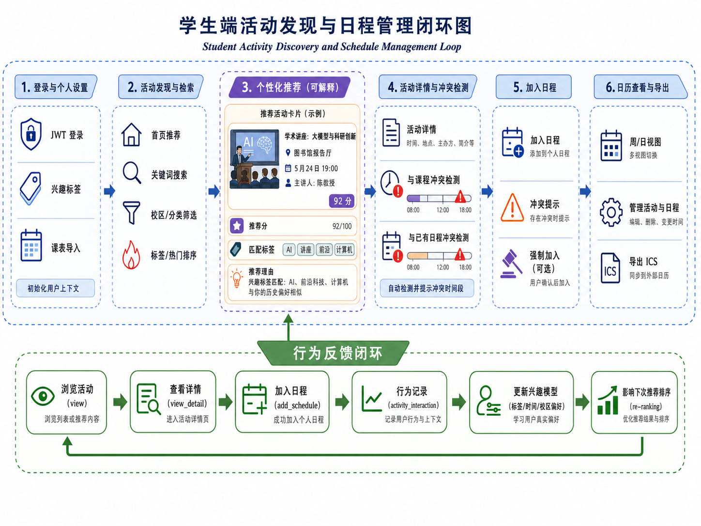

项目的主要特色体现在以下几个方面。

| 亮点方向 | 具体体现 | 工程价值 |
| --- | --- | --- |
| 活动发现与日程管理闭环 | 用户可以完成活动浏览、推荐查看、详情确认、冲突检测、加入日程和 ICS 导出等连续操作 | 将“发现活动”和“安排时间”整合为同一条主流程，贴近学生真实使用场景 |
| 可解释的规则推荐 | 推荐结果综合兴趣标签、历史行为、热度、时间临近、学院相关性和日程冲突等因素，并返回推荐理由 | 相比黑盒排序更便于调试、测试和向用户解释，适合课程项目结项展示与持续优化 |
| 多源数据聚合 | 系统同时支持管理员手动录入、学院官网爬虫抓取和 OCR 辅助识别活动截图 | 降低活动数据维护成本，并为更多学院来源和数据质量控制机制预留稳定接口 |
| 课表导入与冲突检测 | 课程数据导入后持久化保存，活动加入日程前自动检测与课程或已有日程的时间重叠 | 将推荐系统与个人时间约束结合，避免只推荐“感兴趣但无法参加”的活动 |
| 数据持久化与用户隔离 | 用户课程、日程、兴趣和行为记录均按 `user_id` 绑定，活动与爬虫数据作为全局资源共享 | 保证不同用户个人数据互不混淆，同时支持活动数据复用和统一管理 |
| 可验证的工程实现 | 后端接口、服务层逻辑、数据库持久化、前端构建和关键页面均纳入测试或截图验证 | 使报告内容能够与代码、数据库和运行结果相互对应，提升验收可信度 |

这些亮点共同支撑了平台的核心定位：它不是孤立的活动列表、推荐页面或日历工具，而是围绕校园学术活动构建的一套轻量级信息管理与个人决策支持系统。以下章节将从体系结构、数据设计、推荐流程、设计模式和测试结果等角度进一步说明这些能力的实现方式。

## 2 总体设计

### 2.1 体系结构设计

本系统采用 B/S 架构、前后端分离架构和后端分层架构组合实现。用户通过浏览器访问 Vue 前端页面，前端通过 Axios 调用 FastAPI 后端接口，后端通过 SQLAlchemy 访问 MySQL 数据库，爬虫与 OCR 能力作为外部数据采集和辅助录入能力接入系统。

系统总体设计目标包括：一是保证学生端主流程完整可用，即活动发现、推荐、详情、课表导入、冲突检测和日历管理可以闭环；二是保证职责清晰，页面层不直接访问数据库，路由层不直接编写复杂业务逻辑；三是保证数据可持久化和可追踪，课程、日程、活动、用户行为和后台记录均由数据库保存；四是为推荐策略、数据来源和管理功能的持续优化保留稳定边界。

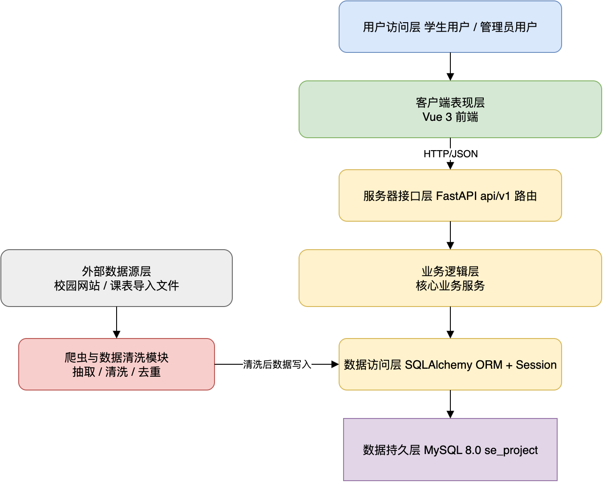

系统边界与外部参与者包括学生用户、管理员用户、校园活动网站、课表文件和第三方日历应用。学生用户主要产生浏览、推荐、加入日程和导出日历请求；管理员用户主要产生活动维护、OCR 识别和爬虫管理请求；校园网站和课表文件为系统提供活动和课程原始数据；ICS 文件则用于与外部日历工具交换数据。

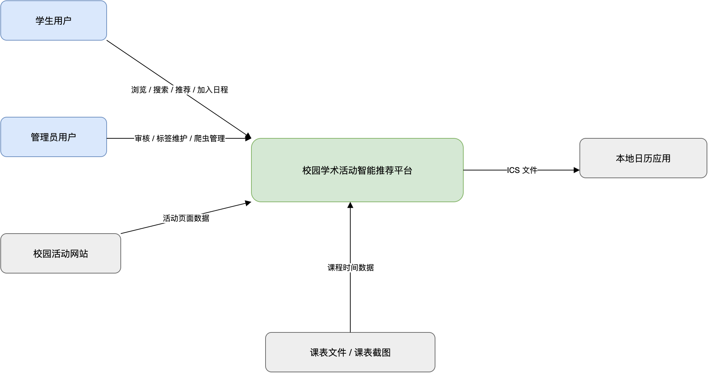

### 2.2 分层结构

系统整体上划分为用户访问层、客户端表现层、服务器接口层、业务逻辑层、数据访问层、数据持久层和外部数据源层。各层之间通过明确接口协作，上层只依赖相邻或约定的下层能力，下层不依赖上层界面细节。

| 层级 | 主要组成 | 核心职责 |
| --- | --- | --- |
| 用户访问层 | 学生用户、管理员用户 | 发起浏览、搜索、推荐、课表导入、日程管理和后台维护请求 |
| 客户端表现层 | Vue 3、Vue Router、Pinia、Element Plus、Axios | 页面渲染、表单输入、状态展示、路由跳转和接口调用 |
| 服务器接口层 | FastAPI `api/v1` 路由 | 接收 HTTP 请求，完成参数校验、权限判断和统一响应封装 |
| 业务逻辑层 | `services` 模块 | 实现活动查询、推荐排序、课程导入、冲突检测、后台管理和爬虫处理 |
| 数据访问层 | SQLAlchemy ORM、数据库会话 | 封装模型和查询操作，维护代码模型与数据库表结构一致 |
| 数据持久层 | MySQL 8.0 | 持久化用户、活动、标签、课程、日程、报名、爬虫记录和管理员日志 |
| 外部数据源层 | 校园网站、课表文件、活动截图 | 提供原始活动信息、课程信息和 OCR 输入 |

服务器端子系统集中处理客户端请求和数据写入，内部包括认证与权限、活动信息、搜索筛选、个性化推荐、课表导入、日程管理、后台管理和爬虫记录等模块。

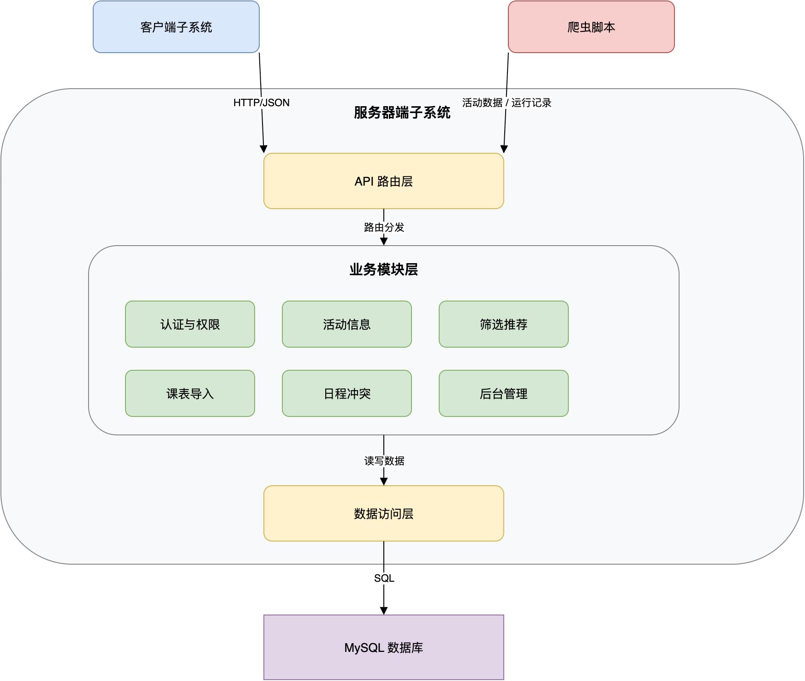

客户端子系统运行在浏览器中，采用“页面视图、路由管理、状态管理、API 封装、通用组件和全局样式”的结构。活动、用户、日程、课程等核心数据均通过后端接口获取，不在前端绕过后端直接访问数据库。

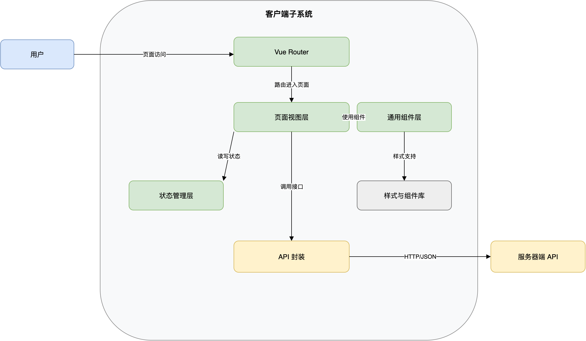

### 2.3 服务器端设计

后端采用三层结构：路由层、业务逻辑层和数据访问层。路由层位于 `backend/app/api/v1`，只负责请求入口、依赖注入、参数接收和响应封装；业务逻辑层位于 `backend/app/services`，负责活动查询、推荐计算、课表导入、冲突检测、ICS 生成和后台维护；数据访问层由 ORM 模型和数据库会话组成，负责与 MySQL 交互。

| 模块 | 路由/服务映射 | 主要能力 |
| --- | --- | --- |
| 用户认证与权限 | `auth.py`、`users.py`、安全依赖 | 登录、注册、JWT 签发、当前用户查询、管理员角色校验 |
| 活动信息管理 | `activities.py`、`admin.py`、`activity_service.py` | 活动列表、详情、搜索、筛选、后台新增、编辑和下架 |
| 个性化推荐 | `recommendations.py`、`recommendation_service.py` | 候选活动生成、规则打分、推荐理由、后台推荐预览 |
| 课表导入 | `courses.py`、课程解析逻辑 | 手动新增课程、CSV/XLSX 导入、教务格式解析、课程删除 |
| 日程管理 | `schedules.py`、`schedule_service.py` | 日程查询、冲突检测、活动加入、自定义日程、颜色标识和 ICS 导出 |
| OCR 与爬虫 | `admin.py`、`crawler.py`、OCR/爬虫服务 | 活动截图识别、日程截图识别、爬虫触发、爬虫记录保存 |

推荐模块采用规则模型，按照兴趣标签匹配、历史行为、热度、时间临近、学院相关性和冲突惩罚等因素计算得分，也便于在真实数据积累后继续优化权重。

```text
推荐分 = 兴趣标签匹配分 + 历史行为标签分 + 热度分 + 时间临近分 + 学院相关分 - 冲突惩罚分
```

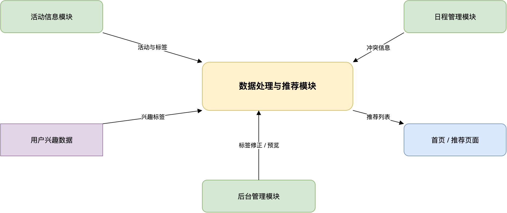

日程管理模块以时间区间重叠为核心规则。用户加入活动前，后端先比较活动时间与课程、活动、自定义日程的起止时间；若存在重叠，接口返回冲突明细，前端弹出确认；用户强制加入后，系统仍会写入日程并标识冲突状态。

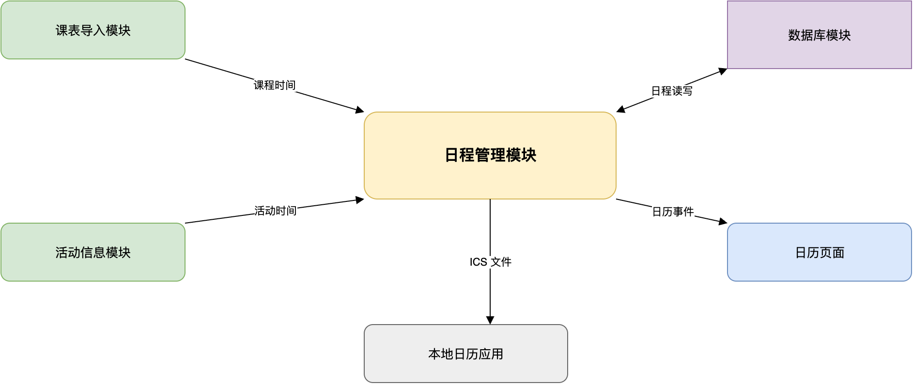

### 2.4 数据库设计

数据库以 `database/schema.sql` 为权威来源，结项版本核心数据围绕用户、活动、标签、课程、日程、报名、爬虫记录和管理员日志组织。实体关系以用户和活动为中心：一个用户可以拥有多个兴趣标签、课程、日程和报名记录；一个活动可以拥有多个标签，也可以被多个用户加入日程；课程与日程共同支持冲突检测和 ICS 导出。

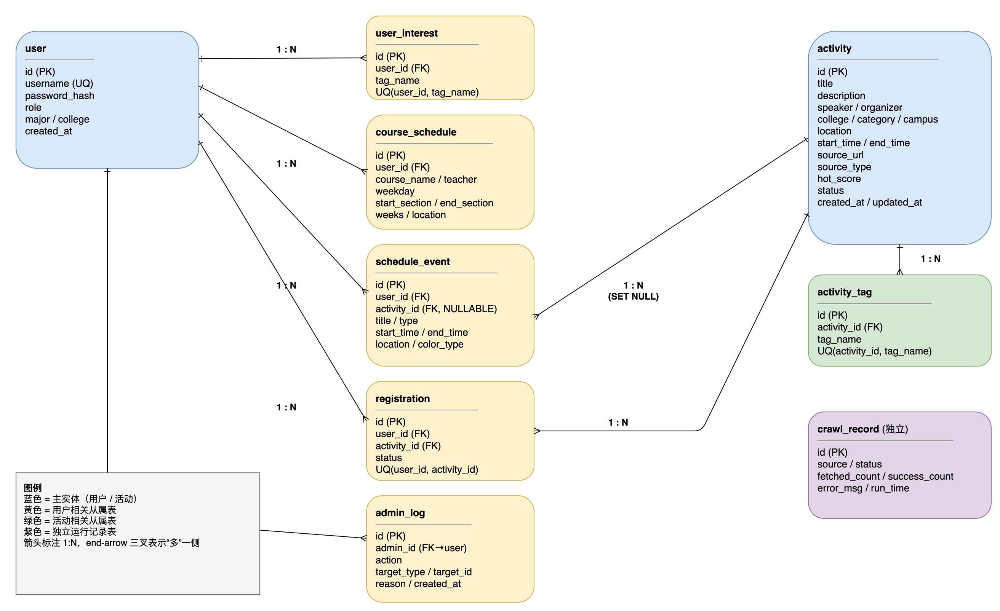

在数据隔离策略上，系统将课程、日程、兴趣标签和行为记录等用户私有数据按 `user_id` 绑定，将活动、活动标签和爬虫记录作为全局共享资源。这样既能保证不同学生账号之间的课表和日程互不干扰，也能复用统一维护的活动数据资产。

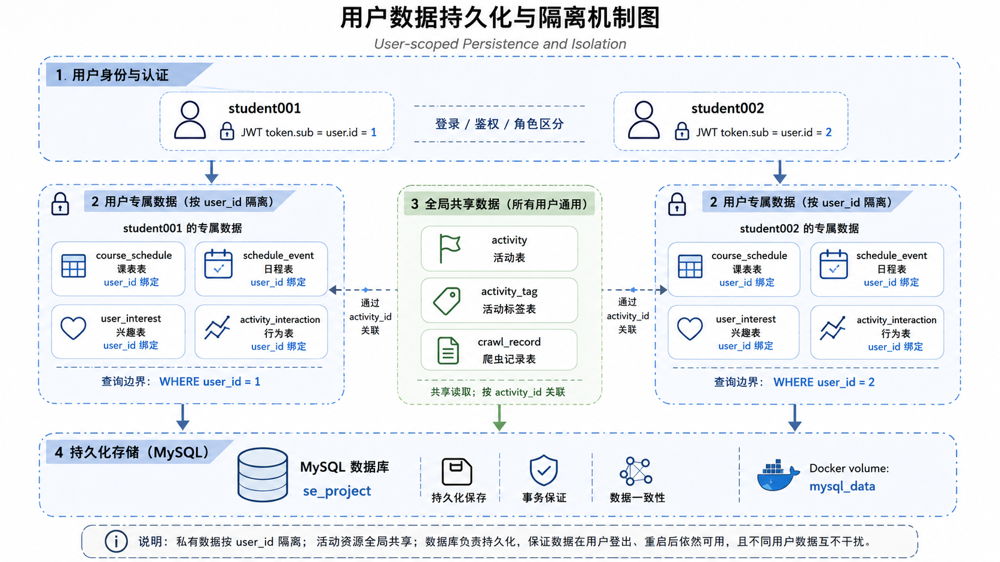

核心数据表职责如下。

| 表名 | 主要用途 | 关键字段 |
| --- | --- | --- |
| user | 存储学生和管理员账户 | `username`、`password_hash`、`role`、`major`、`college` |
| activity | 存储活动主信息 | `title`、`description`、`campus`、`location`、`start_time`、`end_time`、`source_type`、`hot_score`、`status` |
| activity_tag | 存储活动标签 | `activity_id`、`tag_name` |
| user_interest | 存储用户兴趣标签 | `user_id`、`tag_name` |
| course_schedule | 存储导入后的课程规则 | `course_name`、`weekday`、`start_section`、`end_section`、`weeks`、`location` |
| schedule_event | 存储用户日程事件 | `user_id`、`title`、`type`、`activity_id`、`start_time`、`end_time`、`color_type` |
| registration | 存储用户与活动的报名或加入记录 | `user_id`、`activity_id`、`status` |
| crawl_record | 存储爬虫运行记录 | `source`、`status`、`fetched_count`、`success_count`、`error_msg` |
| admin_log | 存储管理员操作日志 | `admin_id`、`action`、`target_type`、`target_id`、`reason` |

数据一致性主要通过字段约束、外键关系、唯一索引和服务层校验共同保证。活动状态统一使用 `open/offline`，活动来源统一使用 `manual/crawled`，推荐热度字段统一使用 `hot_score`，课程和日程的起止时间在写入前完成合法性校验。

### 2.5 客户端与 UI 设计

前端使用 Vue 3 和 Element Plus 构建，页面组织为登录页、首页推荐、活动列表、活动详情、课表导入、个人日历、个人中心和后台管理。下面三张图采用结项测试阶段的最新页面截图，和系统最终界面保持一致。前端 API 调用集中在 `frontend/src/api`，页面组件不直接拼接底层 Axios 细节，而是通过业务函数访问后端。

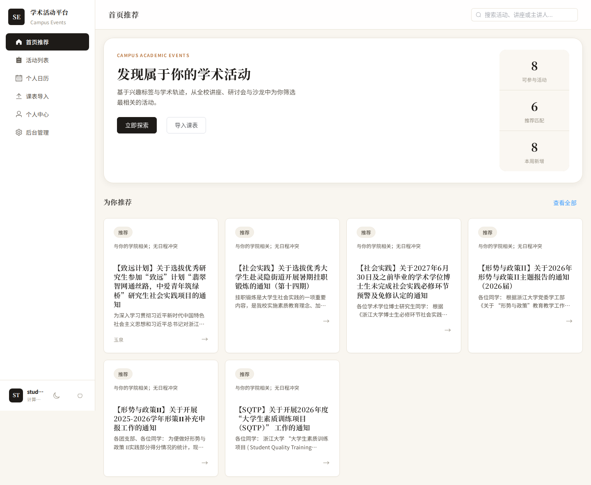

学生端 UI 的核心体验是“发现 - 决策 - 安排 - 回看”。用户从首页推荐或活动列表进入详情页，在详情页完成冲突检测和加入日程，之后进入日历页查看课程与活动安排。管理员端 UI 的核心体验是“维护 - 校验 - 发布”，重点提供活动新增、OCR 识别、活动编辑、下架和统计入口。

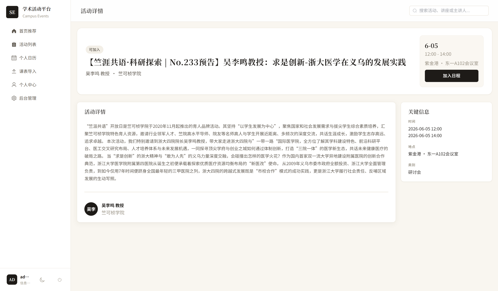

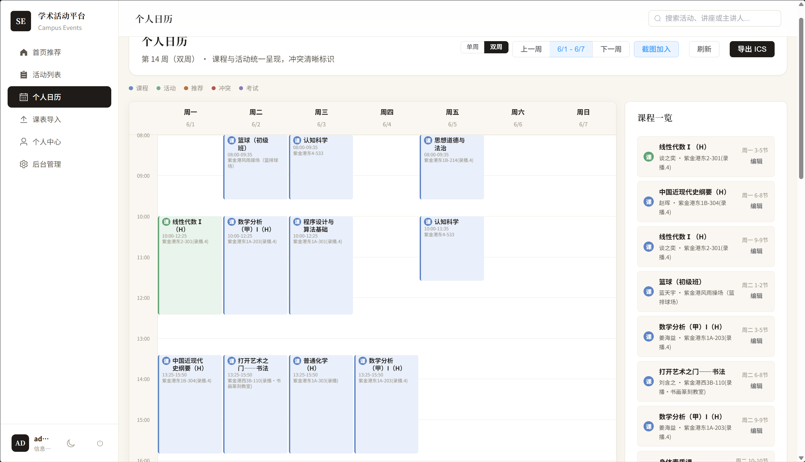

### 2.6 数据处理流程

总体设计中最关键的数据处理流程包括个性化推荐、课表导入、加入日程冲突检测和数据采集入库。

平台的数据资产从学院官网、爬虫、OCR 和管理员手动录入等来源进入系统，经字段抽取、时间地点标准化、去重过滤和人工修正后写入 MySQL，再服务于活动检索、个性化推荐、日程管理和后台统计。该流程使活动信息不再只是页面展示内容，而是可追踪、可维护、可复用的数据资产。

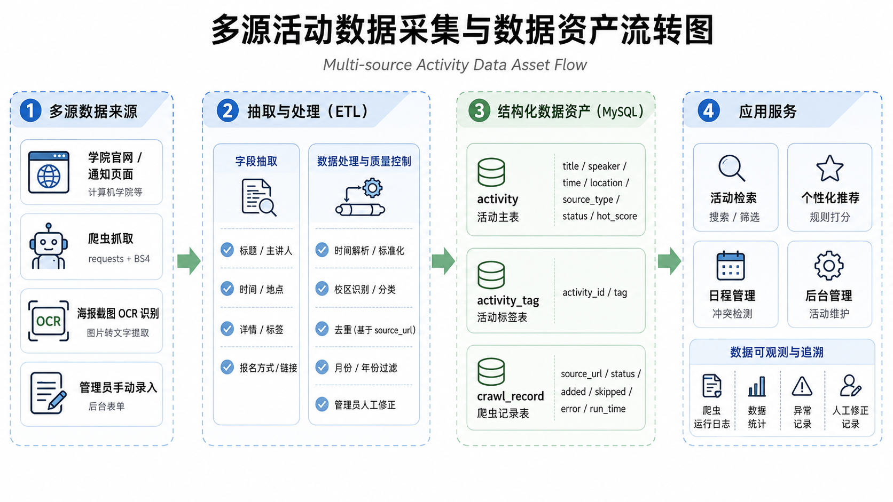

推荐流程首先从开放且未结束的活动中生成候选集，再读取用户兴趣标签、历史行为、学院信息和已有日程，计算每个候选活动的得分和推荐理由，最后进行排序和数量截断。匿名用户不具备个性化画像时，系统退化为热度和时间临近度驱动的通用推荐。

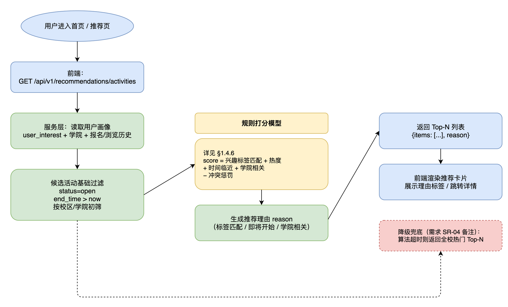

课表导入流程从文件上传开始，后端根据文件类型和表头解析课程名、星期、节次、周次、地点和教师等字段，再将多时段课程拆分为课程规则。课程规则写入数据库后，在日历查询时按日期范围和教学周动态展开为课程事件。

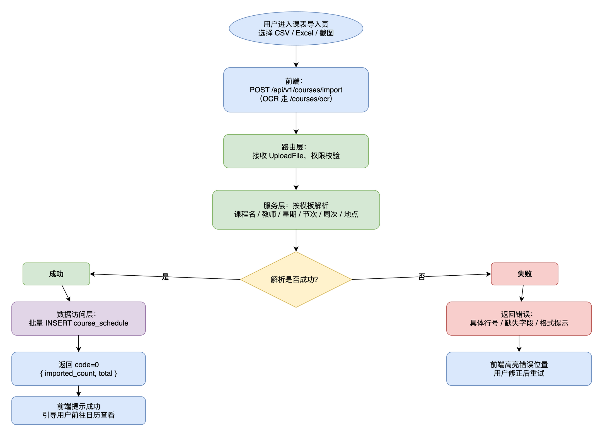

加入日程流程以活动详情页为入口。用户选择加入后，后端先执行冲突检测；如果无冲突则直接写入日程；如果有冲突则返回冲突明细，由前端提示用户确认；用户确认强制加入后，后端写入事件并记录冲突标识。

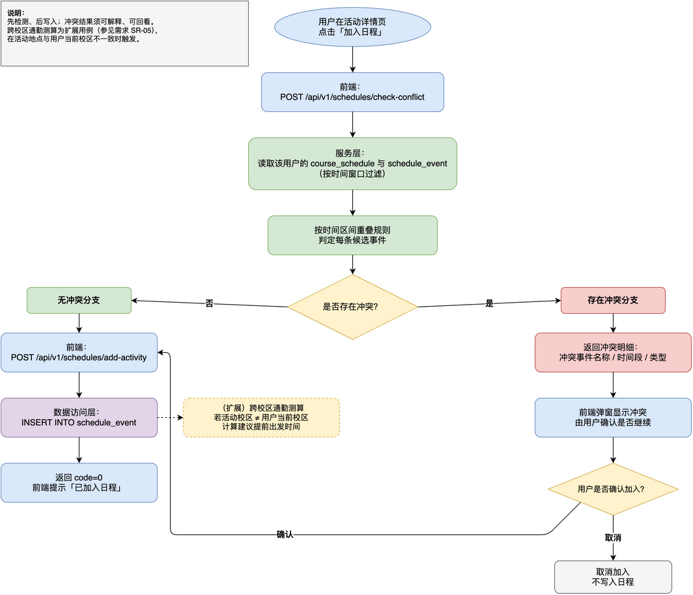

爬虫数据采集流程则负责把外部网站中的活动文本转化为结构化活动数据。流程包括请求页面、解析列表、抽取字段、清洗去重、状态记录和写入数据库。由于真实网站访问可能受到网络、反爬策略和页面结构变化影响，爬虫记录表用于保存运行结果和异常信息。

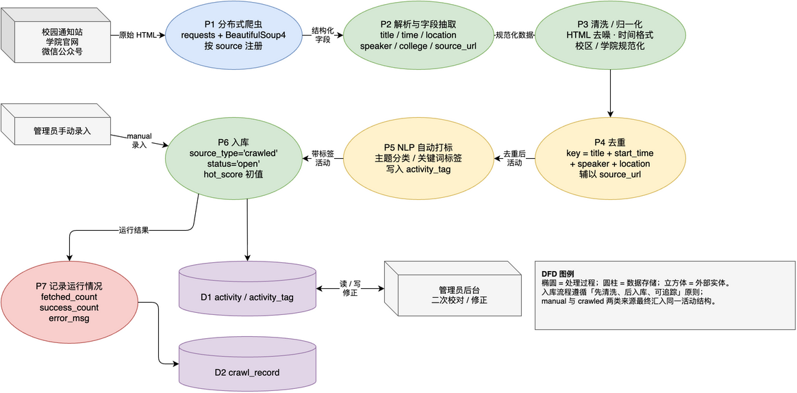

## 3 设计模式

### 3.1 概述

本项目在功能上覆盖活动聚合、搜索推荐、课表导入、日程冲突检测和后台管理，结构复杂度主要来自多源数据接入、前后端分离协作、推荐规则可变和多人并行开发。设计模式的作用不是单纯增加抽象层，而是在高频变化点处提供稳定协作方式，使系统更容易扩展和测试。

本项目使用或规划使用的主要模式如下。

| 模式类别 | 设计模式 | 项目落点 |
| --- | --- | --- |
| 创建型 | 工厂方法 | 课程事件、活动事件和自定义事件的统一创建 |
| 创建型 | 单件 | 全局配置、数据库会话工厂、Axios 实例、Pinia store |
| 结构型 | 适配器 | CSV、Excel、OCR 等不同课表导入来源适配为统一课程结构 |
| 结构型 | 外观 | 前端 `src/api/*.js` 向页面提供统一 API 门面 |
| 结构型 | 代理 | 管理员后台操作前的鉴权、角色校验和拦截 |
| 行为型 | 观察者 | 登录态、用户信息和页面组件之间的响应式联动 |
| 行为型 | 策略 | 个性化推荐中多种打分规则的组合 |
| 行为型 | 状态 | 课表导入任务从选择文件到导入成功或失败的状态流转 |
| 行为型 | 模板方法 | 课表导入、OCR 导入和爬虫入库流程的统一处理骨架 |
| 行为型 | 中介者 | 活动列表筛选面板中关键词、筛选项、分页和刷新逻辑的协调 |

### 3.2 创建型模式

工厂方法适合用于日程事件创建。系统中的日程事件来源并不单一：课程导入会生成课程事件，活动详情页会生成活动事件，截图识别或手动录入会生成自定义事件。不同来源的字段填充规则、颜色标识和来源关联不同，但最终都需要在日历中统一展示。因此可以用 `CourseEventCreator`、`ActivityEventCreator` 和 `PersonalEventCreator` 隔离创建细节，由服务层根据事件类型选择具体创建器。


单件模式主要体现在全局配置和共享实例中。后端的 `settings` 对象、数据库 Engine 和会话工厂应保持全局一致；前端 Axios 实例和 Pinia store 也不应在各页面重复创建。统一的单件实例可以减少配置漂移，保证 API 基础地址、请求头注入、登录态和数据库连接策略只有一个权威来源。


### 3.3 结构型模式

适配器模式用于处理不同课表导入来源之间的格式差异。CSV、Excel、教务导出文件和 OCR 识别结果在原始结构上差异很大，但服务层最终需要得到统一的课程字段，如课程名、星期、节次、周次、地点和教师。通过 `CsvCourseAdapter`、`ExcelCourseAdapter`、`ZjuCourseAdapter` 和 `OcrCourseAdapter` 等适配器，可以把不同输入转换为统一的 `CourseDTO` 列表，让课程入库、课程展开和冲突检测逻辑保持稳定。


外观模式已经体现在前端 API 封装中。页面组件不直接使用 Axios 发起请求，而是调用 `activities.js`、`recommendations.js`、`schedules.js`、`courses.js` 和 `admin.js` 中的业务函数。这层门面隐藏了基础地址、认证头、响应解包和错误处理细节，使页面更专注于视图状态和交互流程。


代理模式适合用于后台权限控制。管理员新增、编辑、下架活动以及触发爬虫都属于高权限操作，真实业务逻辑应该关注活动字段校验、状态变更和日志记录，而“是否登录、是否管理员、token 是否有效”等横切逻辑由鉴权代理统一处理。这种设计可以减少权限判断在各个接口中的重复散落。


### 3.4 行为型模式

观察者模式主要体现在前端响应式状态管理中。登录成功后，token、用户角色和用户信息保存在状态管理中，导航栏、个人中心、路由守卫和后台入口都需要随登录态变化而同步更新。Pinia store 可以作为被观察对象，多个页面和组件作为观察者响应状态变化。


策略模式用于推荐模块。推荐分由兴趣标签、历史行为、活动热度、时间临近度、学院相关性和冲突惩罚等多种规则组成。将每种规则封装为独立策略后，推荐引擎只负责组合候选集和汇总得分。这样既方便单独测试每项得分，也方便在结项后根据真实数据调整权重或替换某个策略。


状态模式适合建模课表导入流程。导入任务通常会经历“待选择文件、文件已选、开始解析、字段校验通过、导入成功、导入失败”等状态。显式状态模型可以让前端提示和后端处理保持一致，也便于对 OCR、错误定位和重试逻辑进行统一表达。


模板方法模式适合抽象导入和采集流水线。无论是课表文件导入、OCR 日程识别，还是爬虫活动入库，它们都可以抽象为“读取源数据、校验、解析、规范化、持久化、返回结果”的稳定骨架，差异只存在于读取方式、解析规则和目标数据表。模板方法可以复用错误处理和结果汇报机制。


中介者模式适合活动列表筛选面板。关键词、校区、类别、标签、排序和分页之间存在联动关系：筛选条件变化时需要重置页码，分页切换时需要保留筛选条件，重置按钮需要清空多个控件状态。通过统一的筛选协调者管理这些交互，可以避免控件之间形成复杂的多对多依赖。


## 4 测试

### 4.1 测试概述

测试报告围绕结项版本的功能正确性、运行稳定性、界面可用性和课程验收可演示性展开。测试依据包括项目代码、接口文档、Docker Compose 运行环境、自动化测试结果和关键页面截图。测试范围覆盖登录注册、活动浏览、个性化推荐、课表导入、日程管理、后台维护、OCR 和爬虫等模块。

本轮后端自动化测试执行结果为：

```text
69 passed, 318 warnings in 13.47s
```

其中 `69 passed` 表示 pytest 收集到的 69 个测试用例全部通过；`318 warnings` 主要来自框架或依赖库运行时提示，并未影响本轮功能验证结论。

### 4.2 测试环境与范围

| 项目 | 内容 |
| --- | --- |
| 操作环境 | 本地开发机，Docker Compose 统一启动前端、后端和数据库 |
| 后端框架 | FastAPI、Pydantic、SQLAlchemy、PyMySQL |
| 前端框架 | Vue 3、Vite、Element Plus、Vue Router、Pinia、Axios |
| 数据库 | MySQL 8.0；自动化测试使用独立测试数据库环境 |
| 测试框架 | pytest、FastAPI TestClient |
| 构建验证 | Vite、npm |
| 页面证据 | 关键页面截图，保存在 `docs/测试文档/screenshots/` |

测试方法包括自动化接口测试、服务层测试、前后端联调测试、真实联网爬虫测试、前端构建验证和用户接口检查。测试不覆盖生产级大规模并发压测、长期真实用户推荐效果评估和部署到公网后的安全扫描。

### 4.3 测试覆盖结果

| 模块 | 主要接口/功能 | 自动化测试 | 页面/联调测试 | 结论 |
| --- | --- | --- | --- | --- |
| 登录注册与权限 | 登录、注册、当前用户、后台权限 | 已覆盖 | 登录页已截图 | 通过 |
| 活动浏览与交互 | 活动列表、详情、筛选、交互记录 | 已覆盖 | 活动列表和详情页已截图 | 通过 |
| 个性化推荐 | 通用推荐、登录推荐、后台预览 | 已覆盖 | 首页推荐已截图 | 通过 |
| 课表与课程 | 新增课程、课程查询、CSV/XLSX 导入、删除 | 已覆盖 | 课表导入页已截图 | 通过 |
| 日程与冲突 | 日程查询、冲突检测、强制加入、ICS 导出 | 已覆盖 | 日历页已截图 | 通过 |
| 后台管理 | 新增、编辑、下架活动、统计 | 已覆盖 | 后台页已截图 | 通过 |
| OCR | 文本解析、接口预览、异常文件 | 已覆盖 | 后台入口已截图 | 通过，有环境依赖 |
| 爬虫 | mock 接口、真实联网抓取、记录查询 | 已覆盖/已联调 | 后台入口已截图 | 功能通过，存在外部网络依赖 |

从测试结果看，结项版本已经具备完整的核心闭环：用户能够登录或注册，浏览活动并查看详情，基于兴趣标签与行为数据获得推荐，导入课程并在日历中查看，检测活动与已有课程或日程的冲突，并由管理员维护活动与查看后台统计。

### 4.4 功能验证与边界测试

功能验证测试覆盖登录、活动、推荐、课表、日程和后台模块。典型验证结果如下。

| 功能模块 | 关键场景 | 预期结果 | 实际结论 |
| --- | --- | --- | --- |
| 登录注册与权限 | 正常登录、错误密码、重复用户名、普通用户访问后台 | 成功场景返回 token 或用户信息，失败场景返回明确错误 | 与预期相符 |
| 活动浏览与筛选 | 列表分页、详情查询、关键词搜索、分类和校区筛选 | 返回符合条件的活动数据，字段与接口文档一致 | 与预期相符 |
| 个性化推荐 | 匿名推荐、登录推荐、兴趣匹配、历史行为、冲突惩罚 | 返回推荐活动、得分、匹配标签和推荐理由 | 与预期相符 |
| 课表导入 | 手动新增、CSV/XLSX 导入、教务格式解析、课程删除 | 课程规则写入数据库并可在日历中展开 | 与预期相符 |
| 日程与冲突检测 | 日程查询、活动加入、强制加入、自定义日程、ICS 导出 | 无冲突直接加入，有冲突返回明细，确认后可强制加入 | 与预期相符 |
| 后台管理 | 管理员新增、编辑、下架活动、查看统计 | 后台操作持久化，普通用户无权限访问 | 与预期相符 |

边界测试重点验证异常输入和业务边界，包括错误密码、非法分页、活动不存在、缺失文件、错误课表表头、冲突日程、OCR 缺失文件、普通用户访问后台和不支持的爬虫来源等。系统能够返回业务错误码或明确提示，未出现导致服务崩溃的情况。

### 4.5 用户接口测试

用户接口测试验证关键页面能否支持主要操作。登录页需要提供账号密码输入、登录反馈和角色状态更新；首页推荐页需要展示推荐活动、推荐理由和进入详情入口；活动列表页需要支持搜索、筛选和分页；活动详情页需要展示时间、地点、标签和加入日程操作；课表导入页需要支持文件上传和导入结果反馈；日历页需要展示课程与活动；后台页需要支持活动维护和统计查看。

### 4.6 测试结论

综合自动化测试、接口验证、页面检查和联调记录，结项版本核心功能达到课程项目验收要求。活动浏览、推荐、课表导入、日程管理、冲突检测、后台管理和 OCR/爬虫辅助功能均能够完成主要场景。系统已经从早期 mock 骨架推进到可运行的真实数据闭环，关键持久化数据通过 MySQL 保存，并按登录用户隔离课程和日程。

结项评估中仍需说明的边界包括：推荐质量依赖真实用户兴趣和行为数据积累；OCR 与真实联网爬虫受本地环境、图片质量、目标网站网络和页面结构影响；压力测试属于课程项目尺度，不能等同于生产级性能评估；跨浏览器兼容性和公网安全扫描不纳入本次课程结项验证范围。

## 5 总结与展望

### 5.1 项目成果

本项目围绕校园学术活动信息获取和个人日程安排这一实际场景，完成了从需求分析、总体设计、设计模式应用到测试验证的完整软件工程过程。需求分析明确了学生用户和管理员用户的核心诉求；总体设计确定了 B/S 架构、前后端分离和后端三层结构；系统实现完成了活动、推荐、课表、日程、后台、OCR 和爬虫等模块；测试验证通过自动化测试和页面检查确认了核心链路。

结项版本的主要成果包括：

- 建立了统一的活动数据模型和接口规范，支持活动浏览、搜索、筛选、详情和后台维护。
- 实现了基于兴趣标签、热度、时间和冲突信息的可解释推荐模型。
- 打通了课表导入、课程展开、活动加入日程、冲突检测和 ICS 导出的日程闭环。
- 建立了管理员后台，支持活动维护、OCR 辅助录入、统计和爬虫记录管理。
- 形成了覆盖需求、设计、设计模式和测试的配套文档材料，便于答辩展示和结项归档。

### 5.2 局限与风险

推荐模型虽然具备可解释性，但仍以规则为主，推荐效果需要更多真实行为数据验证。其次，爬虫能力依赖外部网站可访问性和页面结构稳定性，一旦目标站点改版，解析规则需要同步维护。第三，OCR 识别受环境、字体、图片清晰度和排版影响，仍需要人工确认字段。第四，系统主要面向课程项目演示环境，权限、安全、并发和日志审计若要达到生产级标准，还需要进一步工程化加固。

### 5.3 展望与产品化增强

平台具备继续产品化增强的条件，后续可从以下方向推进：

| 方向 | 计划内容 |
| --- | --- |
| 推荐增强 | 引入更细粒度的用户画像、点击反馈和权重配置，支持推荐策略 A/B 对比 |
| 数据采集增强 | 增加更多学院网站来源，完善去重规则、失败重试和字段质量检查 |
| 日程体验增强 | 支持跨校区通勤时间提醒、更多日历视图和更灵活的 ICS 同步 |
| 后台能力增强 | 增加标签维护、活动审核流、操作审计和异常告警 |
| 社交功能扩展 | 支持活动评价、学术笔记、组队和个人学术轨迹 |
| 工程质量提升 | 完善端到端测试、浏览器兼容性测试、性能测试和安全测试 |
