# 校园学术活动智能推荐平台总体设计报告

## 1 体系结构设计

### 1.1 目的

体系结构设计用于说明系统的总体组织方式，即系统由哪些主要构件组成、构件之间如何通信、数据如何流动，以及这些设计选择如何支撑后续开发、测试和维护。本章意在从整体层面确定平台的系统边界、子系统划分、层级结构、模块职责和关键交互关系。

本系统面向学术讲座、学院报告、竞赛宣讲、学术沙龙等校园活动场景，重点解决活动信息分散、检索成本高、推荐缺少个性化、活动与课程时间冲突不易提前发现等问题。系统最终形态是一个 Web 应用，提供活动聚合、搜索筛选、个性化推荐、课表导入、日程管理、冲突检测和后台维护等能力。

本系统的设计目标如下：

1. **功能完整性**：覆盖普通学生用户从浏览活动、检索活动、查看详情、获取推荐、导入课表、加入日程到导出日历文件的主流程，同时支持管理员对活动、标签和爬虫数据进行维护。

2. **职责清晰性**：将用户界面、接口路由、业务逻辑、数据访问和数据采集分开设计，使每个模块有明确边界，避免页面层直接处理复杂业务或直接访问数据库。

3. **数据一致性**：以 MySQL 数据库为活动、用户、课表、日程和后台日志的权威数据源，统一由后端完成数据校验、状态控制、权限判断和冲突检测。

4. **可扩展性**：第一阶段采用规则推荐和结构化筛选，后续可在不重构整体系统的前提下扩展更多活动来源、推荐策略、日历视图和后台管理能力。

5. **可测试性**：后端接口遵循统一响应格式，前端通过 Axios 封装访问接口，便于分别进行接口测试、页面联调和构建验证。

### 1.2 体系结构风格

本系统采用 **B/S 架构、前后端分离架构和分层架构** 组合实现。

1. **B/S 架构**

    学生和管理员均通过浏览器访问系统，无需安装专用客户端。前端由 Vue 3 与 Vite 构建，负责页面展示、表单交互、路由跳转和局部状态管理；后端由 FastAPI 提供 HTTP API；数据库采用 MySQL 8.0 存储持久化数据。该架构降低了使用门槛，也便于在课程项目阶段快速部署和演示。

2. **前后端分离架构**

    前端与后端通过 HTTP/JSON 接口交互。前端负责展示和交互，不直接访问数据库；后端负责数据校验、权限控制、推荐计算、冲突检测和持久化操作，不承担页面渲染。该方式可以减少前后端之间的耦合，使页面开发、接口开发和接口测试相对独立。

3. **后端三层架构**

    后端内部采用 `api/v1` 路由层、`services` 业务逻辑层、`models + db` 数据访问层的三层结构：

    - 路由层负责参数接收、依赖注入、权限校验和统一响应封装；
    - 服务层负责活动查询、推荐计算、课表解析、冲突检测、后台管理等业务逻辑；
    - 数据访问层负责 SQLAlchemy ORM 模型、数据库会话和 MySQL 持久化操作。

4. **数据驱动与规则推荐风格**

    平台以活动标签、用户兴趣标签、活动热度、时间临近程度、学院相关性和日程冲突结果为主要因素进行规则推荐。


### 1.3 层级结构

系统总体上分为用户访问层、客户端表现层、服务器接口层、业务逻辑层、数据访问层、数据持久层和外部数据源层。

我们的设计原则是：上层只依赖相邻或明确约定的下层能力，下层不反向依赖上层展示细节；跨层交互通过接口、服务或数据模型完成。

| 层级 | 主要组成 | 职责 |
| --- | --- | --- |
| 用户访问层 | 学生用户、管理员用户 | 发起活动浏览、搜索、推荐、课表导入、日程管理和后台维护请求 |
| 客户端表现层 | Vue 3、Vue Router、Pinia、Element Plus、Axios | 页面渲染、表单输入、状态展示、接口调用、前端路由控制 |
| 服务器接口层 | FastAPI `api/v1` 路由 | 接收 HTTP 请求，完成参数校验、权限判断和统一响应 |
| 业务逻辑层 | `services` 模块 | 实现活动查询、推荐排序、课表导入、冲突检测、日程处理、后台审核等核心逻辑 |
| 数据访问层 | SQLAlchemy ORM、数据库会话 | 封装数据库模型和查询操作，保证模型与 `schema.sql` 一致 |
| 数据持久层 | MySQL 8.0 | 持久化用户、活动、标签、兴趣、课表、日程、报名、爬虫记录和管理员日志 |
| 外部数据源层 | 校园网站、手动录入数据、课表文件 | 为系统提供活动信息和个人课表来源 |

系统层级结构如下图所示：

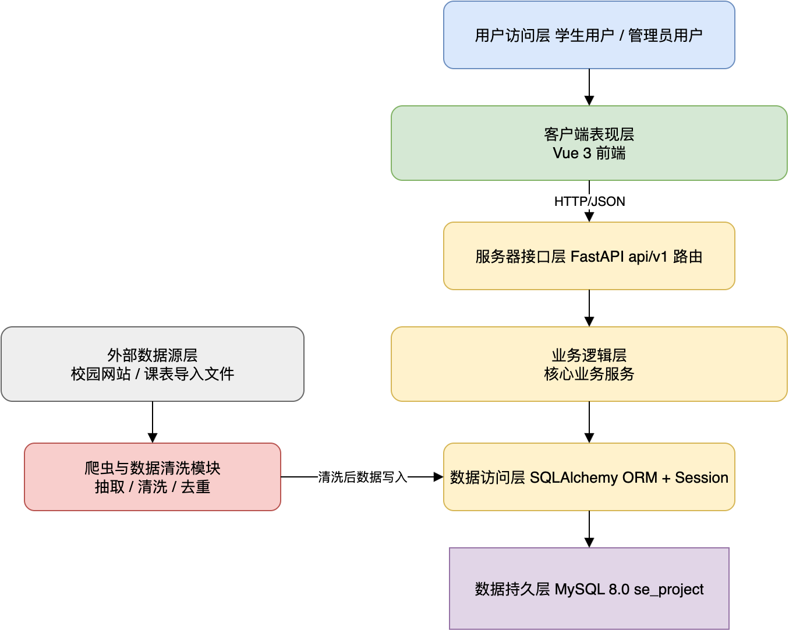

<center>图 1-1 系统层级结构图</center>

### 1.4 体系结构环境图和原型

本章将从顶层、次顶层和中间层逐步展开体系结构:

- 顶层视图说明系统边界和外部参与者

- 次顶层视图说明客户端与服务器端两个主要子系统

- 中间层视图进一步说明网络、数据库、推荐、日程和界面模块的内部组成。

#### 1.4.1 顶层 - 校园学术活动智能推荐平台

顶层环境图描述系统边界及其外部交互对象。

平台内部负责活动聚合、推荐、日程和后台维护；平台外部包括学生用户、管理员用户、校园活动网站、课表导入文件，以及用户本地日历应用。学生用户主要使用浏览、检索、推荐和日程功能；管理员用户主要维护活动数据和标签；校园网站与课表文件为系统提供原始数据；ICS 文件用于把系统内日程导出到外部日历工具。

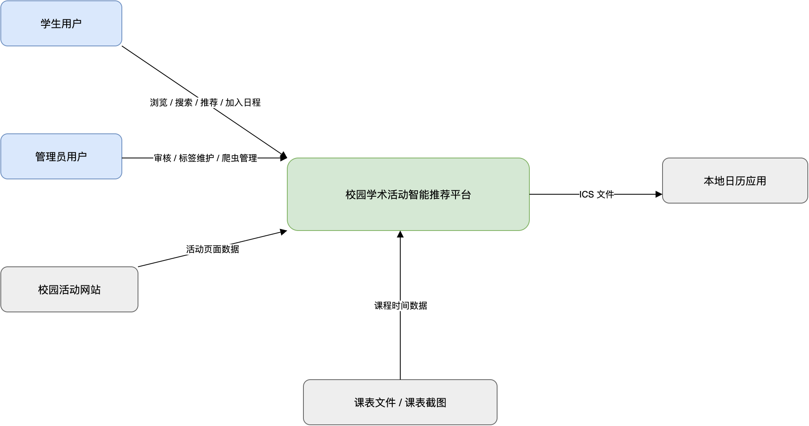

<center>图 1-2 顶层环境图</center>


#### 1.4.2 次顶层 - 服务器端子系统

服务器端子系统负责处理客户端请求和爬虫数据写入，集中了平台服务逻辑与数据一致性维护。服务器端以 FastAPI 作为应用入口，内部划分为认证与权限、活动信息、搜索筛选、个性化推荐、课表导入、日程与冲突检测、后台管理和爬虫记录等模块。

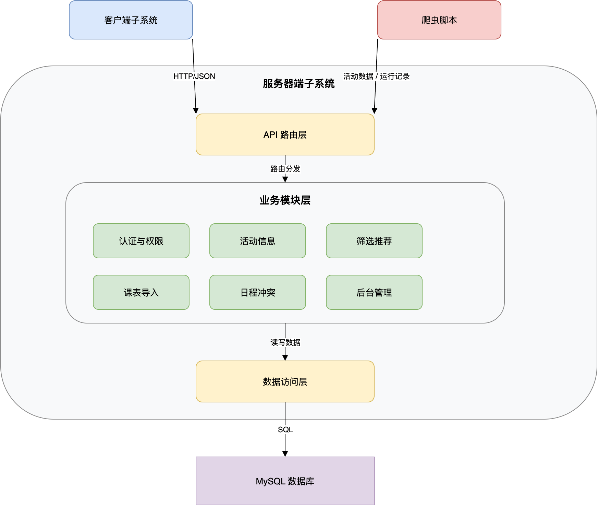

<center>图 1-3 服务器端子系统结构图</center>


#### 1.4.3 次顶层 - 客户端子系统

客户端子系统运行在浏览器中，负责用户可见的页面和交互,活动、用户、日程、课程等核心数据均通过后端接口获取。

客户端由页面视图、路由管理、状态管理、API 封装、通用组件和全局样式组成。

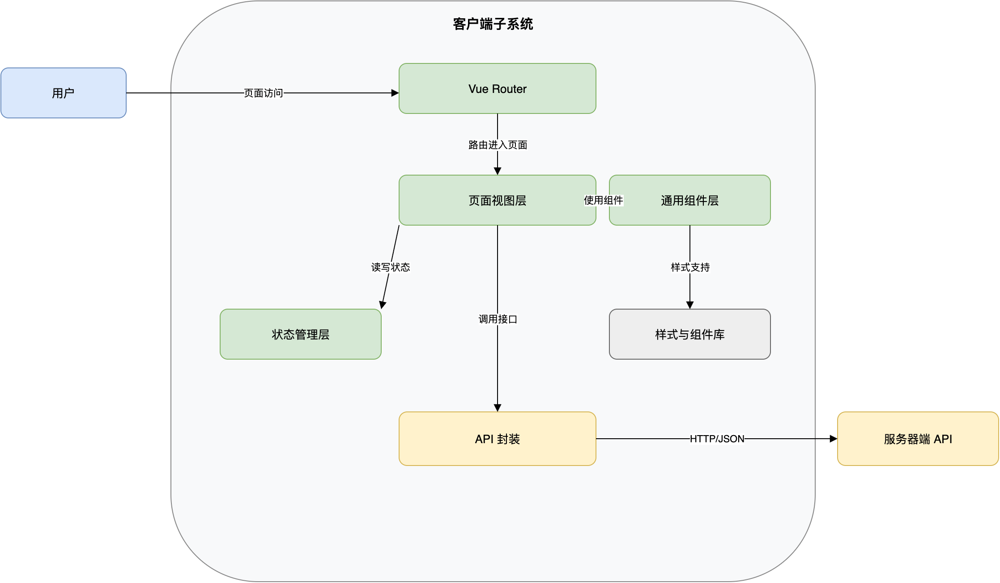

<center>图 1-4 客户端子系统结构图</center>

客户端按业务场景组织页面：

- 首页负责推荐入口，活动列表页负责搜索筛选

- 活动详情页负责详情展示和加入日程

- 日历页负责课程与活动的时间视图

- 课表导入页负责录入课程数据

- 后台页面负责活动维护和审核。

#### 1.4.4 中间层 - 服务器端子系统的网络模块

服务器端网络模块对应 FastAPI 应用入口等。该模块对客户端暴露稳定的 HTTP API，并把请求转交给相应服务层处理。

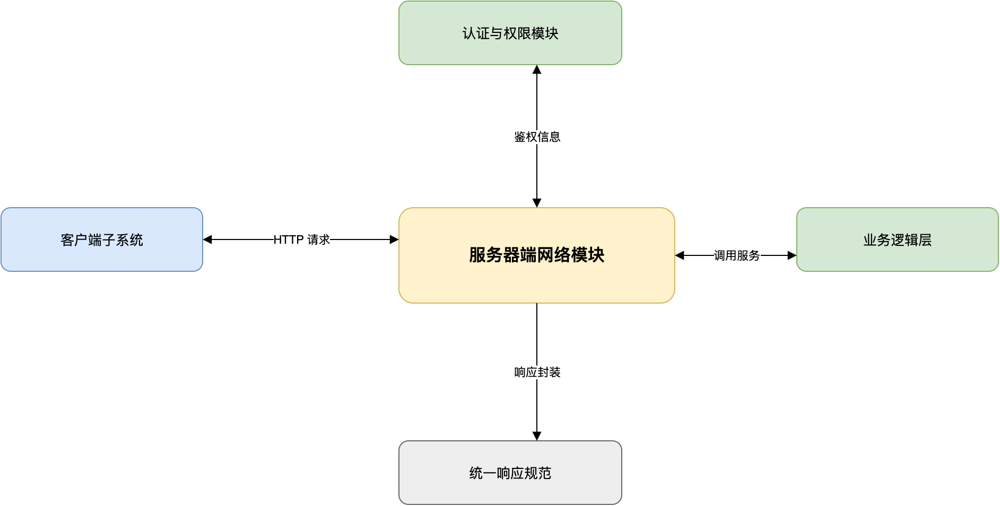

<center>图 1-5 服务器端网络模块结构图</center>


#### 1.4.5 中间层 - 服务器端子系统的数据库模块

数据库模块由配置读取、SQLAlchemy Engine、数据库会话依赖、ORM 数据模型和 MySQL 数据库组成。数据库表结构以 `database/schema.sql` 为权威来源。

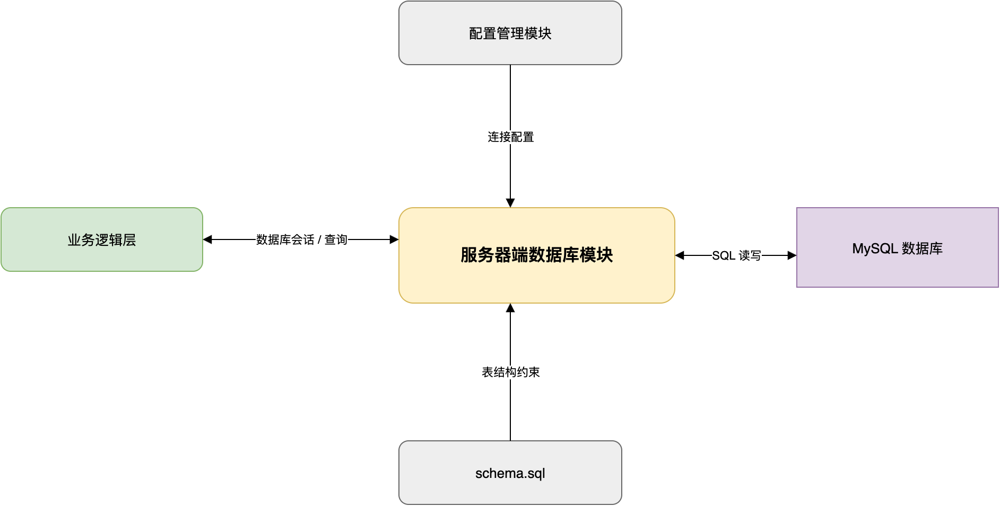

<center>图 1-6 服务器端数据库模块结构图</center>

数据库模块主要承担以下职责：

1. 维护活动、用户、标签、兴趣、课程、日程、报名、爬虫记录和管理员日志等核心数据；

2. 通过外键约束和唯一索引保证基础一致性，例如用户与活动报名记录唯一；

3. 为高频字段建立索引,比如校区等


#### 1.4.6 中间层 - 服务器端子系统的数据处理与推荐模块

数据处理与推荐模块负责将活动原始信息转化为框架可使用的的结构化结果。该模块包含活动基础过滤、标签处理、筛选排序、规则打分和推荐理由生成。

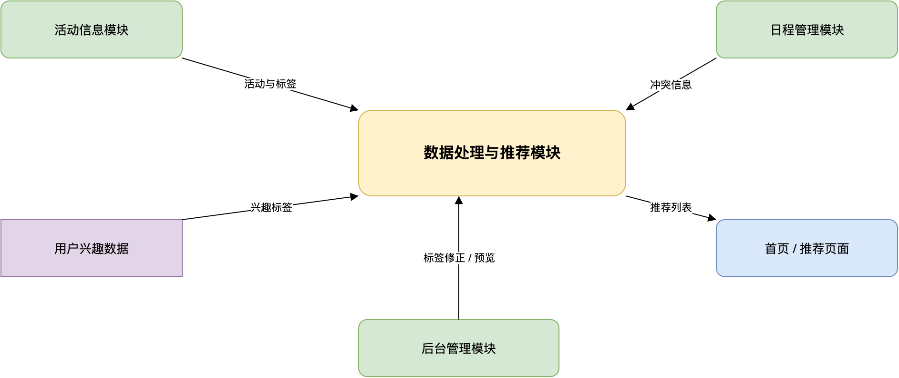

<center>图 1-7 数据处理与推荐模块结构图</center>

推荐模块第一阶段采用规则模型：

```text
推荐分 = 兴趣标签匹配分 + 热度分 + 时间临近分 + 学院相关分 - 冲突惩罚分
```

#### 1.4.7 中间层 - 服务器端子系统的日程管理模块

日程管理模块负责课程时间、活动时间和用户个人日程之间的统一管理。

该模块支持课表导入、活动加入日程、冲突检测、日历查询和 ICS 导出。

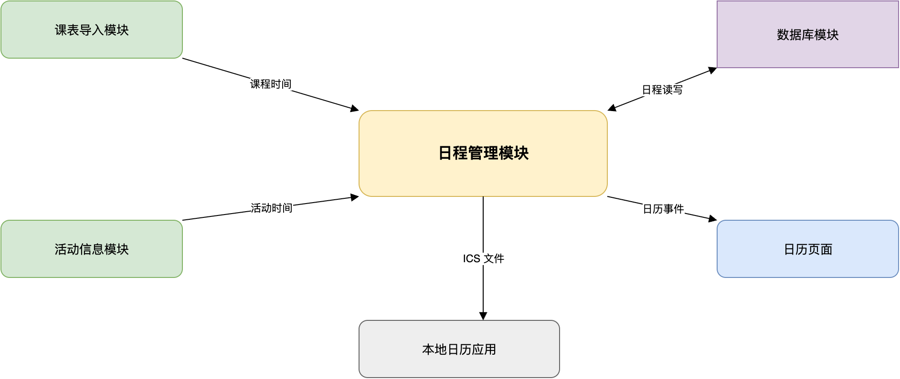

<center>图 1-8 日程管理模块结构图</center>

冲突检测以时间区间重叠为核心规则。活动加入日程前，系统检查该用户在相同时间段内是否已有课程或其他日程事件，并把检测结果返回前端。前端根据这个提示用户是否存在冲突，后端则负责保证最终写入的数据符合约束。

#### 1.4.8 中间层 - 客户端子系统的网络模块

客户端网络模块统一封装在 `frontend/src/api/http.js` 和各业务 API 文件中。该模块负责设置 API 基础地址、组织请求参数、处理响应解包和错误传播。

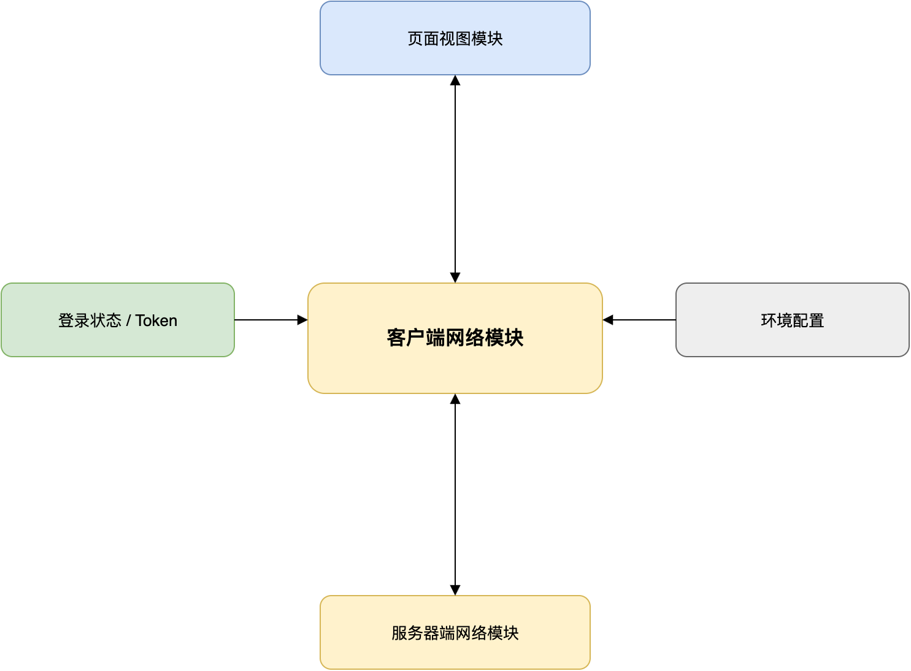

<center>图 1-9 客户端网络模块结构图</center>

前端调用方直接获得后端统一响应对象：

```json
{
  "code": 0,
  "message": "success",
  "data": {}
}
```


#### 1.4.9 中间层 - 客户端子系统的数据解析模块

客户端数据解析模块负责将后端返回的数据转换为页面展示所需的结构

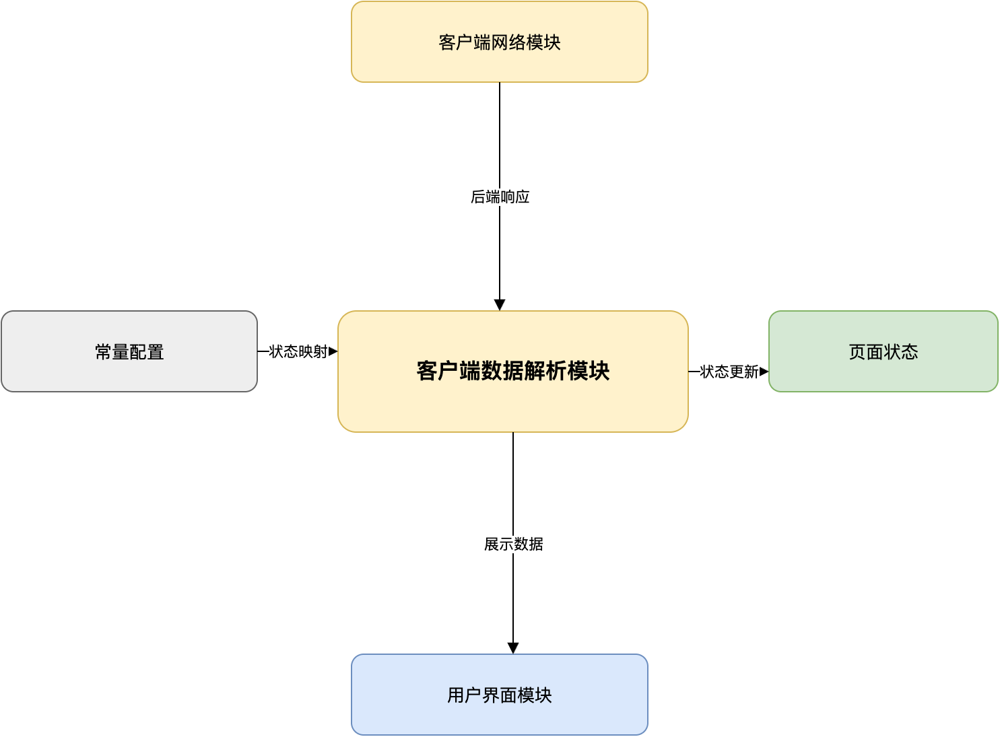

<center>图 1-10 客户端数据解析模块结构图</center>

例如，活动状态 `open`、`offline` 可映射为不同颜色标签；日程事件可根据 `type` 和 `color_type` 转换为日历中的课程、活动、冲突等展示状态。

#### 1.4.10 中间层 - 客户端子系统的用户界面模块

用户界面模块负责将活动推荐、检索结果、日程数据和后台维护功能组织为可操作页面:

- 学生端突出活动发现和日程安排

- 管理员端突出活动维护和数据控制。

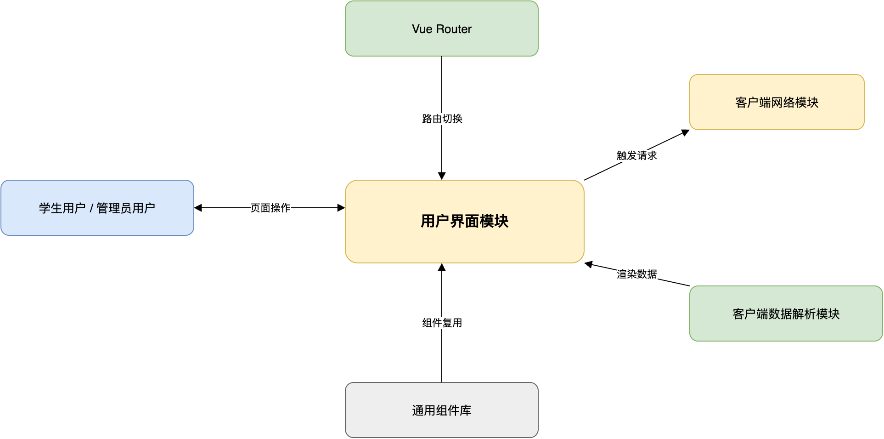

<center>图 1-11 客户端用户界面模块结构图</center>

客户端界面与后端模块之间的主要对应关系如下：

| 页面 | 主要后端接口 | 核心交互 |
| --- | --- | --- |
| 首页/推荐 | `GET /api/v1/recommendations/activities` | 展示个性化推荐活动和推荐理由 |
| 活动列表 | `GET /api/v1/activities` | 关键词搜索、筛选、排序和分页 |
| 活动详情 | `GET /api/v1/activities/{id}` | 展示活动详情，触发加入日程 |
| 日历 | `GET /api/v1/schedules` | 展示课程、活动和冲突状态 |
| 课表导入 | `POST /api/v1/courses/import` | 导入课程数据并生成课程日程 |
| 个人中心 | `GET /api/v1/users/me` | 展示用户信息和兴趣标签 |
| 后台管理 | `POST/PUT/DELETE /api/v1/admin/activities/*` | 活动维护、审核和上下架 |

总的来说,本系统以 B/S 架构、前后端分离架构和分层架构作为体系结构原型。客户端负责页面展示与交互，服务器端负责接口调度、业务处理和数据访问，数据库负责持久化存储。

---

## 2 服务器端设计

### 2.1 服务器架构

#### 2.1.1 表示层

#### 2.1.2 业务逻辑层

#### 2.1.3 数据访问层

### 2.2 服务器处理流程

#### 2.2.1 活动浏览与检索处理流程

#### 2.2.2 个性化推荐处理流程

#### 2.2.3 课表导入处理流程

#### 2.2.4 一键加入日程与冲突检测处理流程

#### 2.2.5 ICS 导出处理流程

#### 2.2.6 后台活动管理处理流程

### 2.3 数据库设计

#### 2.3.1 数据库设计原则

#### 2.3.2 数据库 ER 图

#### 2.3.3 核心数据表设计

#### 2.3.4 表关系设计

#### 2.3.5 数据一致性与约束设计

### 2.4 后端模块设计

#### 2.4.1 用户认证与权限模块

#### 2.4.2 活动信息管理模块

#### 2.4.3 搜索筛选与排序模块

1. 模块目标
    - 支持用户从大量校园学术活动中快速定位目标活动，并保证搜索结果可分页、可筛选、可排序。

1. 主要开发内容

    - 实现活动列表查询接口，支持分页加载
    - 实现关键词搜索，覆盖标题、简介、主讲人、地点等主要字段
    - 实现类别、校区、学院、标签、时间范围等组合筛选
    - 实现热门优先、时间优先、发布时间优先等排序规则
    - 返回筛选项统计信息或可选项列表，便于前端生成筛选面板

    关键数据/接口：

    - 核心数据表：`activity`、`activity_tag`
    - 核心接口：
        - `GET /api/v1/activities`：获取活动列表
        - `GET /api/v1/activities/filter-options`：获取筛选选项
    - 关键字段：`category`、`campus`、`college`、`tags`、`start_time`、`created_at`

1. 实现重点

    - 后端根据查询参数动态构造查询条件，避免为每一种筛选组合单独写接口
    - 排序规则需要统一约定字段含义，例如“时间优先”按 `start_time` 升序，“热门优先”按报名数或浏览热度降序
    - 分页查询应保证返回总条数、当前页码和页大小，方便前端实现稳定翻页
    - 筛选参数为空时默认返回未结束活动，避免首页出现大量过期内容

1. 与其他模块关系

    - 该模块依赖活动信息管理模块提供结构化活动数据
    - 推荐模块可复用排序与过滤能力，对候选集进行二次裁剪
    - 后台修正标签、校区、类别后，会直接影响搜索与筛选结果

#### 2.4.4 个性化推荐模块

1. 模块目标
    - 在第一阶段实现可运行、可解释的个性化推荐能力，为首页和推荐页提供展示内容。

2. 主要开发内容

    - 读取用户兴趣标签和基础信息
    - 建立候选活动集合，并过滤已结束或明显不相关活动
    - 基于规则计算推荐分
    - 返回推荐理由，如“匹配你的人工智能兴趣标签”“活动即将开始”“与你所在学院相关”
    - 提供后台推荐预览接口，便于调试推荐效果

    推荐分可采用如下规则模型：

    ```text
    推荐分 = 兴趣标签匹配分 + 热度分 + 时间临近分 + 学院相关分 - 冲突惩罚分
    ```

3. 关键数据/接口

    - 核心数据表：`activity`、`activity_tag`、`user_interest`、`registration`
    - 核心接口：
        - `GET /api/v1/recommendations/activities`：获取推荐活动列表
        - `GET /api/v1/admin/recommendations/preview`：获取后台推荐预览接口
    - 关键字段：`tags`、`campus`、`college`、`start_time`、`hot_score`

4. 实现重点

    - 第一阶段不引入复杂机器学习模型，优先保证推荐逻辑简单、稳定、可解释
    - 推荐结果不能只返回活动列表，还要返回 `reason` 或类似字段，说明推荐原因
    - 推荐候选集应先经过基础过滤，排除已结束、已下架或时间明显冲突的活动
    - 推荐算法参数需要集中配置，避免权重散落在多个文件中难以维护

5. 与其他模块关系

    - 依赖用户兴趣标签维护和活动标签体系
    - 可结合日历与冲突检测模块，降低与课程时间冲突的活动得分
    - 后台辅助接口可用于人工修正推荐所依赖的标签和类别信息

#### 2.4.5 课表导入模块

#### 2.4.6 日历与冲突检测模块

#### 2.4.7 ICS 导出模块

#### 2.4.8 后台管理模块

### 2.5 数据库与爬虫模块设计

#### 2.5.1 数据采集模块设计

#### 2.5.2 爬虫数据源设计

#### 2.5.3 活动字段抽取设计

#### 2.5.4 数据清洗与去重设计

#### 2.5.5 爬虫数据入库流程

#### 2.5.6 爬虫记录与异常处理设计

---

## 3 UI 设计

### 3.1 设计原则

### 3.2 UI 原型设计

#### 3.2.1 登录/注册页面设计

#### 3.2.2 用户主界面设计

#### 3.2.3 活动列表页面设计

#### 3.2.4 活动详情页面设计

#### 3.2.5 日历页面设计

#### 3.2.6 课表导入页面设计

#### 3.2.7 个人中心页面设计

#### 3.2.8 管理端页面设计

### 3.3 日历视图与状态标识设计

#### 3.3.1 课程事件展示

#### 3.3.2 已加入活动展示

#### 3.3.3 推荐活动展示

#### 3.3.4 冲突活动展示

#### 3.3.5 已结束活动展示

### 3.4 前后端交互页面说明

#### 3.4.1 活动检索交互

#### 3.4.2 加入日程交互

#### 3.4.3 冲突提示交互

#### 3.4.4 课表导入交互

#### 3.4.5 ICS 导出交互
