# 校园学术活动智能推荐平台总体设计报告

## 1 体系结构设计

### 1.1 目的

体系结构设计用于说明系统的总体组织方式，即系统由哪些主要构件组成、构件之间如何通信、数据如何流动，以及这些设计选择如何支撑后续开发、测试和维护。本章意在从整体层面确定平台的系统边界、子系统划分、层级结构、模块职责和关键交互关系。


本系统面向学术讲座、学院报告、竞赛宣讲、学术沙龙等校园活动场景，重点解决活动信息分散、检索成本高、推荐缺少个性化、活动与课程时间冲突不易提前发现等问题。系统最终形态是一个 Web 应用，提供活动聚合、搜索筛选、个性化推荐、课表导入、日程管理、冲突检测和后台维护等能力。

本系统的设计目标如下：

1. **功能完整性**：覆盖普通学生用户从浏览活动、检索活动、查看详情、获取推荐、导入课表、加入日程到导出日历文件的主流程，同时支持管理员对活动、标签和爬虫数据进行维护。


2. **职责清晰性**：将用户界面、接口路由、业务逻辑、数据访问和数据采集分开设计，使每个模块有明确边界，避免页面层直接处理复杂业务或直接访问数据库。

3. **数据一致性**：以 MySQL 数据库为活动、用户、课表、日程和后台日志的权威数据源，统一由后端完成数据校验、状态控制、权限判断和冲突检测。

4. **可扩展性**：第一阶段采用规则推荐和结构化筛选，后续可在不重构整体系统的前提下扩展更多活动来源、推荐策略、日历视图和后台管理能力。


5. **可测试性**：后端接口遵循统一响应格式，前端通过 Axios 封装访问接口，便于分别进行接口测试、页面联调和构建验证。

### 1.2 体系结构风格

本系统采用 **B/S 架构、前后端分离架构和分层架构** 组合实现。


1. **B/S 架构**

    学生和管理员均通过浏览器访问系统，无需安装专用客户端。前端由 Vue 3 与 Vite 构建，负责页面展示、表单交互、路由跳转和局部状态管理；后端由 FastAPI 提供 HTTP API；数据库采用 MySQL 8.0 存储持久化数据。该架构降低了使用门槛，也便于在课程项目阶段快速部署和演示。

2. **前后端分离架构**


    前端与后端通过 HTTP/JSON 接口交互。前端负责展示和交互，不直接访问数据库；后端负责数据校验、权限控制、推荐计算、冲突检测和持久化操作，不承担页面渲染。该方式可以减少前后端之间的耦合，使页面开发、接口开发和接口测试相对独立。

3. **后端三层架构**

    后端内部采用 `api/v1` 路由层、`services` 业务逻辑层、`models + db` 数据访问层的三层结构：


    - 路由层负责参数接收、依赖注入、权限校验和统一响应封装；
    - 服务层负责活动查询、推荐计算、课表解析、冲突检测、后台管理等业务逻辑；
    - 数据访问层负责 SQLAlchemy ORM 模型、数据库会话和 MySQL 持久化操作。

4. **数据驱动与规则推荐风格**

    平台以活动标签、用户兴趣标签、活动热度、时间临近程度、学院相关性和日程冲突结果为主要因素进行规则推荐。


### 1.3 层级结构

系统总体上分为用户访问层、客户端表现层、服务器接口层、业务逻辑层、数据访问层、数据持久层和外部数据源层。

我们的设计原则是：上层只依赖相邻或明确约定的下层能力，下层不反向依赖上层展示细节；跨层交互通过接口、服务或数据模型完成。

| 层级 | 主要组成 | 职责 |
| --- | --- | --- |
| 用户访问层 | 学生用户、管理员用户 | 发起活动浏览、搜索、推荐、课表导入、日程管理和后台维护请求 |
| 客户端表现层 | Vue 3、Vue Router、Pinia、Element Plus、Axios | 页面渲染、表单输入、状态展示、接口调用、前端路由控制 |
| 服务器接口层 | FastAPI `api/v1` 路由 | 接收 HTTP 请求，完成参数校验、权限判断和统一响应 |
| 业务逻辑层 | `services` 模块 | 实现活动查询、推荐排序、课表导入、冲突检测、日程处理、后台审核等核心逻辑 |
| 数据访问层 | SQLAlchemy ORM、数据库会话 | 封装数据库模型和查询操作，保证模型与 `schema.sql` 一致 |
| 数据持久层 | MySQL 8.0 | 持久化用户、活动、标签、兴趣、课表、日程、报名、爬虫记录和管理员日志 |
| 外部数据源层 | 校园网站、手动录入数据、课表文件 | 为系统提供活动信息和个人课表来源 |

系统层级结构如下图所示：


<center>图 1-1 系统层级结构图</center>

### 1.4 体系结构环境图和原型

本章将从顶层、次顶层和中间层逐步展开体系结构:

- 顶层视图说明系统边界和外部参与者

- 次顶层视图说明客户端与服务器端两个主要子系统

- 中间层视图进一步说明网络、数据库、推荐、日程和界面模块的内部组成。

#### 1.4.1 顶层 - 校园学术活动智能推荐平台

顶层环境图描述系统边界及其外部交互对象。

平台内部负责活动聚合、推荐、日程和后台维护；平台外部包括学生用户、管理员用户、校园活动网站、课表导入文件，以及用户本地日历应用。学生用户主要使用浏览、检索、推荐和日程功能；管理员用户主要维护活动数据和标签；校园网站与课表文件为系统提供原始数据；ICS 文件用于把系统内日程导出到外部日历工具。


<center>图 1-2 顶层环境图</center>


#### 1.4.2 次顶层 - 服务器端子系统

服务器端子系统负责处理客户端请求和爬虫数据写入，集中了平台服务逻辑与数据一致性维护。服务器端以 FastAPI 作为应用入口，内部划分为认证与权限、活动信息、搜索筛选、个性化推荐、课表导入、日程与冲突检测、后台管理和爬虫记录等模块。


<center>图 1-3 服务器端子系统结构图</center>


#### 1.4.3 次顶层 - 客户端子系统

客户端子系统运行在浏览器中，负责用户可见的页面和交互,活动、用户、日程、课程等核心数据均通过后端接口获取。

客户端由页面视图、路由管理、状态管理、API 封装、通用组件和全局样式组成。


<center>图 1-4 客户端子系统结构图</center>

客户端按业务场景组织页面：

- 首页负责推荐入口，活动列表页负责搜索筛选

- 活动详情页负责详情展示和加入日程

- 日历页负责课程与活动的时间视图

- 课表导入页负责录入课程数据

- 后台页面负责活动维护和审核。

#### 1.4.4 中间层 - 服务器端子系统的网络模块

服务器端网络模块对应 FastAPI 应用入口等。该模块对客户端暴露稳定的 HTTP API，并把请求转交给相应服务层处理。

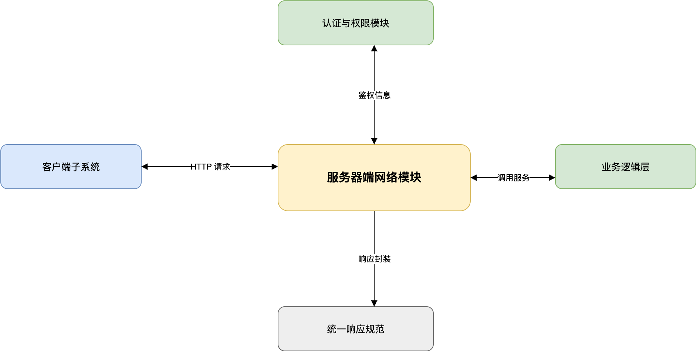

<center>图 1-5 服务器端网络模块结构图</center>


#### 1.4.5 中间层 - 服务器端子系统的数据库模块

数据库模块由配置读取、SQLAlchemy Engine、数据库会话依赖、ORM 数据模型和 MySQL 数据库组成。数据库表结构以 `database/schema.sql` 为权威来源。

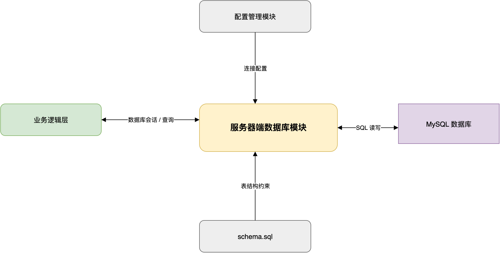

<center>图 1-6 服务器端数据库模块结构图</center>

数据库模块主要承担以下职责：

1. 维护活动、用户、标签、兴趣、课程、日程、报名、爬虫记录和管理员日志等核心数据；

2. 通过外键约束和唯一索引保证基础一致性，例如用户与活动报名记录唯一；

3. 为高频字段建立索引,比如校区等


#### 1.4.6 中间层 - 服务器端子系统的数据处理与推荐模块

数据处理与推荐模块负责将活动原始信息转化为框架可使用的的结构化结果。该模块包含活动基础过滤、标签处理、筛选排序、规则打分和推荐理由生成。


<center>图 1-7 数据处理与推荐模块结构图</center>

推荐模块第一阶段采用规则模型：

```text
推荐分 = 兴趣标签匹配分 + 热度分 + 时间临近分 + 学院相关分 - 冲突惩罚分
```

#### 1.4.7 中间层 - 服务器端子系统的日程管理模块

日程管理模块负责课程时间、活动时间和用户个人日程之间的统一管理。

该模块支持课表导入、活动加入日程、冲突检测、日历查询和 ICS 导出。


<center>图 1-8 日程管理模块结构图</center>

冲突检测以时间区间重叠为核心规则。活动加入日程前，系统检查该用户在相同时间段内是否已有课程或其他日程事件，并把检测结果返回前端。前端根据这个提示用户是否存在冲突，后端则负责保证最终写入的数据符合约束。

#### 1.4.8 中间层 - 客户端子系统的网络模块

客户端网络模块统一封装在 `frontend/src/api/http.js` 和各业务 API 文件中。该模块负责设置 API 基础地址、组织请求参数、处理响应解包和错误传播。

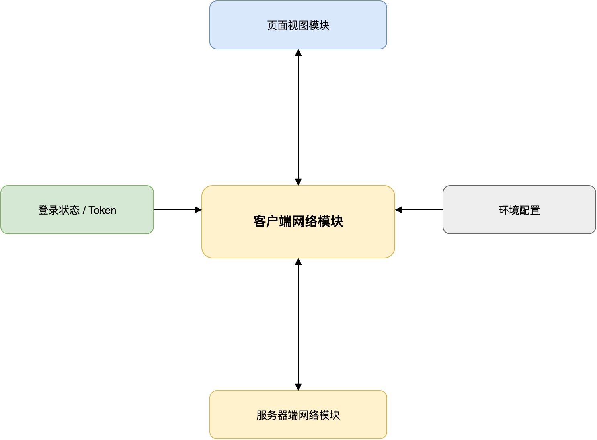

<center>图 1-9 客户端网络模块结构图</center>

前端调用方直接获得后端统一响应对象：

```json
{
  "code": 0,
  "message": "success",
  "data": {}
}
```


#### 1.4.9 中间层 - 客户端子系统的数据解析模块

客户端数据解析模块负责将后端返回的数据转换为页面展示所需的结构

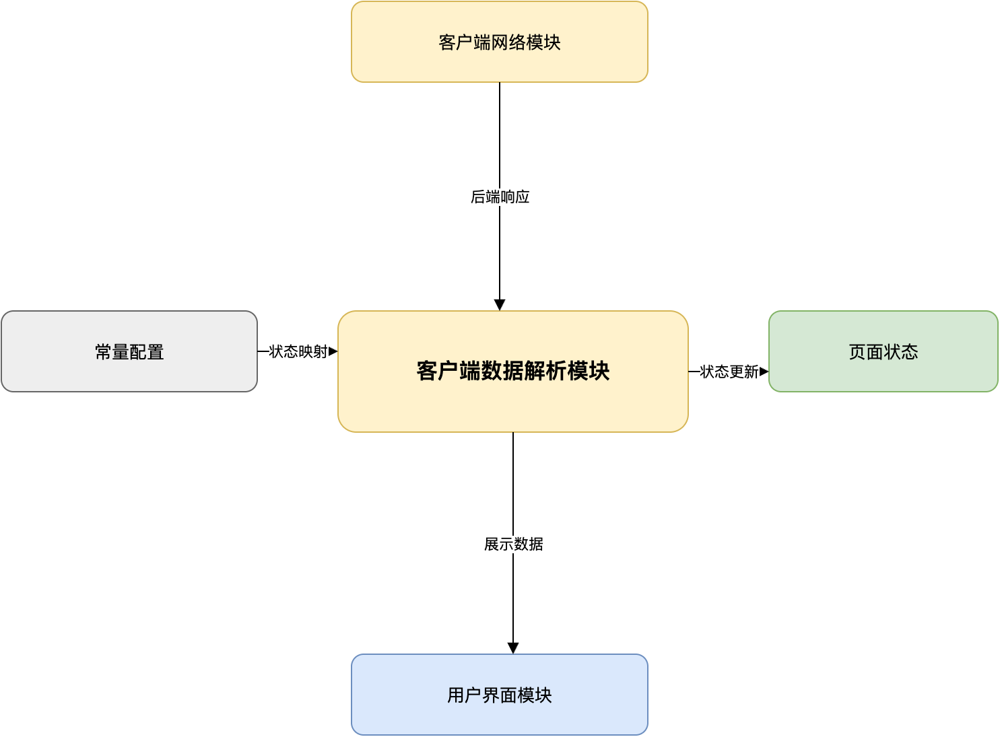

<center>图 1-10 客户端数据解析模块结构图</center>

例如，活动状态 `open`、`offline` 可映射为不同颜色标签；日程事件可根据 `type` 和 `color_type` 转换为日历中的课程、活动、冲突等展示状态。

#### 1.4.10 中间层 - 客户端子系统的用户界面模块

用户界面模块负责将活动推荐、检索结果、日程数据和后台维护功能组织为可操作页面:

- 学生端突出活动发现和日程安排

- 管理员端突出活动维护和数据控制。

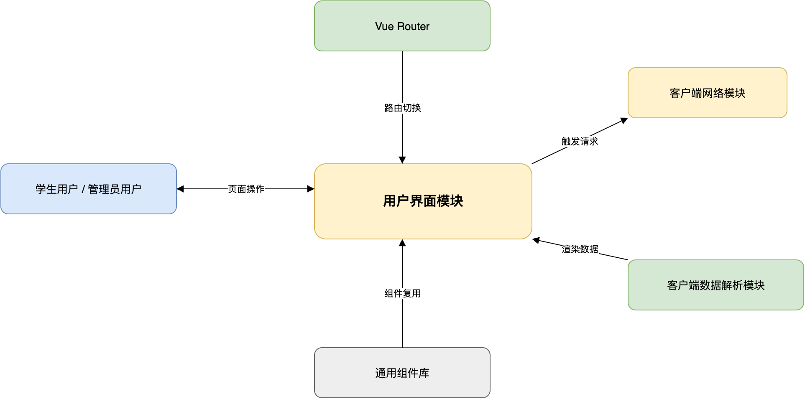

<center>图 1-11 客户端用户界面模块结构图</center>

客户端界面与后端模块之间的主要对应关系如下：

| 页面 | 主要后端接口 | 核心交互 |
| --- | --- | --- |
| 首页/推荐 | `GET /api/v1/recommendations/activities` | 展示个性化推荐活动和推荐理由 |
| 活动列表 | `GET /api/v1/activities` | 关键词搜索、筛选、排序和分页 |
| 活动详情 | `GET /api/v1/activities/{id}` | 展示活动详情，触发加入日程 |
| 日历 | `GET /api/v1/schedules` | 展示课程、活动和冲突状态 |
| 课表导入 | `POST /api/v1/courses/import` | 导入课程数据并生成课程日程 |
| 个人中心 | `GET /api/v1/users/me` | 展示用户信息和兴趣标签 |
| 后台管理 | `POST/PUT/DELETE /api/v1/admin/activities/*` | 活动维护、审核和上下架 |

总的来说,本系统以 B/S 架构、前后端分离架构和分层架构作为体系结构原型。客户端负责页面展示与交互，服务器端负责接口调度、业务处理和数据访问，数据库负责持久化存储。

---

## 2 服务器端设计

### 2.1 服务器架构

服务器端采用经典的三层架构组织内部职责，自上而下依次为表示层、业务逻辑层和数据访问层。上层只调用相邻下层提供的能力，下层不依赖上层的具体形式，跨层交互通过统一的接口契约和数据模型完成。这种划分使请求入口、业务规则和数据落地相互解耦，便于功能扩展、独立测试和后续推荐与日程模块的迭代。

#### 2.1.1 表示层

表示层直接面向客户端与外部调用方，是服务器对外暴露的统一入口。该层基于 FastAPI 框架实现，负责接收 HTTP 请求、解析查询参数与请求体、校验基础格式与权限，并把合法请求转交给业务逻辑层处理，最后将处理结果以统一格式封装为响应返回。表示层不承载复杂业务规则，也不直接访问数据库。

按业务领域，表示层划分为认证、用户、活动信息、搜索筛选、个性化推荐、课表导入、日程与冲突检测、后台管理和爬虫记录等多个相互独立的路由模块。所有响应统一遵循以下结构，前端据此判断请求结果并展示提示信息：

```json
{
  "code": 0,
  "message": "success",
  "data": {}
}
```

表示层遵循“轻路由、重服务”的设计原则：路由只承担请求入口与出口的职责，不直接拼装复杂查询，从而保证业务逻辑可以集中演进，而不必随接口形式频繁变动。

#### 2.1.2 业务逻辑层

业务逻辑层处于表示层与数据访问层之间，是系统的核心。该层接收来自表示层的请求参数与上下文，依据业务规则完成数据组装、计算、判定和编排，再将结果交由表示层返回，或调用数据访问层完成持久化。本系统的核心业务逻辑均在此层实现：

- **活动服务**：负责活动列表查询、活动详情读取以及多条件筛选与排序；
- **推荐服务**：负责候选活动集合的构造、规则打分和推荐理由生成；
- **日程服务**：负责日程事件管理、时间区间冲突检测以及一键加入日程的业务规则；
- **课程服务**：负责课表文件解析、字段校验和课程事件生成；
- **后台服务**：负责活动审核、爬虫记录追踪和管理员操作日志记录；
- **导出服务**：负责按 ICS 标准格式组织日程数据，供外部日历工具使用。

将业务规则集中收敛到业务逻辑层，可以保证业务变化的影响范围被限定在该层内部，表示层的接口与数据访问层的模型无需随之修改，从而降低维护成本，也便于后续在不改变对外接口的前提下替换具体算法（例如将规则推荐升级为基于机器学习的推荐策略）。

#### 2.1.3 数据访问层

数据访问层负责与数据库进行真实的数据读写，是整个系统的数据落点。该层由 ORM 数据模型、数据库连接会话和数据库表结构定义三部分组成，三者之间通过统一的实体定义保持一致：ORM 模型描述代码层面的实体结构，会话管理负责连接获取与事务边界，表结构定义则作为表与索引的权威来源。

业务逻辑层通过依赖注入获取数据库会话，并以 ORM 接口完成查询、插入、更新和删除操作，避免在上层直接拼写 SQL 语句。数据访问层屏蔽了底层数据库的具体差异，使业务逻辑无需关心连接池、事务管理和 SQL 方言等细节，提高了代码的可维护性和可测试性，也为后续切换数据库或拆分读写实例预留了空间。

#### 2.1.4 层间协作与异常处理

一次完整请求按"自上而下处理、自下而上返回"的方式贯穿三层，事务边界收敛在业务逻辑层，保证一次业务操作中的多次数据访问要么全部成功、要么整体回滚。异常处理同样遵循分层原则：数据访问层抛出的底层异常由业务逻辑层映射为带语义的业务错误，再由表示层封装为 `code != 0` 的统一响应交给前端，从而保证前端在所有失败情况下都能得到一致的反馈结构。

### 2.2 服务器处理流程

依据上一节的三层划分，服务器处理客户端请求的总体流程可概括为：表示层接收并解析请求 → 业务逻辑层执行业务规则与计算 → 数据访问层完成数据读写 → 表示层封装并返回响应。下面针对系统中的关键业务场景，分别说明具体的处理流程。

#### 2.2.1 活动浏览与检索处理流程

活动浏览与检索是学生端最基础的入口流程。其处理过程为：前端提交关键词、类别、校区、学院、标签、排序和分页参数，表示层接收请求后调用活动服务，业务逻辑层根据条件动态组装查询，最后由数据访问层从活动表和活动标签表中取回结果，并返回统一分页结构。

典型流程如下：

1. 用户进入活动列表页，输入关键词或选择筛选条件；
2. 前端请求 `GET /api/v1/activities`；
3. 表示层校验分页参数与排序参数；
4. 业务逻辑层根据条件组织查询，并默认排除已结束或不可见活动；
5. 数据访问层返回活动列表和总数；
6. 前端渲染卡片列表、分页器和筛选状态。

该流程的关键点是保证查询结果稳定、分页一致，并能支持后续扩展更多筛选项而无需重写接口。

#### 2.2.2 个性化推荐处理流程

个性化推荐流程以用户兴趣标签和活动属性为核心。系统先读取用户兴趣、学院、历史报名或浏览偏好，再构造候选活动集合，随后基于标签匹配、热度、时间临近程度、学院相关性和冲突惩罚等因素计算推荐分。

典型流程如下：

1. 用户打开首页或推荐页；
2. 前端请求 `GET /api/v1/recommendations/activities`；
3. 业务逻辑层读取用户画像与基础信息；
4. 候选活动先经过基础过滤，排除已结束、已下架或明显冲突的活动；
5. 业务逻辑层计算推荐分并生成推荐理由；
6. 前端展示推荐列表、理由标签和跳转详情入口。

第一阶段推荐策略以规则模型为主，强调可解释和可维护，后续可以在不改变接口形态的前提下替换更复杂的推荐算法。


<center>图 2-1 个性化推荐处理流程</center>

#### 2.2.3 课表导入处理流程

课表导入流程用于把用户学期课表转换为系统可识别的课程事件，作为日程和冲突检测的基础数据。当前设计支持文件导入，并为 OCR 识别预留接口。

典型流程如下：

1. 用户进入课表导入页面并选择文件；
2. 前端请求 `POST /api/v1/courses/import` 或预留的 OCR 接口；
3. 表示层接收上传文件并交给业务逻辑层解析；
4. 业务逻辑层按模板识别课程名、星期、节次、周次、地点和教师等字段；
5. 数据访问层将解析结果写入课程表；
6. 系统返回导入结果和成功条数，前端提示用户前往日历查看。

若导入文件格式不规范，应返回明确的错误位置或字段说明，减少用户重试成本。


<center>图 2-2 课表导入处理流程</center>

#### 2.2.4 一键加入日程与冲突检测处理流程

一键加入日程与冲突检测是本系统的核心闭环流程。用户在活动详情页发起加入操作时，系统必须先判断该活动是否与课程或已有日程重叠，再决定是否写入日程事件。

典型流程如下：

1. 用户在活动详情页点击"加入日程"；
2. 前端先请求冲突检测接口 `POST /api/v1/schedules/check-conflict`；
3. 业务逻辑层读取当前用户的课程表和日程事件；
4. 按时间区间重叠规则判断是否冲突；
5. 若无冲突，则写入新的日程事件；若存在冲突，则返回冲突明细供用户确认；
6. 前端根据结果弹出提示，并可在用户确认后调用加入接口 `POST /api/v1/schedules/add-activity`。

该流程的核心是保证"先检测、后写入"，并让冲突结果可解释、可回看。


<center>图 2-3 一键加入日程与冲突检测处理流程</center>

#### 2.2.5 ICS 导出处理流程

ICS 导出流程用于把系统中的日程同步到外部日历工具。系统在用户确认导出后，汇总其课程和活动事件，生成标准 `.ics` 文件或下载地址。

典型流程如下：

1. 用户在日历页点击导出；
2. 前端请求 `GET /api/v1/schedules/export-ics`；
3. 业务逻辑层读取当前用户的日程事件；
4. 按 ICS 格式组装事件标题、开始时间、结束时间和地点；
5. 返回文件下载地址或文件流；
6. 用户可将文件导入第三方日历应用。

该流程强调标准格式输出和兼容性，保证系统外的日历工具也能正常识别。

#### 2.2.6 后台活动管理处理流程

后台活动管理流程面向管理员，用于新增、编辑、下架活动，以及查看爬虫运行和统计信息。管理员操作必须经过角色校验，并在必要时写入日志。

典型流程如下：

1. 管理员进入后台管理页；
2. 前端请求新增、编辑、下架或统计接口；
3. 表示层检查管理员身份；
4. 业务逻辑层对活动字段进行校验并执行写入或状态变更；
5. 对人工维护和爬虫数据统一更新活动表、活动标签表、爬虫记录表或管理员日志表；
6. 前端刷新列表并展示最新状态。

该流程的目标是让后台维护与前台展示保持一致，并为活动数据来源、审核记录和异常追踪提供依据。

### 2.3 数据库设计

#### 2.3.1 数据库设计原则

本系统数据库采用 MySQL 8.0 进行持久化存储，并以集中维护的表结构定义作为权威来源，保证 ORM 模型、迁移脚本与实际数据库结构始终一致。设计时遵循以下原则：

1. **实体清晰**：将用户、活动、课程、日程、报名、爬虫记录和管理员日志拆分为独立表；
2. **关系明确**：通过外键、唯一约束和索引表达实体之间的约束关系；
3. **字段统一**：活动热度使用 `hot_score`，活动状态使用 `open/offline`，创建时间使用 `created_at`；
4. **便于检索**：对时间、状态、校区等高频查询字段建立索引；
5. **便于扩展**：保留标签、多对多关系和日志表，方便后续扩展推荐、管理和统计功能。

数据库字符集统一为 `utf8mb4`，以兼容中文活动名称、地点与说明文本。

#### 2.3.2 数据库 ER 图

系统数据库实体关系可以概括为以下几类：

- `user` 与 `user_interest`、`course_schedule`、`schedule_event`、`registration`、`admin_log` 形成一对多关系；
- `activity` 与 `activity_tag`、`schedule_event`、`registration` 形成一对多关系或引用关系；
- `activity_tag` 与 `user_interest` 分别表示活动标签和用户兴趣标签，为推荐与筛选提供输入；
- `crawl_record` 独立记录每次爬虫执行情况，用于追踪数据来源与异常情况。

这些实体共同构成“用户 - 活动 - 课程 - 日程 - 标签 - 记录”的核心数据闭环。


<center>图 2-4 数据库 ER 图</center>

#### 2.3.3 核心数据表设计

本系统当前共有 9 张核心表，分别承担如下职责：

| 表名 | 主要用途 | 关键字段 |
| --- | --- | --- |
| `user` | 存储学生和管理员账户 | `username`、`password_hash`、`role`、`major`、`college` |
| `activity` | 存储活动主信息 | `title`、`description`、`college`、`category`、`campus`、`location`、`start_time`、`end_time`、`source_type`、`hot_score`、`status` |
| `activity_tag` | 存储活动标签 | `activity_id`、`tag_name` |
| `user_interest` | 存储用户兴趣标签 | `user_id`、`tag_name` |
| `course_schedule` | 存储导入后的课程表 | `course_name`、`weekday`、`start_section`、`end_section`、`weeks`、`location` |
| `schedule_event` | 存储用户日程事件 | `user_id`、`title`、`type`、`activity_id`、`start_time`、`end_time`、`location`、`color_type` |
| `registration` | 存储用户与活动的报名/加入记录 | `user_id`、`activity_id`、`status` |
| `crawl_record` | 存储爬虫运行记录 | `source`、`status`、`fetched_count`、`success_count`、`error_msg`、`run_time` |
| `admin_log` | 存储管理员操作日志 | `admin_id`、`action`、`target_type`、`target_id`、`reason` |

其中 `activity`、`schedule_event` 和 `registration` 是日历与活动闭环的核心表，`user_interest` 和 `activity_tag` 则是推荐与筛选的核心输入。

#### 2.3.4 表关系设计

表关系设计以活动和用户为中心展开：

1. 一个用户可以拥有多个兴趣标签、多个课程事件、多个日程事件、多个报名记录和多条管理员日志；
2. 一个活动可以对应多个标签，也可以被多个用户报名或加入日程；
3. 一个日程事件可以指向一个活动，也可以独立表示课程或其他计划事项；
4. `registration` 通过 `(user_id, activity_id)` 唯一约束避免重复报名或重复加入；
5. `activity_tag` 通过 `(activity_id, tag_name)` 唯一约束避免同一活动重复打标。

通过这种设计，系统能够同时支持检索、推荐、日程安排和后台维护，而不会把所有信息堆在单表中。

#### 2.3.5 数据一致性与约束设计

为保证业务数据可靠，数据库层和服务层共同承担一致性控制：

1. `activity.status` 使用 `open/offline` 表示活动是否可见，避免前台展示脏数据；
2. `activity.source_type` 使用 `manual/crawled` 区分手工录入和爬虫导入；
3. `activity.hot_score` 统一表示热度分，便于排序和推荐复用；
4. `created_at`、`updated_at` 用于追踪活动创建和最后修改时间；
5. `schedule_event` 中 `user_id` 和 `activity_id` 通过外键维护引用完整性，活动删除时相关日程可设置为置空；
6. `course_schedule`、`schedule_event` 的时间字段用于冲突检测，必须保证起止时间合法；
7. `crawl_record`、`admin_log` 用于追踪运行和人工操作，便于排查问题。

在服务层写入数据时，应优先完成业务校验，再执行数据库写入，以减少回滚和脏记录。

### 2.4 后端模块设计

#### 2.4.1 用户认证与权限模块

1. 模块目标
    - 为平台提供统一的用户身份识别、登录注册、Token 签发与权限校验能力，保证普通学生用户和管理员用户在不同功能入口下具有清晰的访问边界。

2. 主要开发内容

    - 实现用户注册接口，对用户名、密码、角色等字段进行基础校验
    - 实现用户登录接口，校验账号密码并返回访问令牌
    - 使用 JWT 记录用户身份、角色和过期时间，前端后续请求通过 `Authorization: Bearer <token>` 携带令牌
    - 实现 `get_current_user` 依赖，从 Token 中解析当前用户并查询数据库中的用户状态
    - 实现管理员权限校验依赖，限制后台管理、爬虫触发、活动维护等接口只能由管理员访问
    - 提供当前用户信息接口，供前端个人中心、导航栏和权限控制使用

3. 关键数据/接口

    - 核心数据表：`user`、`user_interest`
    - 核心接口：
        - `POST /api/v1/auth/register`：用户注册
        - `POST /api/v1/auth/login`：用户登录并获取 Token
        - `GET /api/v1/users/me`：获取当前登录用户信息
        - `PUT /api/v1/users/me`：更新当前用户基础信息或兴趣标签（预留/扩展）
    - 关键字段：`username`、`password_hash`、`role`、`email`、`student_no`、`tag_name`

4. 实现重点

    - 密码不以明文形式存储，注册时写入哈希值，登录时使用统一工具函数进行校验
    - Token 只保存必要的用户标识和角色信息，用户详细资料仍以数据库查询结果为准
    - 权限判断统一放在后端依赖函数中，前端页面隐藏入口只能作为交互优化，不能作为安全边界
    - 普通用户默认角色为 `student`，管理员角色为 `admin`，与数据库 `user.role` 字段保持一致
    - 所有认证失败、权限不足、Token 过期等情况均通过统一响应格式返回明确错误信息，便于前端提示和跳转登录页

5. 与其他模块关系

    - 活动报名、加入日程、课表导入、ICS 导出等个人化功能均依赖当前用户身份
    - 个性化推荐模块需要读取用户兴趣标签和用户基础信息
    - 后台管理模块依赖管理员权限校验，防止普通用户访问活动维护和爬虫触发能力
    - 前端登录页、个人中心和导航状态依赖登录接口和当前用户信息接口

#### 2.4.2 活动信息管理模块

1. 模块目标
    - 维护平台中的学术活动基础数据，并为活动列表、活动详情、搜索筛选、推荐、日程加入和后台管理等功能提供统一的数据来源。

2. 主要开发内容

    - 实现活动列表查询接口，返回可分页的活动基础信息
    - 实现活动详情查询接口，返回活动标题、时间、地点、主讲人、简介、标签、状态等完整信息
    - 对活动状态进行统一控制，普通用户默认只浏览 `open` 状态且未明显过期的活动
    - 维护活动标签数据，使活动可被搜索筛选和推荐模块复用
    - 为后台新增、编辑、下架活动提供底层数据操作能力
    - 为爬虫入库活动提供字段校验和去重后的写入入口

3. 关键数据/接口

    - 核心数据表：`activity`、`activity_tag`、`registration`
    - 核心接口：
        - `GET /api/v1/activities`：获取活动列表
        - `GET /api/v1/activities/{id}`：获取活动详情
        - `POST /api/v1/admin/activities`：管理员新增活动
        - `PUT /api/v1/admin/activities/{id}`：管理员编辑活动
        - `DELETE /api/v1/admin/activities/{id}`：管理员下架或删除活动
    - 关键字段：`title`、`description`、`start_time`、`end_time`、`location`、`campus`、`college`、`speaker`、`source_type`、`source_url`、`status`、`hot_score`

4. 实现重点

    - 活动表字段以 `database/schema.sql` 为权威来源，ORM 模型必须保持字段名称一致，例如使用 `hot_score`、`status`、`source_type`、`created_at` 等既定字段
    - 活动时间必须满足 `start_time < end_time`，否则不允许写入或更新，避免影响排序和冲突检测
    - 下架活动采用状态控制，普通用户侧不展示或显示不可用提示，管理员侧仍可查看和维护
    - 活动详情接口需要同时返回标签列表，避免前端再次发起额外请求
    - 对爬虫来源活动优先使用 `source_url` 去重，对手动录入活动则通过标题、开始时间和地点辅助判断重复

5. 与其他模块关系

    - 搜索筛选与排序模块依赖活动信息管理模块提供结构化活动数据
    - 个性化推荐模块读取活动标签、热度、时间和学院等字段计算推荐分
    - 日历与冲突检测模块依赖活动起止时间和地点生成日程事件
    - 后台管理模块通过该模块完成活动新增、编辑、下架和状态维护
    - 爬虫模块采集到的活动最终写入 `activity` 和 `activity_tag` 表，进入统一活动数据池

#### 2.4.3 搜索筛选与排序模块

1. 模块目标
    - 支持用户从大量校园学术活动中快速定位目标活动，并保证搜索结果可分页、可筛选、可排序。

1. 主要开发内容

    - 实现活动列表查询接口，支持分页加载
    - 实现关键词搜索，覆盖标题、简介、主讲人、地点等主要字段
    - 实现类别、校区、学院、标签、时间范围等组合筛选
    - 实现热门优先、时间优先、发布时间优先等排序规则
    - 返回筛选项统计信息或可选项列表，便于前端生成筛选面板

    关键数据/接口：

    - 核心数据表：`activity`、`activity_tag`
    - 核心接口：
        - `GET /api/v1/activities`：获取活动列表
        - `GET /api/v1/activities/filter-options`：获取筛选选项
    - 关键字段：`category`、`campus`、`college`、`tags`、`start_time`、`created_at`

1. 实现重点

    - 后端根据查询参数动态构造查询条件，避免为每一种筛选组合单独写接口
    - 排序规则需要统一约定字段含义，例如“时间优先”按 `start_time` 升序，“热门优先”按报名数或浏览热度降序
    - 分页查询应保证返回总条数、当前页码和页大小，方便前端实现稳定翻页
    - 筛选参数为空时默认返回未结束活动，避免首页出现大量过期内容

1. 与其他模块关系

    - 该模块依赖活动信息管理模块提供结构化活动数据
    - 推荐模块可复用排序与过滤能力，对候选集进行二次裁剪
    - 后台修正标签、校区、类别后，会直接影响搜索与筛选结果

#### 2.4.4 个性化推荐模块

1. 模块目标
    - 在第一阶段实现可运行、可解释的个性化推荐能力，为首页和推荐页提供展示内容。

2. 主要开发内容

    - 读取用户兴趣标签和基础信息
    - 建立候选活动集合，并过滤已结束或明显不相关活动
    - 基于规则计算推荐分
    - 返回推荐理由，如“匹配你的人工智能兴趣标签”“活动即将开始”“与你所在学院相关”
    - 提供后台推荐预览接口，便于调试推荐效果

    推荐分可采用如下规则模型：

    ```text
    推荐分 = 兴趣标签匹配分 + 热度分 + 时间临近分 + 学院相关分 - 冲突惩罚分
    ```

3. 关键数据/接口

    - 核心数据表：`activity`、`activity_tag`、`user_interest`、`registration`
    - 核心接口：
        - `GET /api/v1/recommendations/activities`：获取推荐活动列表
        - `GET /api/v1/admin/recommendations/preview`：获取后台推荐预览接口
    - 关键字段：`tags`、`campus`、`college`、`start_time`、`hot_score`

4. 实现重点

    - 第一阶段不引入复杂机器学习模型，优先保证推荐逻辑简单、稳定、可解释
    - 推荐结果不能只返回活动列表，还要返回 `reason` 或类似字段，说明推荐原因
    - 推荐候选集应先经过基础过滤，排除已结束、已下架或时间明显冲突的活动
    - 推荐算法参数需要集中配置，避免权重散落在多个文件中难以维护

5. 与其他模块关系

    - 依赖用户兴趣标签维护和活动标签体系
    - 可结合日历与冲突检测模块，降低与课程时间冲突的活动得分
    - 后台辅助接口可用于人工修正推荐所依赖的标签和类别信息

#### 2.4.5 课表导入模块

1. 模块目标
    - 把用户的学期课表导入系统并转换为可参与冲突检测的课程事件，作为日历与推荐模块的基础数据。

2. 主要开发内容

    - 提供课表文件上传接口，第一阶段优先支持 CSV/Excel 等结构化格式
    - 解析课程名、星期、节次、周次、地点、教师等字段
    - 将节次映射为绝对时间区间，再按周次展开为可参与冲突检测的课程事件
    - 将解析结果写入课程表，并生成对应的日程事件
    - 对解析失败的文件返回明确的错误位置和字段说明
    - 为后续 OCR 课表识别预留独立接口

3. 关键数据/接口

    - 核心数据表：`course_schedule`、`schedule_event`
    - 核心接口：
        - `POST /api/v1/courses/import`：上传并解析课表文件
        - `POST /api/v1/courses/ocr`：课表截图识别（预留）
    - 关键字段：`course_name`、`weekday`、`start_section`、`end_section`、`weeks`、`location`、`teacher`

4. 实现重点

    - 节次与时间的映射关系（如第 1-2 节对应 8:00–9:35）应集中配置，便于不同学期或校区的调整
    - 同一用户多次导入需约定覆盖或合并策略，避免课程重复出现
    - 大批量课程写入应使用批处理或事务，减少数据库压力并保持原子性
    - 解析失败时尽量定位到具体行号和字段，便于用户根据提示修正后重试

5. 与其他模块关系

    - 为日历与冲突检测模块提供学期课程数据
    - 影响个性化推荐模块的冲突惩罚分计算
    - ICS 导出模块也会读取课程事件作为导出来源之一

#### 2.4.6 日历与冲突检测模块

1. 模块目标
    - 在统一日历视图下展示课程与活动事件，并在用户加入活动时提供可解释的冲突检测能力。

2. 主要开发内容

    - 提供按日/周/月查询的日历事件接口
    - 实现基于时间区间重叠的冲突检测算法
    - 在加入活动前提供"先检测、后写入"的接口形态，避免脏数据
    - 返回冲突明细，包括冲突事件名称、重叠时段和事件类型
    - 维护日程事件的状态字段（如 `open`、`closed`、`conflict`），供前端做差异化展示

3. 关键数据/接口

    - 核心数据表：`course_schedule`、`schedule_event`、`activity`
    - 核心接口：
        - `GET /api/v1/schedules`：查询当前用户的日历事件
        - `POST /api/v1/schedules/check-conflict`：检测时间冲突
        - `POST /api/v1/schedules/add-activity`：将活动加入日程
    - 关键字段：`start_time`、`end_time`、`type`、`color_type`、`activity_id`

4. 实现重点

    - 时间区间重叠判断采用统一的闭开区间约定，避免边界值被重复计入冲突
    - 课程事件按周次模板存储或按周展开存储，需要在存储成本与查询便利之间权衡
    - 冲突检测结果应在前端直接复用展示，避免用户确认时再次请求接口
    - 高频访问下可对单个用户当前周的事件做短期缓存，减小数据库压力

5. 与其他模块关系

    - 依赖课表导入模块提供课程数据，依赖活动信息管理模块提供活动时间
    - 为个性化推荐模块提供冲突惩罚信息
    - 为 ICS 导出模块提供需要导出的事件集合

#### 2.4.7 ICS 导出模块

1. 模块目标
    - 把系统内的课程与活动日程按 ICS 标准导出，便于用户同步到第三方日历应用。

2. 主要开发内容

    - 汇总当前用户的课程事件与活动日程
    - 按 RFC 5545 标准生成 `.ics` 文件，组装事件标题、起止时间、地点等字段
    - 处理时区与重复规则，使第三方日历能正确还原事件
    - 提供文件流下载或临时下载链接两种返回方式
    - 支持按时间范围或事件类型筛选要导出的内容

3. 关键数据/接口

    - 核心数据表：`course_schedule`、`schedule_event`
    - 核心接口：
        - `GET /api/v1/schedules/export-ics`：导出 ICS 文件
    - 关键字段：`title`、`start_time`、`end_time`、`location`、`type`

4. 实现重点

    - 字段输出需符合 ICS 规范，对换行、逗号、分号等特殊字符进行转义
    - 重复事件（如学期课程）优先使用 `RRULE` 表示，而不是展开为多条独立事件
    - 文件名建议包含用户标识和导出时间，避免下载时相互覆盖
    - 大体量导出可采用流式响应，减少内存峰值

5. 与其他模块关系

    - 依赖日历与冲突检测模块的事件聚合能力
    - 与课表导入模块、活动信息管理模块共享数据来源

#### 2.4.8 后台管理模块

1. 模块目标
    - 为管理员提供活动数据维护、爬虫数据修正和基础统计查看能力，保证平台中的活动信息可以被人工校正、上下架和追踪。

2. 主要开发内容

    - 提供后台活动新增、编辑、下架接口，支持管理员维护手动录入活动和爬虫导入活动
    - 对后台接口统一进行管理员角色校验，只有 `admin` 用户可以访问 `/api/v1/admin/*` 路径下的管理能力
    - 支持管理员查看活动列表，并按状态、来源类型、学院、校区、类别等字段进行基础筛选
    - 支持对爬虫导入活动进行人工修正，包括标题、时间、地点、类别、标签和状态等字段
    - 记录管理员关键操作，如新增活动、修改活动、下架活动和修正爬虫数据
    - 提供简单统计能力，如活动总数、爬虫导入数量、下架数量、热门活动数量等，辅助后台管理和答辩展示

3. 关键数据/接口

    - 核心数据表：`activity`、`activity_tag`、`crawl_record`、`admin_log`、`user`
    - 核心接口：
        - `GET /api/v1/admin/activities`：查询后台活动列表
        - `POST /api/v1/admin/activities`：新增活动
        - `PUT /api/v1/admin/activities/{id}`：编辑活动
        - `DELETE /api/v1/admin/activities/{id}`：下架活动
        - `GET /api/v1/admin/crawler/records`：查看爬虫运行记录
        - `GET /api/v1/admin/statistics`：查看后台基础统计数据
    - 关键字段：`status`、`source_type`、`source_url`、`category`、`tag_name`、`admin_id`、`action`、`target_type`、`target_id`

4. 实现重点

    - 后台管理模块以用户认证与权限模块为入口，所有后台接口在进入业务逻辑前必须完成管理员角色校验
    - 活动新增和编辑复用活动信息管理模块的数据校验规则，重点校验标题、起止时间、地点、状态和来源类型等字段
    - 下架活动优先采用状态更新方式，将 `activity.status` 修改为 `offline`，避免直接删除导致历史记录、报名记录或日程引用失效
    - 管理员操作完成后写入 `admin_log`，记录操作者、操作类型、目标对象和操作时间，便于后续追踪
    - 爬虫导入活动默认保留 `source_url` 和 `source_type = 'crawled'`，管理员修正字段时不覆盖来源信息，以保证数据可溯源
    - 后台统计接口第一阶段只提供轻量聚合结果，避免引入复杂报表逻辑

5. 与其他模块关系

    - 依赖用户认证与权限模块提供管理员身份校验
    - 复用活动信息管理模块的活动 CRUD、状态控制和字段校验能力
    - 与搜索筛选与排序模块共享查询条件和排序规则，便于后台活动列表复用前台查询能力
    - 与数据库与爬虫模块共享 `crawl_record` 和爬虫导入活动数据，用于查看采集结果和修正异常记录
    - 管理员维护活动标签和类别后，会影响前台筛选结果和个性化推荐结果

### 2.5 数据库与爬虫模块设计

数据库与爬虫模块是平台的数据基础设施，共同负责活动数据的持久化存储与外部数据采集。数据库以 `database/schema.sql` 为权威数据源，通过 SQLAlchemy ORM 与后端服务层交互；爬虫模块以独立脚本形式运行，从校园网站抓取公开学术活动信息，经清洗去重后写入数据库。两个模块协同工作，确保平台活动数据的完整性、一致性和时效性。

#### 2.5.1 数据采集模块设计

1. 模块目标

    数据采集模块负责从校园公开网页中自动抓取学术活动信息，降低人工录入成本，并为平台提供持续更新的活动数据来源。第一阶段以跑通"目标网页 → HTML 抓取 → 字段解析 → 去重清洗 → 写入 activity 表"这一完整链路为目标。

2. 模块结构

    爬虫模块采用"蜘蛛 + 管道 + 工具"三层组织方式，位于项目根目录下的 `crawler/` 目录：

    | 子模块 | 目录 | 职责 |
    | --- | --- | --- |
    | 蜘蛛（Spiders） | `crawler/spiders/` | 针对特定数据源实现页面抓取与字段解析，每个数据源一个脚本 |
    | 管道（Pipelines） | `crawler/pipelines/` | 接收解析后的活动数据，执行入库或持久化操作 |
    | 工具（Utils） | `crawler/utils/` | 提供文本清洗、空白合并等通用处理函数 |

    蜘蛛与管道之间通过 Python 字典或 `CrawledActivity` 数据类传递结构化活动数据，两者解耦，便于后续新增数据源时复用同一套入库管道。

3. 数据类定义

    爬虫内部使用 `CrawledActivity` 数据类统一表示从网页中解析出的活动信息：

    ```python
    @dataclass
    class CrawledActivity:
        title: str
        source_url: str
        speaker: str | None = None
        start_time: str | None = None
        end_time: str | None = None
        location: str | None = None
        campus: str | None = None
    ```

    该数据类仅包含爬虫能从网页中可靠抽取的字段，其余字段（如 `category`、`college`、`tags`、`hot_score`）由入库管道设置默认值或由管理员在后台补充。

4. 第一阶段实现范围

    - 完成 `fetch_html(url)` 函数：使用 `requests` 库发送 HTTP GET 请求并返回页面 HTML 文本，设置超时和编码检测；
    - 完成 `parse_activity_list(html, base_url)` 函数：使用 `BeautifulSoup4` 解析 HTML，提取标题与链接；
    - 预留管理员手动触发爬虫的接口：`POST /api/v1/admin/crawler/run`，接受 `source` 参数（如 `"cs_zju"`）指定数据源；
    - 预留爬虫运行记录查询接口：`GET /api/v1/admin/crawler/records`，返回历史运行记录列表。

5. 与其他模块关系

    - 爬虫产出的活动数据通过管道写入 `activity` 和 `activity_tag` 表，与活动信息管理模块共享数据；
    - 爬虫运行记录写入 `crawl_record` 表，供后台管理模块查询和监控；
    - 爬虫采集的活动默认 `source_type = 'crawled'`、`status = 'open'`，需管理员审核后确认上架。

#### 2.5.2 爬虫数据源设计

1. 设计原则

    第一阶段仅接入一个学院数据源，优先选择活动信息丰富、页面结构相对稳定的目标网站，降低解析维护成本。后续可在不改变蜘蛛接口的前提下新增更多数据源。

2. 第一阶段数据源

    以浙江大学计算机科学与技术学院官网（`cs_zju`）为第一数据源。该学院定期发布学术讲座、研讨会、报告会等活动信息，页面结构以链接列表为主，适合作为爬虫解析的起点。

3. 数据源配置

    每个数据源在蜘蛛脚本中定义以下要素：

    - **目标 URL**：待抓取页面的完整网址；
    - **编码策略**：使用 `response.apparent_encoding` 自动检测页面编码；
    - **请求超时**：默认 10 秒，避免长时间阻塞；
    - **选择器规则**：使用 CSS 选择器定位标题和链接元素。

4. 扩展预留

    蜘蛛模块的 `CrawledActivity` 数据类和 `parse_activity_list` 函数签名为新增数据源提供了统一接口。新增数据源时，只需在 `crawler/spiders/` 下新增脚本，实现相同签名的解析函数，并复用 `crawler/pipelines/storage.py` 的入库逻辑。

#### 2.5.3 活动字段抽取设计

1. 字段映射关系

    爬虫从网页中抽取的字段与数据库 `activity` 表的字段存在以下映射关系：

    | 网页抽取字段 | 数据库字段 | 说明 |
    | --- | --- | --- |
    | `title` | `activity.title` | 活动标题，从链接文本或标题元素提取 |
    | `source_url` | `activity.source_url` | 活动详情页链接，用于去重和溯源 |
    | `speaker` | `activity.speaker` | 主讲人，从详情页或列表摘要中提取 |
    | `start_time` | `activity.start_time` | 开始时间，需解析为 `DATETIME` 格式 |
    | `end_time` | `activity.end_time` | 结束时间，需解析为 `DATETIME` 格式 |
    | `location` | `activity.location` | 活动地点 |
    | `campus` | `activity.campus` | 校区，可根据地点关键词推断（如"紫金港"→"紫金港"） |

2. 默认值填充

    爬虫无法可靠抽取的字段由入库管道设置默认值：

    | 字段 | 默认值 | 说明 |
    | --- | --- | --- |
    | `source_type` | `'crawled'` | 标记数据来源为爬虫 |
    | `status` | `'open'` | 默认上架，管理员可后续下架 |
    | `hot_score` | `0` | 初始热度为 0，后续由系统计算 |
    | `college` | `'计算机科学与技术学院'` | 第一阶段爬虫固定来源学院 |
    | `category` | `'讲座'` | 第一阶段默认类别，管理员可修改 |
    | `organizer` | 同 `college` | 默认主办方与来源学院一致 |

3. 时间字段解析

    网页中的时间信息格式多样（如"2026年5月10日 14:00"、"5月10日下午2点"等），解析时需：

    - 统一转换为 `YYYY-MM-DD HH:MM:SS` 格式；
    - 对于无法解析的时间字段，设为 `NULL` 并由管理员手动补充；
    - 对于仅有日期无具体时间的活动，默认开始时间为当日 `09:00:00`，结束时间为当日 `17:00:00`。

#### 2.5.4 数据清洗与去重设计

1. 文本清洗

    爬虫采集的原始文本常包含多余空白、换行符和 HTML 实体残留。`crawler/utils/clean_text.py` 中的 `clean_text()` 函数负责清洗：

    - 将连续的空白字符（空格、制表符、换行）合并为单个空格；
    - 去除首尾空白；
    - 对 `None` 或空值返回空字符串。

    所有入库字段（标题、简介、地点、主讲人等）在写入数据库之前必须经过 `clean_text()` 处理。

2. 去重策略

    爬虫去重以 `source_url` 为主要判重依据，辅以标题相似度判断：

    - **主规则**：在写入 `activity` 表前，检查 `source_url` 是否已存在于数据库中。若已存在，跳过该条记录；
    - **辅助规则**：对于无 `source_url` 或 URL 模式不稳定的数据源，比较标题字符串是否完全相同，并结合 `start_time` 是否在同一天来判断是否为重复活动；
    - **更新策略**：第一阶段采用"跳过不更新"策略，即发现重复时保留已有记录不做修改。后续可扩展为"发现重复时更新部分字段"（如时间、地点变更时自动同步）。

3. 数据质量控制

    - 标题为空或仅含空白字符的记录直接丢弃；
    - `start_time` 早于爬虫运行时间超过 7 天的活动（即已结束一周以上）不再入库；
    - 标题长度小于 2 个字符或超过 255 个字符的记录标记为可疑，但仍入库并交由管理员审核。

#### 2.5.5 爬虫数据入库流程

1. 整体流程

    爬虫数据入库遵循"抓取 → 解析 → 清洗 → 去重 → 写入"的流水线模式：

    ```text
    管理员触发/定时触发
        ↓
    蜘蛛 fetch_html() 获取目标页面 HTML
        ↓
    蜘蛛 parse_activity_list() 解析为 CrawledActivity 列表
        ↓
    clean_text() 清洗所有文本字段
        ↓
    管道检查 source_url 去重
        ↓
    管道构造 activity 记录并写入 MySQL
        ↓
    管道记录 crawl_record 运行日志
    ```

2. 入库方式

    第一阶段爬虫通过后端 API 间接触发入库，而非直接操作数据库：

    - 管理员通过后台页面或 Swagger 调用 `POST /api/v1/admin/crawler/run` 接口；
    - 后端路由层调用爬虫脚本（通过子进程或直接导入蜘蛛模块）；
    - 蜘蛛返回结构化活动列表后，后端服务层负责写入 `activity` 表和 `activity_tag` 表；
    - 入库完成后，后端将运行结果（抓取数、成功数、错误信息）写入 `crawl_record` 表。

    该方式保证了数据写入始终经过后端服务层，便于统一进行数据校验、权限控制和日志记录。

3. 事务与一致性

    - 每次爬虫运行作为一个整体事务：全部活动入库成功则提交，任一环节失败则回滚当次爬虫的所有写入；
    - `crawl_record` 的写入与活动写入在同一事务中，确保运行记录与实际入库数据严格对应；
    - 标签写入（`activity_tag` 表）紧随活动写入，若标签写入失败则回滚对应活动。

4. 标签自动生成

    爬虫采集的活动在入库时可尝试自动生成标签：

    - 从标题和描述中匹配预定义标签关键词（如"人工智能"、"机器学习"、"数据库"、"网络安全"等）；
    - 若未匹配到任何标签，默认添加 `source_type = 'crawled'` 来源对应的通用标签 `"学术讲座"`；
    - 管理员可在后台为爬虫活动补充或修改标签。

#### 2.5.6 爬虫记录与异常处理设计

1. 爬虫运行记录

    每次爬虫运行的元信息写入 `crawl_record` 表，字段如下：

    | 字段 | 类型 | 说明 |
    | --- | --- | --- |
    | `id` | `INT PK` | 记录主键 |
    | `source` | `VARCHAR(64)` | 数据源标识，如 `"cs_zju"` |
    | `status` | `VARCHAR(32)` | 运行状态：`"success"` / `"partial"` / `"failed"` |
    | `fetched_count` | `INT` | 本次抓取到的活动总数 |
    | `success_count` | `INT` | 成功入库的活动数量 |
    | `error_msg` | `TEXT` | 错误详情（失败时记录异常堆栈或原因） |
    | `run_time` | `DATETIME` | 运行时间，默认 `CURRENT_TIMESTAMP` |

    管理员可通过 `GET /api/v1/admin/crawler/records` 接口查询历史运行记录，了解爬虫运行频率、成功率和异常情况。

2. 异常分类与处理

    爬虫运行过程中可能遇到的异常分为以下几类，分别采取不同处理策略：

    | 异常类型 | 场景 | 处理策略 |
    | --- | --- | --- |
    | 网络异常 | 目标网站不可达、超时 | 记录错误信息，设置 `status = 'failed'`，不重试（第一阶段） |
    | 解析异常 | 页面结构变更、HTML 格式异常 | 记录错误信息，`status = 'partial'`（部分成功），保留已解析的有效记录 |
    | 数据库异常 | 连接失败、写入冲突 | 回滚当次写入，记录错误信息，`status = 'failed'` |
    | 编码异常 | 网页编码无法识别 | 降级使用 `utf-8` 编码，记录警告但不中断流程 |

3. 状态码约定

    `crawl_record.status` 采用三态约定：

    - `"success"`：全部活动成功抓取并入库，`fetched_count == success_count`；
    - `"partial"`：部分活动入库成功，`success_count < fetched_count`，`error_msg` 记录失败条目摘要；
    - `"failed"`：运行过程中断或全部活动入库失败，`success_count = 0`，`error_msg` 记录完整异常信息。

4. 与后台管理的关系

    - 后台管理模块读取 `crawl_record` 表展示爬虫运行历史；
    - 管理员可根据运行记录判断数据源的稳定性和数据质量；
    - 连续多次 `"failed"` 的记录提示数据源可能需要更新解析规则；
    - 爬虫采集的活动入库后默认 `status = 'open'`，管理员可在后台活动列表中审核并下架质量不合格的活动。

---

## 3 UI 设计

### 3.1 设计原则

本系统 UI 以“学术活动发现 + 日程管理”为核心主线，面向学生与管理员两类角色，设计上强调主流程可走通、信息结构清晰、交互反馈明确。

在具体实现中，学生端的主流程覆盖“检索/推荐 → 详情 → 冲突检测 → 加入日程 → 日历 → ICS 导出”，管理端的主流程覆盖“活动维护 → 爬虫记录”，以保证核心场景先可运行。列表页在信息呈现上优先突出标题、时间、地点、标签与状态等关键字段，详情页则突出操作入口与冲突提示，减少用户反复翻找信息的成本。交互层面统一表单校验、提示弹窗与状态标签的语义（open/offline/closed/conflict 等），并要求推荐结果具备可解释性、失败操作可恢复（给出原因与重试路径）。同时，所有读写均通过后端接口完成，管理员能力以角色控制与后端鉴权为准，以保证权限边界与前后端一致。

### 3.2 UI 原型设计

本系统 UI 采用“应用外壳 + 业务页面”的组织方式：左侧全局导航，右侧内容区展示业务页面；导航与页头在全站保持一致。

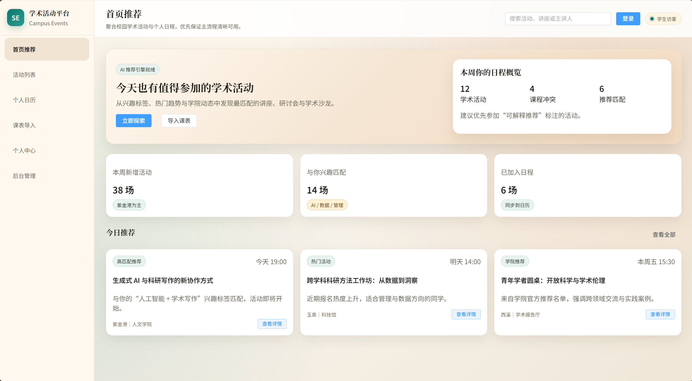

<center>图 3-0 应用外壳与导航结构原型图</center>

应用外壳关键区域：侧边栏导航（核心入口）、页头（标题与登录状态）、内容区（页面主体）。

为保证主流程连续性，导航与页面的跳转关系遵循“从列表/推荐进入详情，从详情回到日历或列表”的闭环：

首页推荐与活动列表均可进入活动详情，活动详情在加入日程成功后提供“前往日历”的快捷入口，日历页在点击活动类事件时也可回到活动详情，从而形成“发现—决策—安排—回看”的闭环路径。

#### 3.2.1 登录/注册页面设计

登录/注册页面以“统一入口完成登录”为目标，注册入口作为后续扩展位保留。页面核心元素包含用户名与密码输入框、登录/注册按钮，以及必填校验与失败提示；登录成功后跳转到首页推荐以进入主流程。交互上，未登录状态下页头应显示“登录”入口，登录成功后在本地保存 token 并刷新用户信息（用于显示角色与权限），登录失败时需输出明确原因（如账号密码错误或服务不可用），同时保留用户已输入的用户名以降低重复输入成本。

#### 3.2.2 用户主界面设计

用户主界面为学生端提供统一工作区，保证“浏览—检索—详情—日程”的路径顺畅。关键交互包括通过卡片进入详情、在详情页加入日程后提供一键跳转日历的入口，以及在课表导入完成后引导用户到日历查看。主界面状态提示以“轻提示”为主，例如在页头给出当前阶段说明，在页面空态处提供下一步建议（去检索、去导入课表或去日历查看），避免用大量弹窗打断浏览。

#### 3.2.3 活动列表页面设计

活动列表页面提供关键词检索、基础筛选与分页能力，目标是帮助用户在大量活动中快速定位目标活动。页面结构由筛选栏（关键词、校区等）、活动卡片列表与分页组件组成；卡片字段包含标题（可点击进入详情）、时间、地点（校区+场地）、标签与状态，并默认优先展示未结束活动。筛选与排序在第一阶段可逐步实现，关键词应覆盖标题、简介、地点等主要字段，常用筛选优先支持校区、类别、学院与时间范围，排序规则建议可配置为时间优先（按开始时间）、热门优先（按热度/报名数）与发布时间优先（按 created_at）。

分页展示统一遵循后端约定：`items/total/page/page_size`，以保证翻页时结果稳定。

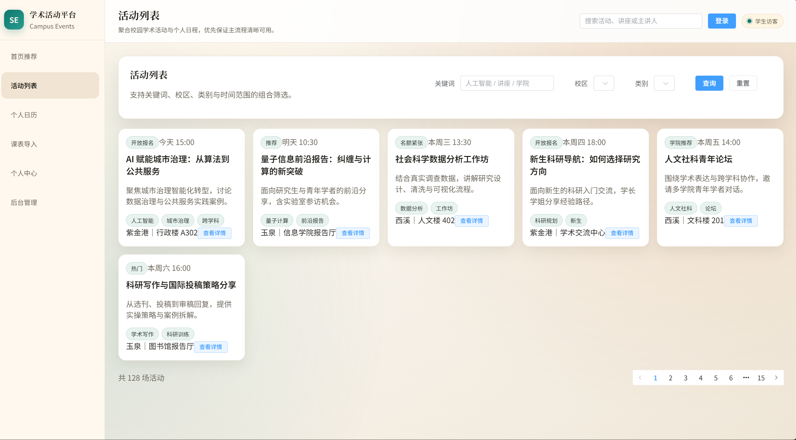

<center>图 3-1 活动列表页面原型图</center>

#### 3.2.4 活动详情页面设计

活动详情页面用于展示活动完整信息，并提供“检测冲突/加入日程”的关键操作入口。页面结构由标题与状态、关键信息（时间、地点、校区、标签等）、操作区（检测冲突、一键加入）与详情介绍构成，并约束已结束活动不允许加入日程；下架活动对普通用户不可见或需要提示“已下架”。详情页的信息组织强调“可行动信息”，时间与地点需在首屏可见区域展示以便快速决策，冲突检测结果以弹窗或抽屉呈现并包含冲突事件名称、时间段与类型等要素；对于无法加入的情况（已结束、已下架或权限不足），按钮应置灰并明确给出原因。

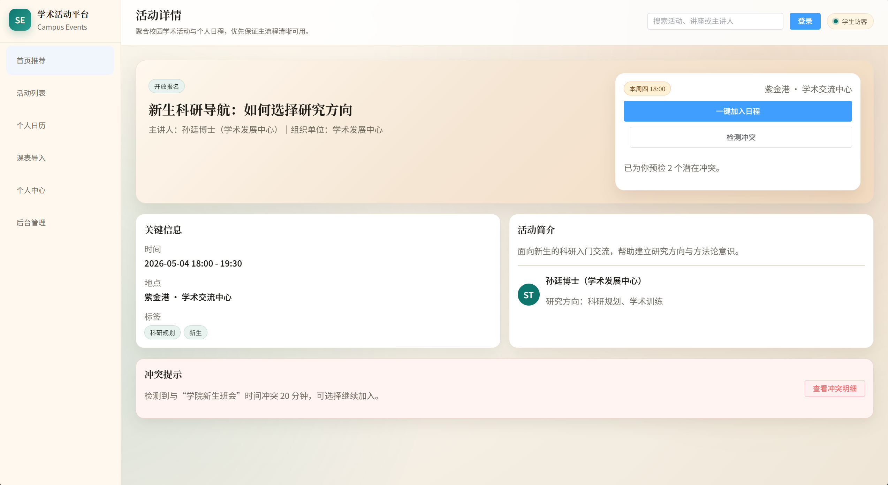

<center>图 3-4 活动详情页面原型图</center>

#### 3.2.5 日历页面设计

日历页面用于统一展示课程与活动，并提供冲突标识与 ICS 导出能力。页面结构由状态图例、日历主体（周/月或列表视图）与导出入口组成。事件展示与交互上，同一时间段内出现多个事件时需要优先突出冲突标识；点击事件可查看简要信息（标题、时间、地点、来源类型）并支持跳转到活动详情；当用户尚未导入课表时，日历页应提示先完成导入，以便开启可靠的冲突检测。

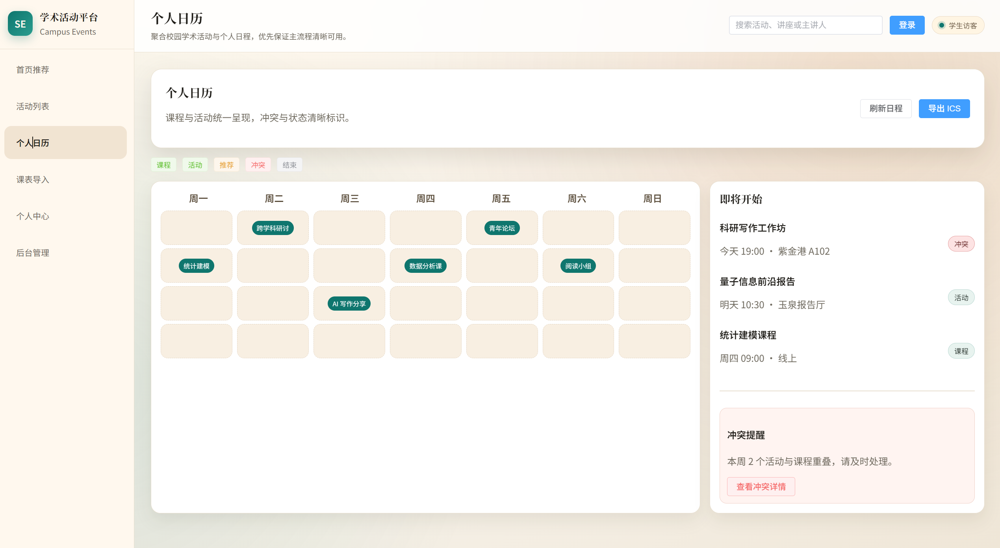

<center>图 3-2 个人日历页面原型图</center>


#### 3.2.6 课表导入页面设计

课表导入页面的目标是导入个人课表并生成课程事件，为后续冲突检测提供基础数据。导入方式以拖拽上传 CSV/Excel 为第一阶段优先方案，OCR 入口可作为后续扩展预留；导入完成后应提示用户前往日历查看结果。为降低导入失败率，导入页需要提供示例格式说明（如列名、时间格式、校区与地点字段），并在解析失败时尽量定位到具体错误行或字段，便于用户修正后重试。

#### 3.2.7 个人中心页面设计

个人中心页面用于展示用户信息，并提供兴趣标签入口以为推荐模块提供输入。页面结构由用户信息卡片与兴趣标签展示组成，兴趣标签编辑能力可作为后续迭代。兴趣标签同时承担解释推荐结果的作用，UI 上应提示“推荐理由来源于你的兴趣标签匹配”等信息，以提升推荐的可理解性与信任度。

#### 3.2.8 管理端页面设计

管理端页面面向管理员，用于维护活动数据并查看或触发爬虫记录。页面结构由快捷操作区（新增、触发爬虫、查看记录）、活动管理列表（含下架确认）与爬虫记录列表组成。活动新增与编辑表单建议包含标题、起止时间、校区、地点、学院或主办方、标签、状态（open/offline）与来源类型（manual/crawled）等字段，其中时间与标题必须为必填项，以避免出现无法检索与排序的“脏数据”。下架操作需要二次确认，并在列表中立即反映状态变化，从而保证前台展示与后台维护一致。

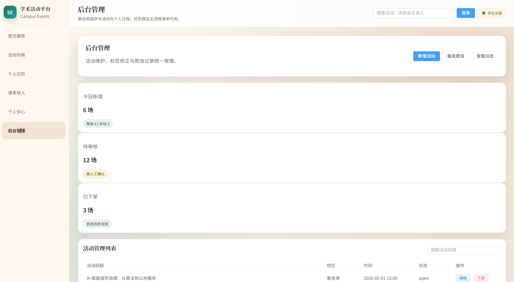

<center>图 3-3 管理端页面原型图</center>

### 3.3 日历视图与状态标识设计

日历视图的核心是“统一呈现课程与活动，并显著标识冲突与状态”。前端通过状态字段映射标签样式（与 Element Plus `el-tag` 类型一致）。

状态字段建议约定：`type`（course/activity），`status`（open/closed/conflict/offline 等）。其中 `offline` 与数据库 `activity.status` 含义一致；`closed` 通常由 `end_time < now` 计算得到的展示态。

状态标识的展示规则以“可解释”为先：冲突（conflict）必须显示原因摘要；已结束（closed）以弱化样式展示；下架（offline）在学生端默认不展示或提示不可用。

#### 3.3.1 课程事件展示

课程事件由课表导入生成，默认状态为 `open`；展示课程名、时间段与地点，确保时间位置准确。

#### 3.3.2 已加入活动展示

已加入日程的活动默认状态为 `open`；展示标题、起止时间与地点，点击可跳转活动详情。

#### 3.3.3 推荐活动展示

推荐活动可作为扩展：用于提示“尚未加入但可能感兴趣”的活动，展示标题与简短理由，点击进入详情。

#### 3.3.4 冲突活动展示

冲突事件使用 `conflict` 标识，并给出可解释的冲突原因摘要；点击可查看冲突明细（冲突事件与重叠时间段）。

#### 3.3.5 已结束活动展示

已结束活动使用 `closed` 弱化展示；默认不提供“加入日程”操作。

### 3.4 前后端交互页面说明

本节从 UI 视角说明关键页面与后端接口的对应关系，覆盖检索、详情、冲突检测、加入日程、课表导入与 ICS 导出等主流程。

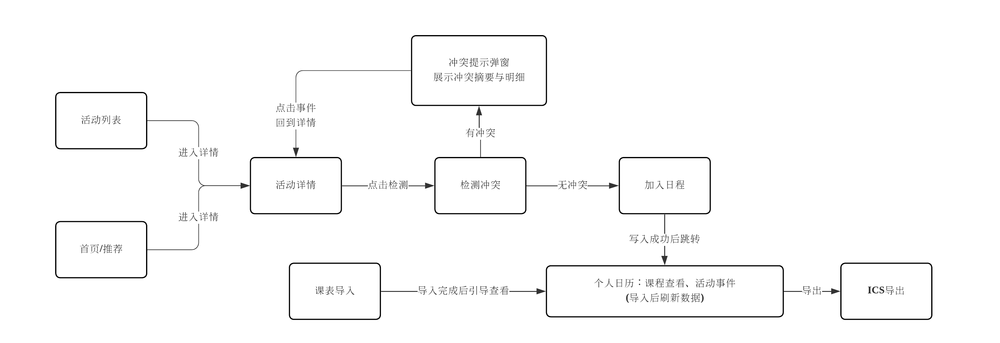

<center>图 3-4 UI 关键交互流程总览图</center>

所有页面请求统一遵循后端响应包装：当 `code != 0` 时前端展示 message，并在必要时提供重试与回退（例如回到列表页）。

#### 3.4.1 活动检索交互

活动检索交互由活动列表页触发，基本步骤为输入关键词与筛选条件后请求活动列表，随后渲染卡片与分页，并在翻页时保持筛选条件不变。该交互对应 `GET /api/v1/activities` 接口（查询参数包含 `page`、`page_size` 及筛选项）。前端在发起请求时需要保证筛选条件可追溯，分页切换时复用上一次筛选参数，刷新页面时可从路由 query 恢复当前筛选状态（第一阶段可先不做持久化）。异常处理上，空结果应展示空态引导，接口失败需要提示并提供重试。

#### 3.4.2 加入日程交互

加入日程交互由活动详情页触发，其目标是将活动写入日程并在日历页可见。交互步骤为在详情页点击加入后先检测冲突，无冲突则直接写入，有冲突则在用户确认后写入。对应接口包括 `GET /api/v1/activities/{id}`（获取活动详情）、`POST /api/v1/schedules/check-conflict`（检测活动与课程或日程冲突）以及 `POST /api/v1/schedules/add-activity`（将活动加入日程）。反馈策略上，成功需要提示并提供跳转日历的入口，失败需要提示原因并允许重试。为避免重复加入同一活动，可在详情页根据后端返回的报名或加入状态更新按钮文案（例如显示“已加入日程”），并在日历页同步展示。

#### 3.4.3 冲突提示交互

冲突提示交互由活动详情页（检测冲突按钮）与日历页（冲突标识）触发，目标是在写入前给出可解释的冲突详情。交互步骤为点击检测后请求冲突接口，再以弹窗展示摘要与明细，并由用户决定是否继续。该交互对应 `POST /api/v1/schedules/check-conflict` 接口。

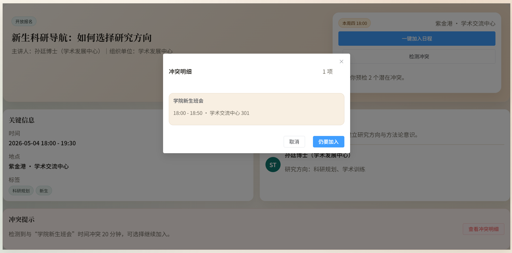

<center>图 3-5 冲突提示弹窗原型图</center>


#### 3.4.4 课表导入交互

课表导入交互由课表导入页触发，目标是导入课表并生成课程事件。交互步骤为上传文件后调用导入接口，展示导入结果摘要并引导前往日历查看。对应接口包括 `POST /api/v1/courses/import`（课表文件导入），以及可选的 `POST /api/v1/courses/ocr`（课表截图 OCR 导入）。导入成功后建议立即触发一次日历数据刷新，或提示用户点击刷新，以便尽快看到课程事件。

#### 3.4.5 ICS 导出交互

ICS 导出交互由个人日历页触发，目标是将用户日程导出为 ICS 文件。交互步骤为点击导出后调用导出接口并下载文件，并在下载完成后给出简单的导入提示。该交互对应 `GET /api/v1/schedules/export-ics` 接口。异常处理上，未登录、无内容与导出失败等情况均需要给出提示并允许重试。
