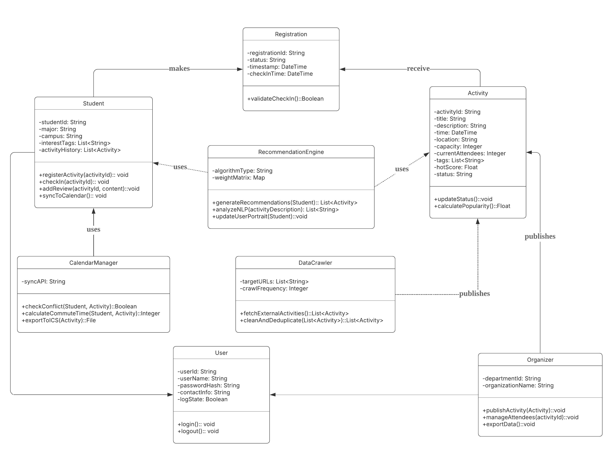
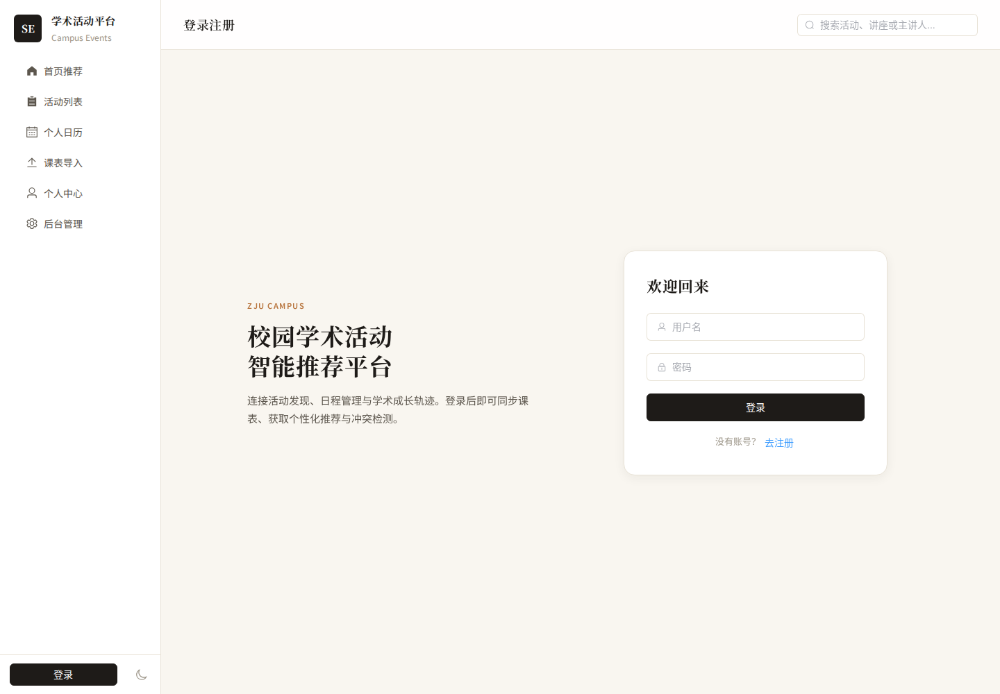
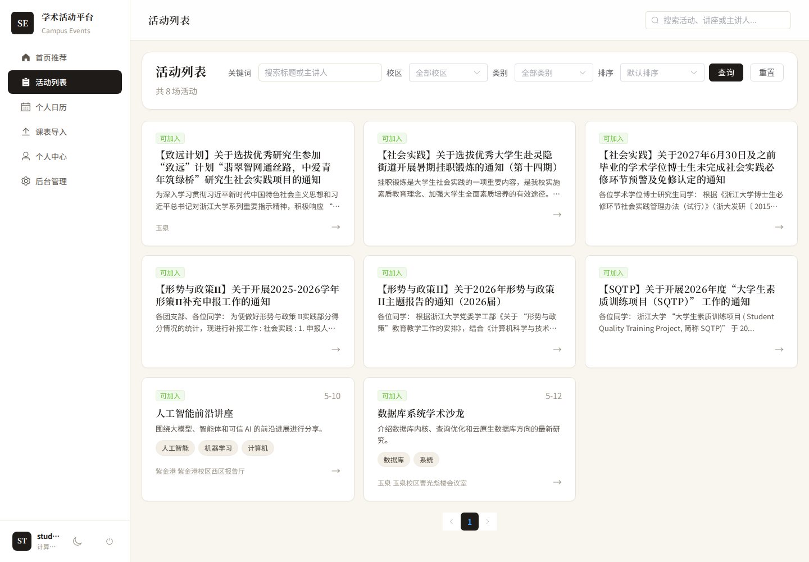
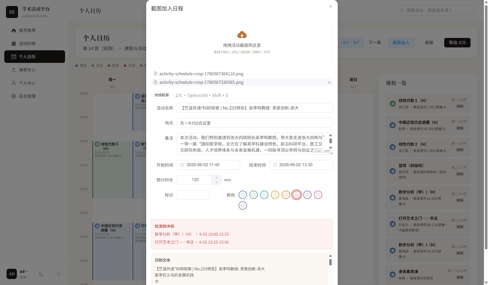
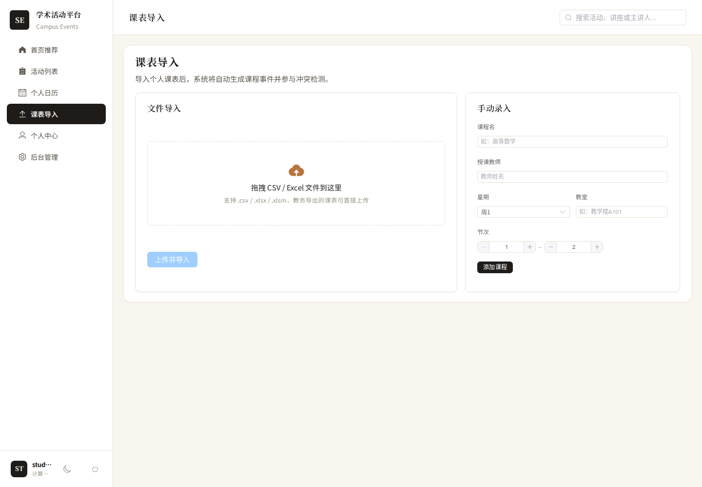
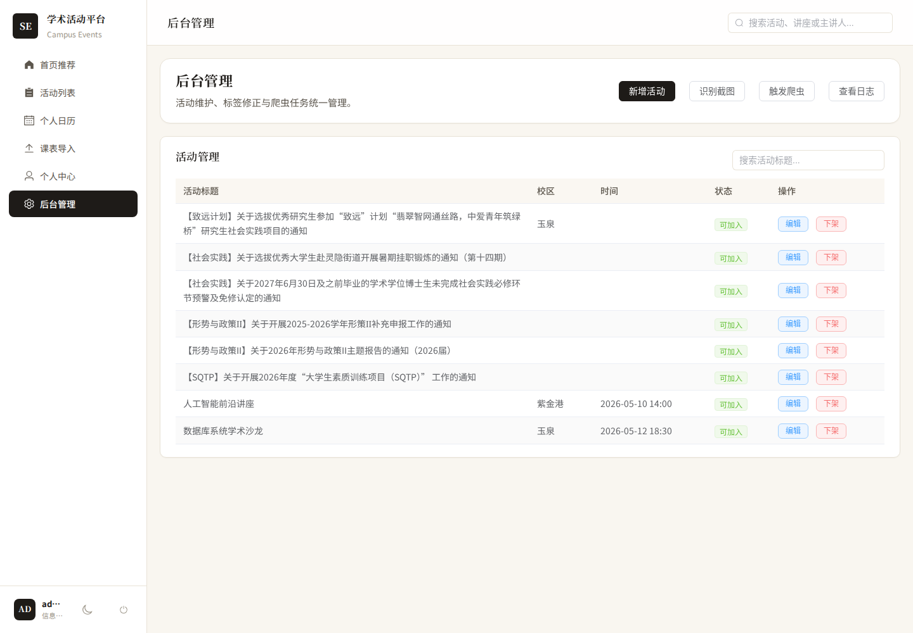

# 软件工程测试报告

项目名称：校园学术活动智能推荐平台  
报告版本：正式报告草稿 v2  
测试日期：2026-06-01  
测试分支：`test`  

---

## 1 引言

### 1.1 编写目的

本文档旨在对《校园学术活动智能推荐平台》当前实现版本的功能正确性、运行稳定性、界面可用性和课程验收可演示性进行说明和评价。

报告中的测试结论均以当前项目代码、自动化测试执行结果、Docker Compose 运行环境和手工页面检查结果为依据。

### 1.2 项目背景

校园内学术活动数量较多，活动信息分散在学院官网、通知页面和人工发布渠道中。学生在选择讲座、报告或学术交流活动时，往往需要同时考虑个人兴趣、活动时间、所在校区以及已有课程安排。若缺乏统一管理工具，容易出现活动信息遗漏、时间冲突和日程维护困难等问题。

本项目面向上述场景，构建一个校园学术活动智能推荐平台。系统围绕“活动聚合 - 浏览检索 - 个性化推荐 - 课表导入 - 冲突检测 - 日程管理 - 后台维护”形成闭环。用户可以浏览和搜索活动，导入课表，查看推荐活动，将活动加入个人日程；管理员可以维护活动信息、查看爬虫记录，并通过 OCR 辅助录入活动内容。

系统采用前后端分离架构。前端基于 Vue 3、Vite 和 Element Plus 实现页面展示与交互；后端基于 FastAPI、SQLAlchemy 和 MySQL 提供接口服务；开发、联调和测试统一使用 Docker Compose 环境。

### 1.3 术语定义

| 术语 | 说明 |
| --- | --- |
| 功能测试 | 根据系统需求和用户操作场景，验证各功能模块是否能够正常运行 |
| 功能验证测试 | 通过输入指定数据并比较预期输出与实际输出，判断系统功能是否符合设计 |
| 边界测试 | 验证系统在错误输入、空输入、非法权限、异常文件等边界情况下的处理能力 |
| 接口测试 | 直接调用后端 HTTP API，检查响应状态、统一响应格式和业务数据 |
| 压力测试 | 本报告中指课程项目尺度下的轻量重复请求稳定性测试 |
| 用户接口测试 | 对前端页面布局、操作入口、提示信息和页面跳转进行检查 |
| 个性化推荐 | 根据用户兴趣标签、活动热度、历史行为、时间和冲突情况计算推荐活动 |
| 冲突检测 | 判断课程、活动和自定义日程之间是否存在时间重叠 |
| OCR 识别 | 从活动海报或日程截图中提取文本，并尝试解析标题、时间、地点等字段 |
| 爬虫 | 从学院官网抓取学术活动信息并写入系统数据库 |
| ICS 导出 | 将用户日程导出为标准日历文件，便于导入其他日历工具 |

### 1.4 参考资料

- 《软件设计文档国家标准》
- 《软件工程项目开发文档范例》
- 《Software Requirements edition2》Karl E. Wiegers
- 《软件需求》刘伟琴、刘洪涛 译


---

## 2 测试概要

结合前期总体设计报告、接口文档和当前系统实现情况，本轮测试从功能测试、功能验证测试、边界测试、轻量压力测试和用户接口测试几个方面进行。

### 2.1 测试目标

本轮测试目标如下：

- 验证登录注册、权限控制、活动浏览、个性化推荐、课表导入、日程管理、后台维护、OCR 和爬虫等核心功能是否可用。
- 验证后端接口是否满足统一响应格式，关键数据是否能够正确写入和读取。
- 验证课程和活动时间冲突检测、强制加入、ICS 导出等闭环流程是否正确。
- 验证典型边界场景下系统是否能返回合理错误提示或业务错误码。
- 验证前端项目能够正常构建，关键页面能够打开并支持基本操作。
- 记录已发现问题和外部依赖风险，为后续修复和报告答辩提供依据。

### 2.2 测试范围

本报告覆盖的测试范围如下：

| 测试项目名称 | 测试目的 | 测试内容 |
| --- | --- | --- |
| 功能测试 | 针对具体实现测试各模块功能是否正常 | 用户与权限、活动、推荐、课程、日程、后台、OCR、爬虫 |
| 功能验证测试 | 利用黑盒测试方式验证系统功能是否按预期执行 | 登录、注册、搜索筛选、活动详情、推荐、课表导入、冲突检测、后台管理 |
| 边界测试 | 测试程序对异常输入和边界条件是否正确处理 | 错误密码、重复用户名、非法分页、空文件、缺失表头、冲突日程、OCR 缺失文件 |
| 压力测试 | 在课程项目尺度下验证关键接口连续调用时的稳定性 | 登录、活动查询、推荐查询、日程查询、ICS 导出、后台统计 |
| 用户接口测试 | 测试用户能否通过网页界面完成主要操作 | 登录界面、首页推荐、活动列表、活动详情、课表导入、日历、后台管理 |

本轮测试不覆盖生产级大规模并发压测、跨浏览器兼容性全面测试、长期真实用户推荐效果评估和部署到公网后的安全扫描。

### 2.3 测试方法

| 测试方法 | 使用方式 |
| --- | --- |
| 自动化接口测试 | 使用 pytest 和 FastAPI TestClient 调用后端接口，检查状态码、响应结构和业务数据 |
| 服务层测试 | 对 OCR 解析、课程时间展开、推荐规则、冲突检测等核心逻辑进行直接验证 |
| 前后端联调测试 | 在 Docker Compose 环境中启动前端、后端和数据库，检查页面与接口可访问性 |
| 真实联网测试 | 运行 CS ZJU 爬虫，验证当前网络环境下能否访问官网并写入抓取记录 |
| 前端构建验证 | 执行 `npm run build`，验证前端项目能够完成生产构建 |
| 用户接口测试 | 打开关键页面，记录页面截图和基本操作结果 |

### 2.4 测试环境与工具

| 项目 | 内容 |
| --- | --- |
| 操作环境 | 本地开发机，Docker Compose 统一启动服务 |
| 后端框架 | FastAPI、Pydantic、SQLAlchemy、PyMySQL |
| 前端框架 | Vue 3、Vite、Element Plus、Vue Router、Pinia、Axios |
| 数据库 | MySQL 8.0；自动化测试中使用独立测试数据库环境 |
| 测试框架 | pytest、FastAPI TestClient |
| 构建工具 | Vite、npm |
| 爬虫工具 | requests、BeautifulSoup4 |
| OCR 相关 | Tesseract OCR / ImageMagick 环境，接口测试中使用 mock 方式稳定验证 |
| 页面证据 | 关键页面截图，保存在 `docs/测试文档/screenshots/` |

本轮后端自动化测试执行结果为：

```text
69 passed, 318 warnings in 13.47s
```

其中 `69 passed` 表示 pytest 收集到的 69 个测试用例全部通过；`318 warnings` 为框架或依赖库运行时警告，不表示测试失败，未影响本轮功能验证结论。

### 2.5 测试数据

测试数据主要来自三部分：

- `database/seed.sql` 中的初始化用户、活动、兴趣标签和课程数据。
- 自动化测试脚本中构造的课程、活动、日程、OCR 文本和爬虫记录数据。
- 真实联网爬虫从 `http://cspo.zju.edu.cn/27181/list.htm` 抓取的活动信息。


当前登录功能只要用户数据已经存在于数据库中，并且密码哈希能够通过校验，就可以正常登录。系统也提供注册接口，可以新增普通学生账号，新增账号注册后同样可以用于普通用户侧功能测试。管理员账号目前主要依赖预置数据或后台数据准备，不通过普通注册接口创建。

### 2.6 测试覆盖概览

| 模块 | 主要接口/功能 | 自动化测试 | 页面/联调测试 | 结论 |
| --- | --- | --- | --- | --- |
| 登录注册与权限 | 登录、注册、当前用户、后台权限 | 已覆盖 | 登录页已截图 | 通过 |
| 活动浏览与交互 | 活动列表、详情、筛选、交互记录 | 已覆盖 | 活动列表和详情页已截图 | 通过 |
| 个性化推荐 | 通用推荐、登录推荐、后台预览 | 已覆盖 | 首页推荐已截图 | 通过 |
| 课表与课程 | 新增课程、课程查询、CSV/XLSX 导入、删除 | 已覆盖 | 课表导入页已截图 | 通过 |
| 日程与冲突 | 日程查询、冲突检测、强制加入、ICS 导出 | 已覆盖 | 日历页已截图 | 通过 |
| 后台管理 | 新增、编辑、下架活动、统计 | 已覆盖 | 后台页已截图 | 通过 |
| OCR | 文本解析、接口预览、异常文件 | 已覆盖 | 后台入口已截图 | 通过，有环境依赖 |
| 爬虫 | mock 接口、真实联网抓取、记录查询 | 已覆盖/已联调 | 后台入口已截图 | 功能通过，存在权限风险 |

---

## 3 面向对象测试

### 3.1 系统整体架构

系统主要由前端页面层、前端 API 封装层、后端路由层、业务服务层、ORM 模型层、数据库层、OCR 服务和爬虫服务组成。



前端页面负责用户交互，API 封装层负责向后端发送请求；后端路由层接收参数并进行权限校验，Service 层完成活动筛选、推荐计算、课程导入、冲突检测等核心逻辑；ORM 模型负责与数据库表结构保持一致；OCR 和爬虫服务作为外部能力接入系统。

面向对象测试重点检查各层之间的职责是否清晰、数据模型是否一致、接口返回是否符合约定，以及各业务对象在协作时能否完成用户预期操作。

### 3.2 具体类测试

### 3.2.1 单元测试

| 测试对象 | 测试内容 | 测试结果 |
| --- | --- | --- |
| 用户与权限对象 | 登录后生成 token，获取当前用户，普通用户访问后台接口被拒绝 | 通过 |
| 活动对象 | 活动列表、活动详情、标签筛选、来源类型、状态字段读取 | 通过 |
| 推荐服务对象 | 兴趣标签、历史行为、活动热度、学院相关性、冲突惩罚计算 | 通过 |
| 课程服务对象 | 节次时间映射、周次展开、单双周、春夏学期、课程删除范围 | 通过 |
| 日程服务对象 | 日程查询、冲突检测、强制加入、颜色和备注更新、ICS 导出 | 通过 |
| OCR 服务对象 | 中文标签解析、日期时间解析、地点提取、竖排文本处理、多图合并 | 通过 |
| 爬虫服务对象 | 指定来源抓取、活动过滤、记录写入、不支持来源处理 | 通过 |
| 数据库访问对象 | 活动、用户、课程、日程、爬虫记录等字段读写 | 通过 |

### 3.2.2 类模型一致性测试

| 模型或服务 | 一致性检查内容 | 测试结果 |
| --- | --- | --- |
| `user` | 用户名、密码、角色、学院、专业等字段与登录和权限逻辑一致 | 通过 |
| `activity` | `hot_score`、`status`、`source_type`、时间、地点、校区等字段与接口返回一致 | 通过 |
| `activity_tag` | 活动标签与活动筛选、推荐标签匹配逻辑一致 | 通过 |
| `course_schedule` | 星期、节次、周次、地点、教师等字段能够展开为日历事件 | 通过 |
| `schedule_event` | 活动日程、课程日程、自定义日程能够统一展示和导出 | 通过 |
| `crawl_record` | 爬虫来源、状态、抓取数量、成功数量、错误信息能够保存和查询 | 通过 |

### 3.2.3 数据模型与接口一致性测试

系统后端接口统一返回如下结构：

```json
{
  "code": 0,
  "message": "success",
  "data": {}
}
```

本轮测试对登录、活动、推荐、课程、日程、后台、OCR 和爬虫接口进行了响应结构检查。结果表明，主要接口能够按照统一响应格式返回数据，分页接口能够返回 `items`、`total`、`page`、`page_size` 等字段，活动和日程相关字段能够与数据库模型保持一致。

---

## 4 功能验证测试

本章主要针对系统各项基本功能分模块进行测试。每个测试点均给出输入、预期输出和实际输出，用以判断当前实现是否符合设计目标。

### 4.1 登录注册与权限模块

| 功能名称 | 输入 | 预期输出 | 实际输出 |
| --- | --- | --- | --- |
| 正常登录 | 输入 `student001 / 123456` | 登录成功，返回 token 和用户信息 | 与预期输出相符 |
| 错误密码登录 | 输入正确用户名和错误密码 | 返回登录失败提示 | 与预期输出相符 |
| 获取当前用户 | 携带学生 token 请求当前用户接口 | 返回当前用户账号和角色信息 | 与预期输出相符 |
| 用户注册 | 输入未被占用的用户名、密码和基础信息 | 注册成功，数据库新增用户 | 与预期输出相符 |
| 重复用户名注册 | 输入已存在用户名 | 返回注册失败提示 | 与预期输出相符 |
| 管理员权限访问 | 管理员 token 请求后台统计或活动管理接口 | 返回后台数据或操作成功 | 与预期输出相符 |
| 普通用户访问后台 | 学生 token 请求后台接口 | 返回权限不足 | 与预期输出相符 |

经过测试，登录注册和主要权限控制功能正常，能够区分普通用户与管理员用户。

### 4.2 活动浏览、筛选与交互模块

| 功能名称 | 输入 | 预期输出 | 实际输出 |
| --- | --- | --- | --- |
| 活动列表查询 | 请求活动列表第一页 | 返回活动分页数据 | 与预期输出相符 |
| 活动详情查询 | 输入存在的活动 ID | 返回该活动的标题、时间、地点、标签等信息 | 与预期输出相符 |
| 关键词搜索 | 输入活动标题或相关关键词 | 返回匹配活动 | 与预期输出相符 |
| 分类、校区、标签筛选 | 输入分类、校区和标签条件 | 返回符合条件的活动列表 | 与预期输出相符 |
| 筛选项查询 | 请求活动筛选选项 | 返回可用分类、校区、标签等字段 | 与预期输出相符 |
| 匿名交互记录 | 未登录状态下访问活动交互接口 | 接口正常返回，不写入用户行为 | 与预期输出相符 |
| 登录用户交互记录 | 登录用户点击或查看活动 | 行为记录写入，后续可用于推荐 | 与预期输出相符 |

经过测试，活动列表、详情、筛选和交互记录能够正常工作，支持用户从活动列表进入活动详情页。

### 4.3 个性化推荐模块

| 功能名称 | 输入 | 预期输出 | 实际输出 |
| --- | --- | --- | --- |
| 未登录推荐 | 未携带 token 请求推荐接口 | 返回通用排序活动 | 与预期输出相符 |
| 登录用户推荐 | 学生用户携带 token 请求推荐接口 | 根据兴趣和行为返回推荐列表 | 与预期输出相符 |
| 兴趣标签加权 | 用户兴趣标签与活动标签匹配 | 匹配活动推荐分提高 | 与预期输出相符 |
| 历史行为加权 | 用户曾浏览或点击相似活动 | 相关活动推荐分提高 | 与预期输出相符 |
| 冲突活动惩罚 | 活动与用户课程或日程冲突 | 推荐结果中体现冲突提示或分数惩罚 | 与预期输出相符 |
| 推荐数量边界 | 输入非法或过大的推荐数量参数 | 返回校验错误或限制后的结果 | 与预期输出相符 |
| 后台推荐预览 | 管理员请求指定用户推荐预览 | 返回该用户的推荐结果 | 与预期输出相符 |

经过测试，推荐模块能够根据规则生成可解释的推荐结果。但推荐质量仍依赖后续真实用户兴趣和行为数据积累。

### 4.4 课表导入与课程管理模块

| 功能名称 | 输入 | 预期输出 | 实际输出 |
| --- | --- | --- | --- |
| 手动新增课程 | 输入课程名称、星期、节次、周次、地点 | 新增课程成功，并同步形成日程事件 | 与预期输出相符 |
| 查询课程 | 请求当前用户课程列表 | 返回已创建或导入的课程 | 与预期输出相符 |
| CSV 课表导入 | 上传符合字段要求的 CSV 文件 | 返回导入成功数量和课程数据 | 与预期输出相符 |
| 浙大教务格式导入 | 上传仿真教务导出格式文件 | 系统解析课程、周次和节次 | 与预期输出相符 |
| XLSX 文件导入 | 上传符合格式的 XLSX 文件 | 成功导入课程 | 与预期输出相符 |
| 删除单次课程 | 指定课程和 occurrence_start 删除 | 仅删除对应周次课程 | 与预期输出相符 |
| 按天或全部删除课程 | 使用 `day` 或 `all` 范围删除 | 删除对应范围内课程事件 | 与预期输出相符 |

经过测试，课程新增、查询、导入和删除功能可用，能够支撑后续日程冲突检测。

### 4.5 日程管理、冲突检测与 ICS 导出模块

| 功能名称 | 输入 | 预期输出 | 实际输出 |
| --- | --- | --- | --- |
| 日程查询 | 请求指定日期范围日程 | 返回课程、活动和自定义日程 | 与预期输出相符 |
| 课程展开 | 输入包含周次和单双周的课程 | 在对应教学周展开为日程事件 | 与预期输出相符 |
| 活动冲突检测 | 添加与课程时间重叠的活动 | 返回冲突提示 | 与预期输出相符 |
| 冲突活动未强制加入 | 不带 `force_add` 添加冲突活动 | 拒绝加入并返回冲突信息 | 与预期输出相符 |
| 冲突活动强制加入 | 带 `force_add=true` 添加冲突活动 | 活动写入个人日程 | 与预期输出相符 |
| 自定义日程添加 | 输入自定义活动文本或识别结果 | 写入日程或返回冲突预览 | 与预期输出相符 |
| 日程外观更新 | 修改颜色、标识或备注 | 日程显示属性更新 | 与预期输出相符 |
| ICS 导出 | 请求导出个人日程 | 返回标准日历文件内容 | 与预期输出相符 |

经过测试，课表、活动和日程之间已经形成完整闭环，冲突检测和强制加入逻辑能够正常运行。

### 4.6 后台管理模块

| 功能名称 | 输入 | 预期输出 | 实际输出 |
| --- | --- | --- | --- |
| 新增活动 | 管理员输入活动标题、时间、地点、标签等信息 | 新增活动成功，列表可查询 | 与预期输出相符 |
| 编辑活动 | 管理员修改已有活动字段 | 更新后详情页显示新数据 | 与预期输出相符 |
| 下架活动 | 管理员下架指定活动 | 活动状态变为 offline | 与预期输出相符 |
| 后台统计 | 管理员访问统计接口 | 返回活动、用户、课程等统计信息 | 与预期输出相符 |
| 非管理员访问后台 | 普通用户请求后台管理接口 | 返回 403 或权限错误 | 与预期输出相符 |

经过测试，后台活动维护功能能够满足基本管理需求。普通用户访问多数后台接口会被后端拒绝。

### 4.7 OCR 识别与爬虫模块

| 功能名称 | 输入 | 预期输出 | 实际输出 |
| --- | --- | --- | --- |
| 管理员活动截图识别 | 上传活动海报或 mock 图片文件 | 返回识别文本和活动字段预览 | 与预期输出相符 |
| 日程截图识别 | 普通用户上传日程截图 | 返回预览事件和冲突信息 | 与预期输出相符 |
| OCR 文本解析 | 输入包含标题、日期、时间、地点的文本 | 提取活动关键字段 | 与预期输出相符 |
| OCR 缺失文件 | 不上传文件调用识别接口 | 返回缺失文件错误 | 与预期输出相符 |
| mock 爬虫运行 | 使用 mock 方式运行爬虫接口 | 返回抓取成功和写入数量 | 与预期输出相符 |
| 不支持爬虫来源 | 输入未知 source | 返回不支持来源错误 | 与预期输出相符 |
| 查询爬虫记录 | 请求爬虫记录列表 | 返回历史抓取记录 | 与预期输出相符 |
| 真实 CS ZJU 抓取 | 访问 `http://cspo.zju.edu.cn/27181/list.htm` | 抓取官网活动并写入数据库 | 与预期输出相符 |

经过测试，OCR 接口和解析逻辑基本符合设计需求，爬虫在当前网络环境下能够真实访问浙江大学计算机学院相关官网页面并抓取活动数据。但 OCR 真实识别质量受图片清晰度影响，爬虫也受目标网站结构和网络状态影响。

---

## 5 边界测试

本章针对系统主要模块的异常输入和边界条件进行测试，以验证系统鲁棒性。

### 5.1 登录注册与权限边界测试

| 功能名称 | 输入 | 预期输出 | 实际输出 |
| --- | --- | --- | --- |
| 登录失败 | 错误密码 | 返回登录失败提示 | 与预期输出相符 |
| 缺少 token | 未携带 token 请求当前用户接口 | 返回未认证错误 | 与预期输出相符 |
| 重复注册 | 使用已存在用户名注册 | 返回用户名重复或注册失败提示 | 与预期输出相符 |
| 权限不足 | 普通用户请求管理员接口 | 返回权限不足 | 与预期输出相符 |

### 5.2 活动检索与筛选边界测试

| 功能名称 | 输入 | 预期输出 | 实际输出 |
| --- | --- | --- | --- |
| 无结果搜索 | 输入不存在的关键词 | 返回空列表，接口成功 | 与预期输出相符 |
| 非法分页 | 输入非法 page 或 page_size | 返回参数校验错误 | 与预期输出相符 |
| 不存在活动 | 查询不存在的活动 ID | 返回活动不存在或业务错误 | 与预期输出相符 |
| 组合筛选无结果 | 输入互相不匹配的筛选条件 | 返回空列表 | 与预期输出相符 |

### 5.3 课表导入边界测试

| 功能名称 | 输入 | 预期输出 | 实际输出 |
| --- | --- | --- | --- |
| 空文件导入 | 上传空课表文件 | 返回文件为空或无有效课程提示 | 与预期输出相符 |
| 缺失表头 | 上传缺少必要字段的 CSV | 返回缺失字段说明和示例 | 与预期输出相符 |
| 旧版 xls 文件 | 上传不支持的旧版 `.xls` 文件 | 返回不支持格式提示 | 与预期输出相符 |
| 周次边界 | 输入单双周、春夏学期、默认 16 周数据 | 按规则正确展开 | 与预期输出相符 |

### 5.4 日程与冲突检测边界测试

| 功能名称 | 输入 | 预期输出 | 实际输出 |
| --- | --- | --- | --- |
| 冲突未强制加入 | 添加与课程冲突的活动且不带 force | 返回冲突信息，不写入活动 | 与预期输出相符 |
| 冲突强制加入 | 添加冲突活动并带 `force_add=true` | 写入活动日程 | 与预期输出相符 |
| 删除不存在范围 | 删除指定周次或范围外课程 | 不影响其他课程事件 | 与预期输出相符 |
| 课程标题兼容 | 旧版课程事件标题带后缀 | 系统仍可识别对应课程 | 与预期输出相符 |

### 5.5 OCR 识别边界测试

| 功能名称 | 输入 | 预期输出 | 实际输出 |
| --- | --- | --- | --- |
| 缺失文件 | 未上传图片调用 OCR 接口 | 返回文件缺失错误 | 与预期输出相符 |
| 多图数量限制 | 上传超过 5 张图片 | 返回数量限制错误 | 与预期输出相符 |
| 缺失结束时间 | OCR 文本只有开始时间 | 保留可解析字段，不强行生成错误时间 | 与预期输出相符 |
| 竖排标题 | 输入竖排或分散标题文本 | 重建标题候选文本 | 与预期输出相符 |

### 5.6 后台与爬虫边界测试

| 功能名称 | 输入 | 预期输出 | 实际输出 |
| --- | --- | --- | --- |
| 编辑不存在活动 | 管理员编辑不存在活动 ID | 返回业务错误 | 与预期输出相符 |
| 下架不存在活动 | 管理员下架不存在活动 ID | 返回业务错误 | 与预期输出相符 |
| 不支持爬虫来源 | 输入未知 source | 返回不支持来源错误 | 与预期输出相符 |
| 爬虫权限检查 | 未登录或普通用户访问 `/api/v1/admin/crawler/*` | 理论上应拒绝访问 | 与预期有差距，当前存在权限风险 |

边界测试结果表明，绝大部分异常输入能够被系统正确处理。已确认的主要问题是爬虫相关接口位于 `/admin` 路径下，但当前权限保护不完整，需要后续修复。

---

## 6 压力测试

### 6.1 测试目标与方法

测试方法是在测试环境下对关键接口进行重复请求，观察接口返回结构和业务状态是否保持稳定。

### 6.2 登录与活动查询压力测试

| 功能名称 | 输入 | 输出 |
| --- | --- | --- |
| 登录 | 连续使用测试账号正常登录 | 系统运行正常 |
| 当前用户查询 | 连续携带 token 查询当前用户 | 系统运行正常 |
| 活动列表查询 | 连续请求活动列表接口 | 系统运行正常 |
| 活动详情查询 | 连续请求活动详情接口 | 系统运行正常 |

### 6.3 推荐、日程与导出压力测试

| 功能名称 | 输入 | 输出 |
| --- | --- | --- |
| 推荐查询 | 连续请求推荐接口 | 系统运行正常 |
| 日程查询 | 连续请求个人日程接口 | 系统运行正常 |
| 冲突检测 | 多次检查活动与课程冲突 | 系统运行正常 |
| ICS 导出 | 连续请求日程导出接口 | 系统运行正常 |

### 6.4 后台与导入功能稳定性测试

| 功能名称 | 输入 | 输出 |
| --- | --- | --- |
| 后台统计 | 管理员连续请求统计接口 | 系统运行正常 |
| 活动维护 | 管理员新增、编辑、下架测试活动 | 系统运行正常 |
| 课表导入 | 上传符合格式的课表文件 | 系统运行正常 |
| 爬虫记录查询 | 查询爬虫历史记录 | 系统运行正常 |

### 6.5 压力测试结果分析

在本地 Docker Compose 环境和课程验收规模下，登录、活动查询、推荐、日程查询、ICS 导出和后台统计等关键接口表现稳定，未出现连续调用导致的接口结构异常或服务中断。


---

## 7 用户接口测试

本章主要针对系统内的几个关键网页进行用户接口测试，用于检查用户能否通过页面顺利完成常见操作。测试方式为打开运行中的前端页面，结合已有截图和接口结果记录实际操作情况。

### 7.1 登录界面

界面截图见附录 D“登录页”。

| 功能名称 | 预期操作 | 实际操作 |
| --- | --- | --- |
| 输入用户名和密码 | 用户能够方便地找到输入框并输入账号信息 | 与预期相符 |
| 登录成功提示 | 正确账号登录后进入系统首页 | 与预期相符 |
| 登录失败提示 | 错误密码登录时显示失败提示 | 与预期相符 |

### 7.2 首页推荐界面

界面截图见附录 D“首页推荐”。

| 功能名称 | 预期操作 | 实际操作 |
| --- | --- | --- |
| 查看推荐活动 | 用户能够在首页看到推荐活动列表 | 与预期相符 |
| 查看活动摘要 | 用户能够看到活动标题、时间、地点等摘要信息 | 与预期相符 |
| 进入活动详情 | 点击推荐活动可进入详情页面 | 与预期相符 |

### 7.3 活动列表界面

界面截图见附录 D“活动列表”。

| 功能名称 | 预期操作 | 实际操作 |
| --- | --- | --- |
| 搜索活动 | 用户能够输入关键词并查看匹配结果 | 与预期相符 |
| 筛选活动 | 用户能够按分类、校区或标签筛选活动 | 与预期相符 |
| 进入详情 | 用户能够从列表点击进入活动详情 | 与预期相符 |

### 7.4 活动详情界面

界面截图和加入日程操作截图见附录 D“活动详情”和“加入日程操作”。加入日程截图展示了用户在活动详情页执行“加入日程”操作后的界面状态，用于说明活动详情、日程写入和冲突检测流程之间的衔接。结合后端接口测试结果，可以验证活动能够从详情页进入个人日程管理流程；当活动与已有课程或日程冲突时，系统会返回冲突信息并要求用户确认是否强制加入。

| 功能名称 | 预期操作 | 实际操作 |
| --- | --- | --- |
| 查看活动信息 | 用户能够查看活动标题、时间、地点和简介 | 与预期相符 |
| 加入个人日程 | 用户能够找到加入日程入口 | 与预期相符 |
| 冲突提示 | 活动与课程冲突时应提示用户 | 接口测试已验证，页面可继续补充人工截图 |

### 7.5 课表导入界面

界面截图见附录 D“课表导入”。

| 功能名称 | 预期操作 | 实际操作 |
| --- | --- | --- |
| 上传课表文件 | 用户能够找到文件上传入口 | 与预期相符 |
| 查看导入结果 | 文件导入后显示导入成功或错误摘要 | 接口测试已验证 |
| 手动录入课程 | 用户能够进入手动录入课程流程 | 与预期相符 |

### 7.6 日历界面

界面截图见附录 D“日历页面”。

| 功能名称 | 预期操作 | 实际操作 |
| --- | --- | --- |
| 查看课程和活动 | 用户能够在日历中查看课程和活动安排 | 与预期相符 |
| 编辑或删除日程 | 用户能够找到日程编辑或删除入口 | 与预期相符 |
| 导出日历 | 用户能够找到 ICS 导出入口 | 接口测试已验证 |

### 7.7 后台管理界面

界面截图见附录 D“后台管理”。

| 功能名称 | 预期操作 | 实际操作 |
| --- | --- | --- |
| 新增和编辑活动 | 管理员能够找到新增、编辑活动入口 | 与预期相符 |
| 下架活动 | 管理员能够对活动进行下架操作 | 接口测试已验证 |
| 查看爬虫记录 | 管理员能够查看爬虫运行记录入口 | 与预期相符 |
| 普通用户访问后台 | 普通用户不应拥有后台操作权限 | 后端多数接口会拒绝，但前端路由仍可进一步优化 |

---

## 8 对软件功能的结论

### 8.1 登录注册与权限模块

该模块实现了用户登录、注册、当前用户信息查询和管理员权限控制等功能。经过测试，普通用户和管理员能够被正确区分，大部分后台接口能够拒绝普通用户访问。该模块功能基本正常，在课程项目规模下具有较好的稳定性。

### 8.2 活动与推荐模块

该模块实现了活动列表、活动详情、关键词搜索、条件筛选、用户交互记录和个性化推荐功能。经过测试，活动信息能够正常展示，推荐结果能够根据兴趣标签、历史行为和时间冲突等规则生成。该模块功能正常，但推荐质量仍依赖后续真实用户行为数据积累。

### 8.3 课表与日程模块

该模块实现了课表导入、课程展开、日程查询、活动加入日程、冲突检测、强制加入、日程外观编辑和 ICS 导出功能。经过测试，该模块已经形成较完整的业务闭环，能够支撑学生在选择活动时避开课程冲突，也能够将活动安排纳入个人日程。

### 8.4 后台、OCR 与爬虫模块

后台模块实现了活动新增、编辑、下架和统计等管理功能。OCR 模块能够从图片或文本中提取活动信息并进行结构化解析，适合辅助录入。爬虫模块能够在当前环境下真实访问浙江大学计算机学院相关官网页面并写入抓取记录。经过测试，上述功能具备演示价值，但 OCR 和爬虫均存在外部环境依赖，爬虫相关后台接口还存在权限保护不足的问题。

---

## 9 分析摘要

### 9.1 能力

经过上述面向对象测试、功能验证测试、边界测试、轻量压力测试和用户接口测试，本系统的大部分预定功能已经得到实现，并能够围绕校园学术活动推荐场景形成完整主流程。

系统当前具备以下能力：

- 用户登录、注册和基础权限控制能力。
- 活动聚合、浏览、搜索、筛选和详情展示能力。
- 基于规则的个性化推荐能力。
- 课表导入、课程展开和个人日程管理能力。
- 活动与课程时间冲突检测能力。
- 管理员活动维护和后台统计能力。
- OCR 辅助录入和真实官网爬虫抓取能力。
- 自动化测试、前端构建和 Docker Compose 联调能力。

### 9.2 限制

本系统当前仍存在以下限制：

- OCR 识别效果受图片清晰度、文字方向和本地 OCR 环境影响。
- 爬虫运行依赖目标网站结构和网络环境，若官网结构变化，需要同步调整解析逻辑。
- 个性化推荐规则可验证，但缺少长期真实用户行为数据，因此无法充分评估推荐质量。

关于风险与改进建议我们汇总如下，用于项目最后阶段完善参照：

| 编号 | 风险或缺陷 | 当前状态 | 改进计划 |
| --- | --- | --- | --- |
| DEF-001 | `/api/v1/admin/crawler/run` 和 `/api/v1/admin/crawler/records` 缺少完整管理员权限保护 | 已确认，未修复 | 将爬虫路由挂载管理员权限依赖，或并入 admin router 统一管理 |
| RISK-001 | OCR 识别受图片质量和环境影响 | 已记录 | 演示时准备清晰样例，并保留人工校验 |
| RISK-002 | 爬虫受官网结构和网络影响 | 当前环境验证通过 | 保留 mock 测试作为回归测试，真实爬虫作为环境相关测试 |
| RISK-003 | 推荐质量缺少长期评估 | 已记录 | 后续积累真实用户行为数据后再进行推荐效果评估 |
| RISK-004 | 前端构建主包较大 | 构建通过但有警告 | 后续使用按需加载或 manualChunks 优化 |

---

## 10 测试资源消耗


本轮测试由小组成员围绕功能验证、边界情况、轻量稳定性和用户接口展示等方面展开，主要完成了测试用例整理、自动化测试执行、前端构建验证、运行态接口抽查、页面截图留存和测试报告撰写等工作。


### 10.1 环境与工具资源

| 类型 | 使用资源 |
| --- | --- |
| 开发与测试环境 | Docker Compose、本地开发机 |
| 后端运行环境 | FastAPI、Uvicorn、Python 3.10+ |
| 前端运行环境 | Vue 3、Vite、npm |
| 数据库 | MySQL 8.0 |
| 测试工具 | pytest、FastAPI TestClient |
| 爬虫工具 | requests、BeautifulSoup4 |
| OCR 相关 | Tesseract OCR / ImageMagick 环境 |
| 文档材料 | 测试提纲、测试执行记录、测试用例矩阵、页面截图 |

### 10.2 测试产出物清单

| 产出物 | 路径 |
| --- | --- |
| 测试用例矩阵 | `docs/test-cases.md` |
| 测试执行记录 | `docs/测试文档/测试执行记录.md` |
| 软件工程测试报告 | `docs/测试文档/软件工程测试报告.md` |
| 页面截图目录 | `docs/测试文档/screenshots/` |
| 活动特性测试脚本 | `tests/api/test_activity_features.py` |
| 推荐测试脚本 | `tests/api/test_recommendations.py` |
| OCR 与爬虫测试脚本 | `tests/api/test_ocr_and_crawler.py` |
| 稳定性测试脚本 | `tests/api/test_stability.py` |

---


## 附录 A 自动化测试脚本与覆盖说明

| 脚本文件 | 对应章节 | 覆盖内容 | 状态 |
| --- | --- | --- | --- |
| `tests/api/test_health.py` | 测试概要 | 健康检查 | 通过 |
| `tests/api/test_auth_activity.py` | 4.1、4.2、4.6、5.1 | 登录、注册、权限、活动、后台 | 通过 |
| `tests/api/test_activity_features.py` | 4.2、5.2 | 活动筛选、筛选项、交互记录 | 通过 |
| `tests/api/test_recommendations.py` | 4.3、6.3 | 通用推荐、个性化推荐、后台预览 | 通过 |
| `tests/api/test_schedule_course.py` | 4.4、4.5、5.3、5.4 | 课表、日程、冲突检测、ICS 导出 | 通过 |
| `tests/api/test_activity_ocr_service.py` | 3.2、4.7、5.5 | OCR 服务层解析 | 通过 |
| `tests/api/test_ocr_and_crawler.py` | 4.7、5.5、5.6 | OCR 接口、爬虫接口、爬虫记录 | 通过 |
| `tests/api/test_stability.py` | 6 | 轻量稳定性测试 | 通过 |


## 附录 B 关键页面与测试结果截图

已保存的关键页面截图如下。

登录页：



首页推荐：


活动列表：



活动详情：


加入日程操作：



课表导入：



日历页面：


后台管理：


