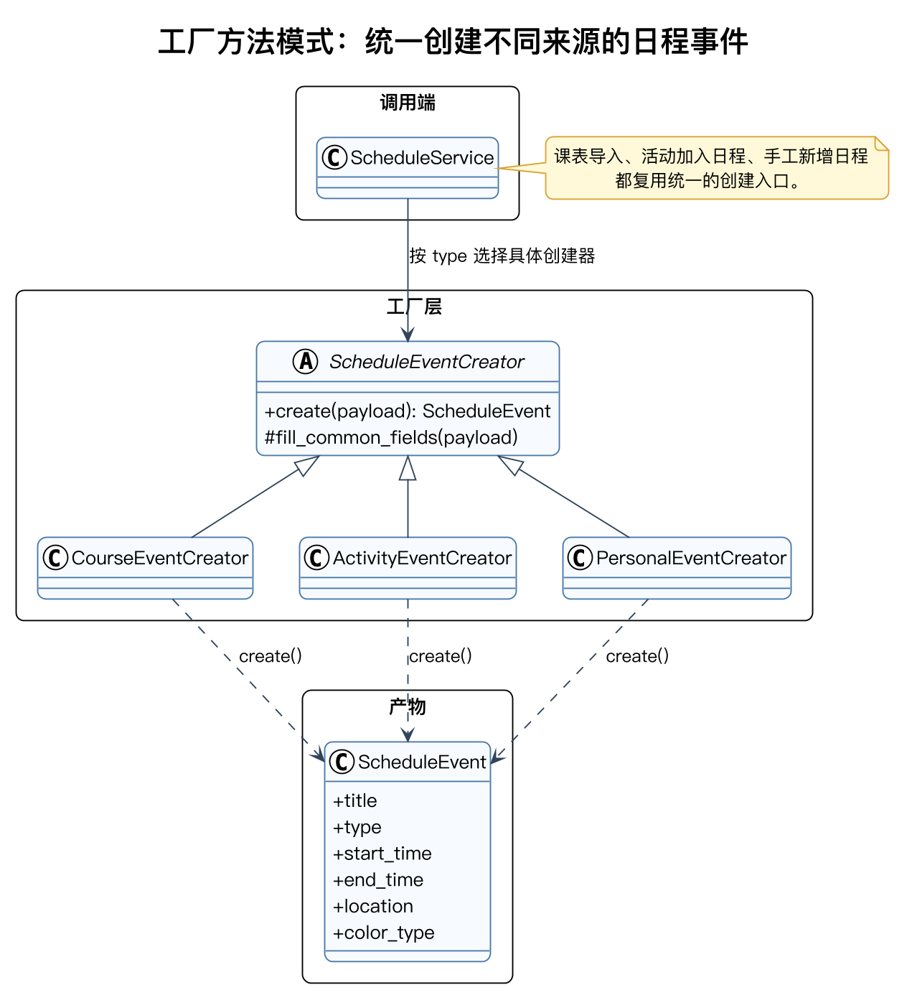
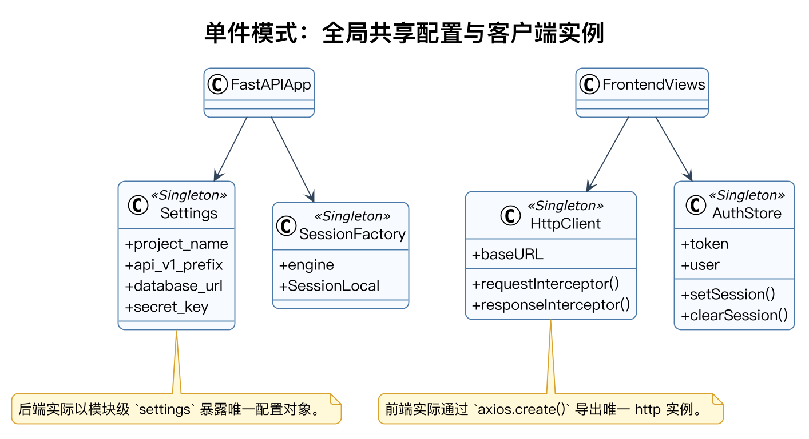
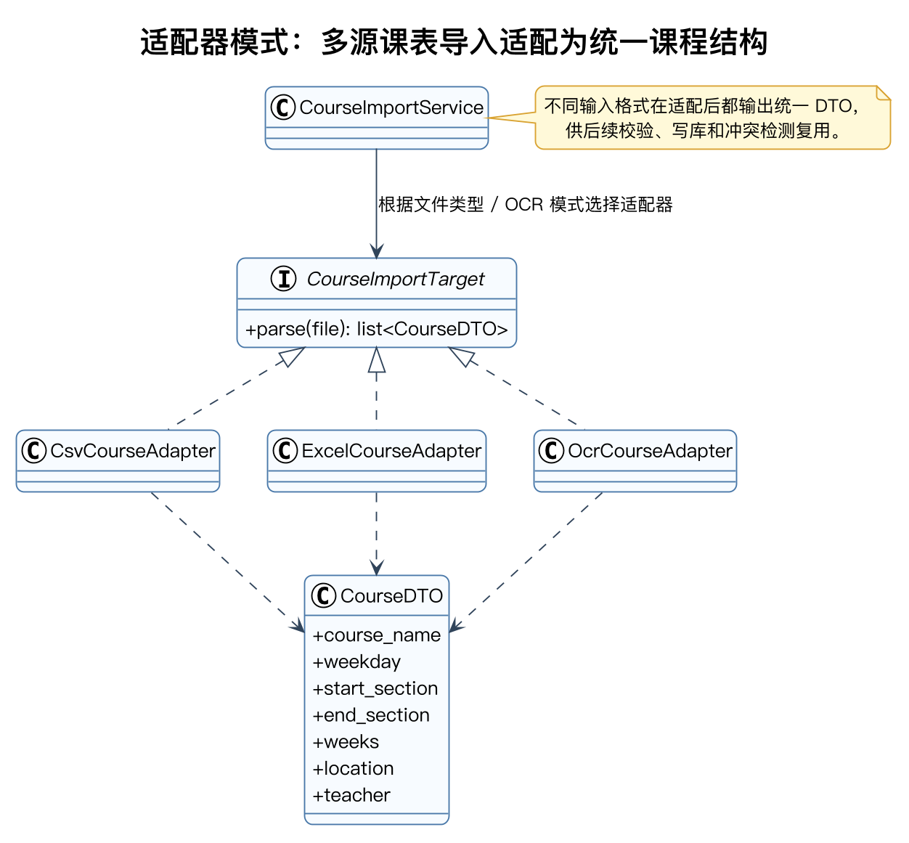
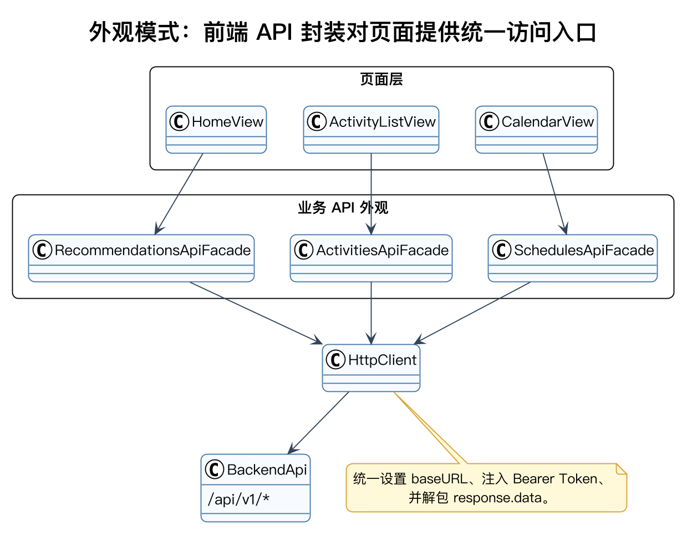
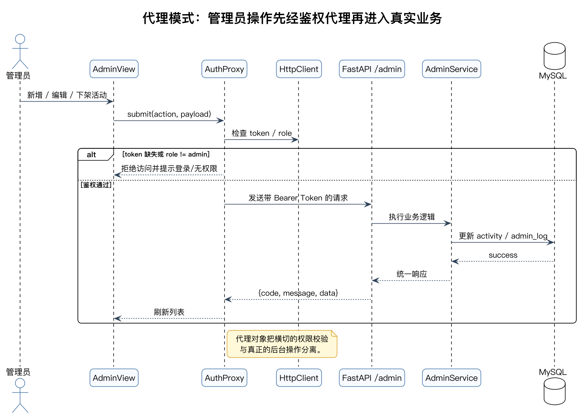
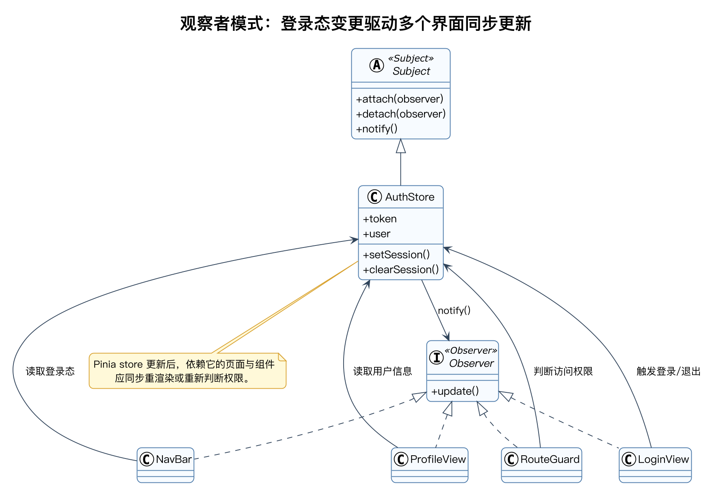
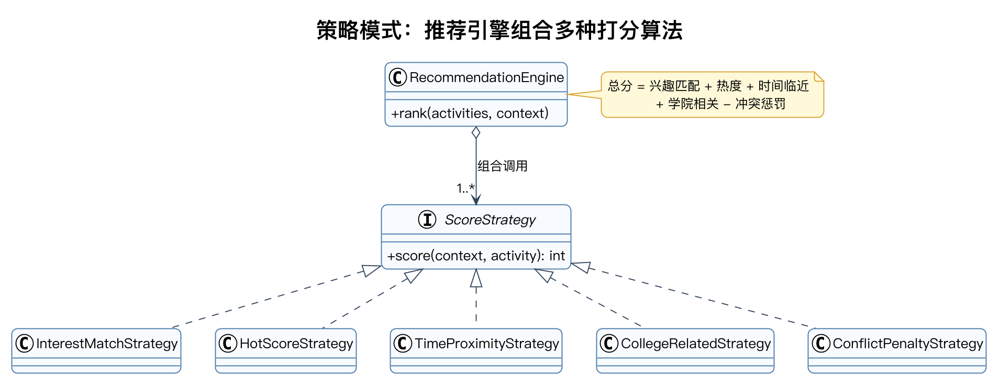
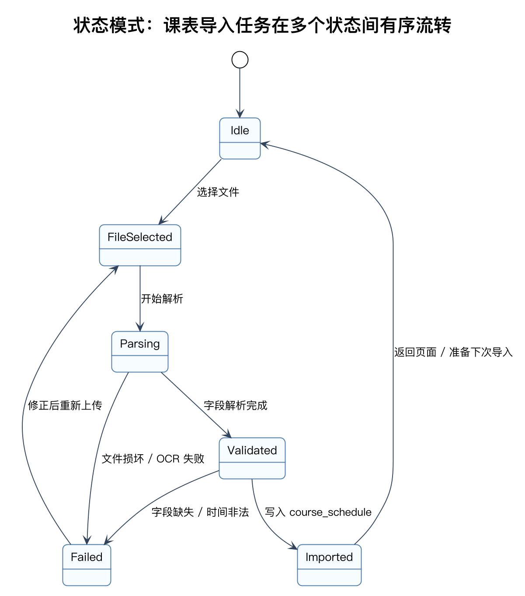
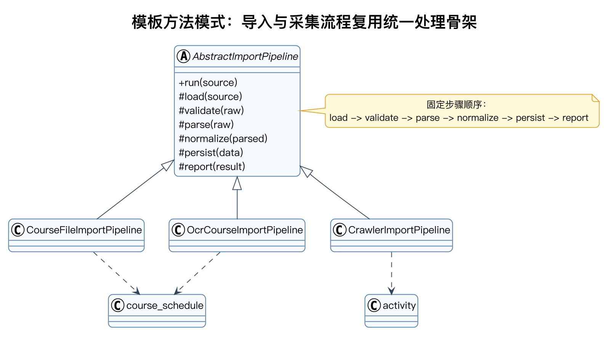
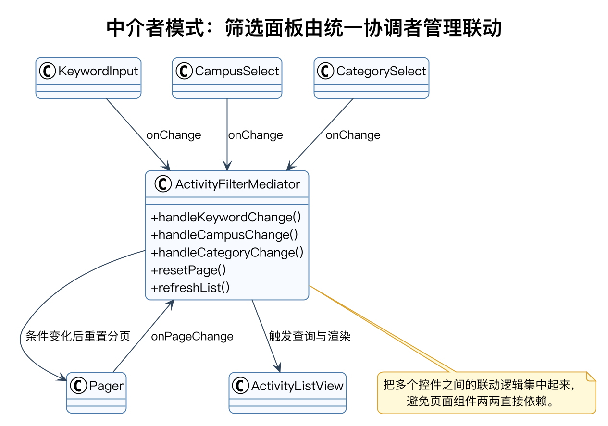

# 软件工程设计模式报告

## 校园学术活动智能推荐平台设计模式报告

项目成员：第 4 组  
完成时间：2026 年 5 月

---

## I. 最新文献回顾

设计模式的研究已经从早期的“总结可复用经验”扩展到“自动识别、质量分析与架构演化支持” [5][6][7]。经典的 GoF 设计模式仍然是面向对象设计的重要语言，因为它们能够把高频的协作关系沉淀为可复用结构，从而降低模块耦合、提升可维护性与可扩展性 [1]。在企业应用和 Web 系统中，模式还常与分层架构、统一接口和状态管理结合使用，用来协调界面层、业务层与数据层之间的职责边界 [2][3]。

近年的研究重点之一是**设计模式自动识别与逆向分析**。Mohan、Jayaraman 与 Jayaraman 在 2024 年提出，结合静态源码信息与运行期执行轨迹，可以更准确地识别 GoF 设计模式的实际实例，从而帮助软件维护与程序理解 [4]。这说明设计模式不再只是“写代码时的经验总结”，也成为了理解既有系统、发现架构意图和支持重构的重要工具。对于我们项目而言，这一点尤其有价值，因为我们的系统目前已经搭建好的完整框架，正在模块内部细化开发，模式化表达可以帮助团队在多人协作时保持实现方向一致。 

另一条明显趋势是，设计模式开始与更复杂的应用场景结合，例如多源数据接入、前后端分离、统一 API 门面、状态驱动的导入流程，以及可解释推荐等。对于我们这样的校园学术活动平台，模式的作用不只是“优雅实现某个类”，而是帮助我们把活动聚合、课表导入、冲突检测、推荐排序和后台管理拆解为清晰、可替换、可测试的构件。因此，在后续的报告中我们不会将计模式视为脱离场景的抽象概念，而是把它们映射到系统中最核心的业务细节上。

---

## II. 系统体系分析

### 2.1 系统特点

我们小组的项目是一个典型的前后端分离 Web 系统，目标是围绕校园学术活动形成 采集 - 检索 - 推荐 - 日程管理 - 后台维护 的闭环。根据总体设计文档，系统采用 B/S 架构，前端使用 Vue 3、Vue Router、Pinia 和 Axios，后端使用 FastAPI、SQLAlchemy 与 MySQL，并预留了爬虫采集与课表导入能力。系统的核心问题并不在于单个算法实现，而在于以下四类结构性复杂度：

1. 数据来源多样：活动既可能来自爬虫，也可能来自后台手工录入；课程既可能来自文件导入，也可能来自 OCR 识别。
2. 协作链路较长：前端页面不会直接访问数据库，而是通过 API 封装、路由层、服务层和数据访问层逐层协作。
3. 业务规则可变：推荐得分、冲突检测、筛选排序、后台校验都可能随着需求推进而调整。
4. 多人协作开发：团队并行开发前端、后端、数据库和爬虫时，如果缺少统一模式，接口和对象协作容易发散。


### 2.2 设计模式落点总览

| 模式 | 项目中的典型落点 |
| --- | --- |
| 工厂方法 | 日程事件统一创建 |
| 单件 | `settings`、数据库会话工厂、Axios 实例、Pinia store |
| 适配器 | CSV / Excel / OCR 课表导入 |
| 外观 | `frontend/src/api/*.js` 对页面提供统一 API |
| 代理 | 管理员后台的鉴权与拦截 |
| 观察者 | Pinia 登录态与页面联动 |
| 策略 | 推荐打分模型 |
| 状态 | 课表导入流程状态机 |
| 模板方法 | 导入流程与爬虫入库流程 |
| 中介者 | 活动筛选面板联动 |

---

## III. 经典 GOF 设计模式应用

我们按照 GoF 的分类方式，从创建型、结构型和行为型三个角度说明本项目中最有代表性的设计模式应用。需要说明的是：由于撰写设计模式报告时候我们同时也处在核心业务逐步实现阶段，以下内容有一部分是对**现有代码实现的归纳**，另一部分是对**后续实现方案的模式化设计**。

### 1. 创建型模式

#### a. 工厂方法（Factory Method）

工厂方法的核心意图是把对象创建延迟到具体子类或具体创建器中，使调用方只依赖统一创建接口，而不直接依赖某个具体类的构造过程。

在本项目中，这一模式非很适合落在**日程事件创建**上。系统中的日程事件并不只有一种来源：课程导入会生成课程事件，活动详情页“加入日程”会生成活动事件，后续还可能支持用户手工创建个人事件。虽然这些对象最后都落到 `schedule_event` 或统一的日历展示结构上，但字段填充规则、类型映射和颜色标识并不完全相同。

如果在 `schedule_service` 中直接用大量 `if/else` 拼接不同类型事件，逻辑会快速膨胀。因此，更合理的做法是为不同事件来源提供各自的创建器，例如 `CourseEventCreator`、`ActivityEventCreator` 和 `PersonalEventCreator`，再由 service 根据类型选择具体创建器。这样一来，活动加入日程、课表导入和手工新增都能共享统一创建入口，而不必在同一个函数里硬编码所有构造细节。



这一模式的直接收益是：新增事件类型时只需要增加新的创建器，而不必破坏已有逻辑；同时单元测试可以针对单个创建器展开，降低后续维护成本。

#### b. 单件（Singleton）

单件模式要求某类在系统生命周期中只保留一个全局可访问实例。在 Python 与前端模块化开发中，单件模式经常不以传统 `getInstance()` 写法出现，而是通过模块级唯一对象体现。
他们的特点都是全局共享、重复创建没有意义、配置应保持一致。



对于本我们项目而言，单件模式的价值主要体现在一致性和可控性上：HTTP 基础地址、认证头注入、数据库连接配置和登录态都应该只有一个权威来源。

### 2. 结构型模式

#### a. 适配器（Adapter）

适配器模式用于把原本接口不兼容的对象转换成调用方期望的统一接口。在本项目中，最典型的适配器落点是**课表导入**。

当前我们的系统已经预留了 `POST /api/v1/courses/import` 和 `POST /api/v1/courses/ocr` 两类入口，前端的课表导入页也明确支持文件上传，并为 OCR 预留了扩展位。这意味着系统后续很可能同时接收 CSV、Excel、截图识别结果等不同形态的数据源。它们原始结构差异很大，但在业务层最终都必须转化为统一的课程结构，如课程名、星期、节次、周次、地点和教师等字段。

因此，适合为每类输入实现一个适配器，例如 `CsvCourseAdapter`、`ExcelCourseAdapter` 和 `OcrCourseAdapter`，统一对外暴露 `parse(file): list<CourseDTO>`。上层导入服务不再关心原始输入的细节，而只处理标准化后的 `CourseDTO` 列表。



采用适配器模式后，系统可以持续扩展新的导入来源，同时保证冲突检测、课程入库和日历展示只依赖统一的数据模型。

#### b. 外观（Facade）

外观模式通过提供更高层、更一致的访问入口，隐藏底层子系统的复杂度 [9]。在本项目中，这一模式已经清晰体现在前端 API 封装中。

当前前端不会在页面组件里直接使用 Axios，而是由 `src/api/http.js` 统一创建客户端实例，再由 `activities.js`、`recommendations.js`、`schedules.js` 等文件分别向页面暴露面向业务的请求函数。页面只需要调用 `getActivities()`、`getRecommendedActivities()` 或 `checkConflict()` 之类的接口，而不必关心 `baseURL`、`Authorization` 请求头和 `response.data` 解包等细节。

这种结构本质上就是一层门面：它把复杂的网络访问细节折叠到少量统一函数中，页面层面对外只看到稳定的业务接口。




#### c. 代理（Proxy）

代理模式通过一个代理对象控制对真实对象的访问，常见用途包括权限控制、延迟加载、日志审计和附加行为织入 [8][9]。在本项目中，最典型的场景是**后台管理操作的鉴权代理**。

管理员新增、编辑和下架活动，本质上都属于高权限操作。当前系统已经具备后台页面、登录接口、JWT token 生成逻辑和统一 HTTP 客户端，但管理员身份校验尚未完全实现。后续最合理的结构不是在每个按钮点击事件里到处散落鉴权代码，而是把“检查 token、判断 role、决定是否放行”收敛为一层代理逻辑。

这样，真实的后台 CRUD 逻辑依然专注于活动字段校验、状态变更和日志记录，而横切的权限控制则由代理对象集中处理。



该模式能够明显降低权限逻辑和业务逻辑的耦合度，并为未来的管理员审计、统一错误提示和请求拦截器扩展留下空间。

### 3. 行为型模式

#### a. 观察者（Observer）

观察者模式定义一种一对多依赖关系：当主题对象状态变化时，所有依赖它的观察者都会收到通知并更新。在前端响应式框架中，这种模式非常常见。

本项目当前最典型的观察者落点就是 **Pinia 登录态**。`auth` store 维护 token 和用户信息，当登录成功或退出登录时，导航栏、个人中心、路由守卫和登录页等界面都需要感知状态变化并同步更新。这种关系非常符合“主题 - 观察者”的结构：store 是被观察对象，多个页面或组件是观察者。



在后续开发中，如果继续引入日历数据 store、推荐结果 store 或后台统计 store，观察者模式也是适用的。

#### b. 策略（Strategy）

策略模式通过封装一组可互换算法，并让调用方依赖统一接口，从而实现算法层面的可替换与可扩展。我们项目中**个性化推荐引擎**就明显运用到了。

在总体设计中已经明确给出了推荐分公式：

```text
推荐分 = 兴趣标签匹配分 + 热度分 + 时间临近分 + 学院相关分 - 冲突惩罚分
```

推荐本质上不是一个单一算法。若把所有计算直接写进一个长函数中，后续想调整权重、增加新规则或移除某项规则都会很痛苦。更合理的做法是为每一项评分因素定义独立策略，例如 `InterestMatchStrategy`、`HotScoreStrategy`、`TimeProximityStrategy`、`CollegeRelatedStrategy` 与 `ConflictPenaltyStrategy`，再由推荐引擎统一组合和累加。



采用策略模式后，本项目的推荐服务将具备更好的可解释性和可测试性：每种策略都可以单独验证，推荐理由也可以直接回溯到具体的得分来源。

#### c. 状态（State）

状态模式把对象在不同状态下的行为差异显式建模，使状态切换不再依赖分散的条件分支。最适合使用状态模式的场景是**课表导入任务**。

课表导入显然不是一个“一次请求立即结束”的黑箱过程，而是包含多个明显阶段：待选择文件、文件已选、开始解析、字段校验通过、导入成功、导入失败。这些阶段不仅决定界面反馈，也决定后端如何处理当前数据。若继续使用简单布尔变量拼装页面状态，后续接入 OCR、错误定位和重试逻辑后会很难维护。




状态模式的优势在于：流程更清晰，错误恢复路径更明确，前端与后端也更容易围绕统一流程语义协作。

#### d. 模板方法（Template Method）

模板方法模式通过在父类中定义稳定的算法骨架，把可变步骤留给子类覆写。在本项目中，最合适的落点是**导入与采集流水线**。

无论是课表文件导入、OCR 识别导入，还是后续爬虫采集活动并写入数据库，它们都共享一个相似的处理骨架：

```text
读取源数据 -> 校验 -> 解析 -> 规范化 -> 持久化 -> 返回结果
```

差异主要出现在“如何读取”“如何解析”和“持久化到哪张表”这些局部步骤上。因此，完全可以定义一个抽象的 `AbstractImportPipeline`，固定流程顺序，再让 `CourseFileImportPipeline`、`OcrCourseImportPipeline` 和 `CrawlerImportPipeline` 分别实现特定步骤。



这样做能显著减少重复代码，也能保证不同导入路径遵循一致的错误处理和结果汇报机制。

#### e. 中介者（Mediator）

中介者模式通过引入一个中介对象，把原本对象之间复杂的多对多交互收敛为“一对多”关系。在本项目中，最自然的落点是**活动列表筛选面板**。

当前活动列表页已经有关键词、校区、类别和分页等多个控件。随着后续真实搜索逻辑落地，这些控件之间会出现大量联动关系：关键词变化后要重置分页，筛选条件变化后要刷新列表，重置按钮需要同时清空多个控件状态。如果让控件彼此直接通信，页面很快会变得难以维护。

因此，更合理的做法是引入 `ActivityFilterMediator`，由它统一协调关键词输入、校区选择、类别选择和分页器的联动逻辑，并最终触发列表刷新。



采用中介者模式后，页面控件之间不再需要两两依赖，前端复杂交互会更容易扩展，也更适合团队协作维护。

---

## IV. 参考文献

[1] Erich Gamma, Richard Helm, Ralph Johnson, John Vlissides. *Design Patterns: Elements of Reusable Object-Oriented Software*. Addison-Wesley, 1995.

[2] Martin Fowler. *Patterns of Enterprise Application Architecture*. Addison-Wesley, 2002.

[3] Frank Buschmann, Regine Meunier, Hans Rohnert, Peter Sommerlad, Michael Stal. *Pattern-Oriented Software Architecture, Volume 1: A System of Patterns*. Wiley, 1996.

[4] Aswathy Mohan, Swaminathan Jayaraman, Bharat Jayaraman. “A declarative approach to detecting design patterns from Java execution traces and source code.” *Information and Software Technology*, Vol. 171, 2024, Article 107457.

[5] “Design pattern detection based on the graph theory.” *Knowledge-Based Systems*, Vol. 120, 2017, pp. 211-225. https://doi.org/10.1016/j.knosys.2017.01.007

[6] Yu, D., Zhang, P., Yang, J., Chen, Z., Liu, C., & Chen, J. “Efficiently detecting structural design pattern instances based on ordered sequences.” *Journal of Systems and Software*, Vol. 142, 2018, pp. 35-56. https://doi.org/10.1016/j.jss.2018.04.015

[7] Bou, C., Laosen, N., & Nantajeewarawat, E. “Design Pattern Ranking Based on the Design Pattern Intent Ontology.” In *Lecture Notes in Computer Science*, Vol. 10751, 2018, pp. 25-35. Springer.

[8] “Design pattern implementation in Java and AspectJ.” 2002.

[9] Walls, C. *Spring in Action*. Manning, 2014.
