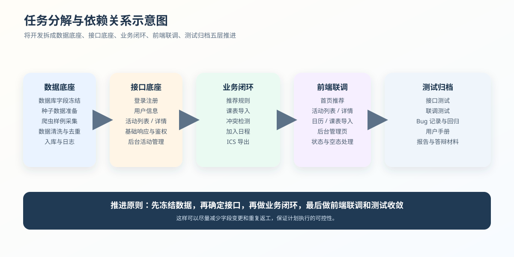

# 校园学术活动智能推荐平台项目开发计划书

**课程**：软件工程  
**项目**：校园学术活动智能推荐平台  
**阶段**：第一阶段开发计划  
**编写日期**：2026-05-10  

## 1 项目概述

### 1.1 项目背景简述

校园学术活动信息通常分散在学院官网、通知页面、公众号和群消息中，存在检索困难、更新不同步、时间冲突难判断等问题。校园学术活动智能推荐平台希望将活动聚合、筛选推荐、课表导入、冲突检测、加入日程和日历展示整合到一个统一入口，帮助师生更高效地安排学术活动。

### 1.2 项目开发目标

本阶段目标不是一次性实现全部需求，而是在课程周期内完成一个可演示、可测试、可交付的原型系统，优先跑通“活动浏览检索 -> 活动详情 -> 推荐展示 -> 课表导入 -> 冲突检测 -> 加入日程 -> 日历展示 -> ICS 导出 -> 后台维护 -> 爬虫补数”的核心闭环。

### 1.3 项目开发原则

| 原则 | 说明 |
| --- | --- |
| 主流程优先 | 先保证答辩可连续演示的主链路，再补充扩展功能 |
| 简化实现优先 | 推荐、OCR、统计先做可展示版本 |
| 接口稳定优先 | 前后端字段尽早统一，减少联调返工 |
| 可验证优先 | 每个阶段都要有可测试、可截图、可复现的产物 |

### 1.4 写作边界

本文档引用的是需求分析和总体设计阶段的结论，重点描述“未来怎么做”，不写“已经做完什么”。涉及页面、接口、数据库和爬虫的内容，均按计划阶段进行说明。

## 2 开发范围

### 2.1 第一阶段开发范围

| 模块 | 第一阶段开发内容 | 预期效果 |
| --- | --- | --- |
| 用户认证 | 简化登录、注册、Token 鉴权 | 用户可进入系统 |
| 活动浏览 | 活动列表、分页、详情页 | 用户可浏览活动信息 |
| 搜索筛选 | 关键词、类别、学院、校区、时间筛选 | 用户可快速定位活动 |
| 推荐模块 | 基于标签、热度、时间的规则推荐 | 首页展示推荐活动 |
| 课表导入 | 手动录入、CSV/Excel 导入，OCR 作为加分项 | 用户课程可进入日历 |
| 冲突检测 | 活动与课程/已有日程时间重叠判断 | 加入活动前提示冲突 |
| 日历展示 | 展示课程、活动、冲突、推荐状态 | 用户可查看个人安排 |
| ICS 导出 | 导出活动或个人日程 | 可导入第三方日历 |
| 后台管理 | 活动新增、编辑、下架、爬虫数据修正 | 管理员可维护活动 |
| 爬虫数据 | 先采集一个学院的活动数据 | 提供真实活动样例 |

### 2.2 暂缓开发功能

| 暂缓功能 | 原因 |
| --- | --- |
| 统一身份认证 SSO/CAS | 接入复杂，第一阶段使用本地账号替代 |
| 精确地图通勤测算 | 依赖外部 API，先预留字段 |
| 学术组队 | 与主流程关系较弱，后续扩展 |
| 笔记共享与评价 | 属于社交沉淀功能，第二阶段再做 |
| 个人学术轨迹 | 依赖大量历史数据，第一阶段不优先 |
| 复杂 NLP 自动打标 | 先用人工标签或简单关键词规则 |
| 协同过滤推荐 | 第一阶段使用规则推荐即可 |

### 2.3 最小可交付版本说明

最小可交付版本至少应支持用户登录、活动列表展示、活动详情查看、关键词搜索、课表导入、加入日程、冲突检测、日历展示和 ICS 导出。即使爬虫、OCR 或推荐算法未完全完善，也必须通过样例数据和规则推荐保证完整演示流程可运行。

## 3 总体开发方案

### 3.1 系统总体架构

系统采用前后端分离架构：前端负责页面展示和交互，后端负责业务逻辑、接口服务、权限控制、冲突检测和 ICS 文件生成，数据库负责存储用户、活动、课表、日程和标签数据，爬虫模块负责从学院站点采集活动信息并写入数据库。

### 3.2 前端开发方案

前端以 Vue 3 + Vite + Element Plus 为基础，围绕“首页推荐、活动列表、活动详情、课表导入、个人日历、后台管理”六个核心页面展开开发。页面开发优先复用既定路由结构，先完成静态交互，再逐步替换为真实接口。

### 3.3 后端开发方案

后端采用 FastAPI 分层架构，路由层只负责参数接收与响应返回，业务逻辑集中在 `services/`，数据访问由 `models/` 与数据库会话层完成。第一阶段优先实现登录注册、用户信息、活动列表、活动详情、推荐、日程、课表导入、后台管理和爬虫记录接口。

后端模块分工如下：

| 模块 | 主要职责 |
| --- | --- |
| `auth` | 登录、注册、Token 鉴权 |
| `users` | 用户信息、兴趣标签、个人中心 |
| `activities` | 活动列表、详情、搜索、筛选、排序 |
| `recommendations` | 规则推荐、推荐理由 |
| `schedules` | 日程查询、加入日程、冲突检测 |
| `courses` | 课表导入、课程保存、识别结果接收 |
| `admin` | 后台活动管理、爬虫记录、人工修正 |
| `crawler` | 爬虫任务触发、运行记录 |

### 3.4 数据库与爬虫开发方案

数据库以 `database/schema.sql` 为权威来源，核心表包括 `user`、`activity`、`activity_tag`、`user_interest`、`course_schedule`、`schedule_event`、`registration`、`crawl_record`、`admin_log`。表结构设计重点保证活动、标签、课程和日程之间的关联关系清晰，便于后续实现推荐与冲突检测。

爬虫部分先完成一个学院或一个数据源的采集闭环，重点实现字段抽取、时间清洗、重复数据去重、入库和运行日志记录。第一阶段以“能稳定产出样例活动数据”为目标，不追求全站覆盖。

### 3.5 测试与文档开发方案

测试采用“接口测试 + 手工功能测试 + 前后端联调测试 + 演示验收测试”的四层策略。测试负责人统一维护测试用例、Bug 记录和回归结果，确保每次接口变更都能同步到文档和测试清单中。

## 4 成员分工

### 4.1 团队角色划分

项目采用“1 名前端、1 名爬虫与数据库、3 名后端、1 名测试与文书”的六人分工模式，按模块负责人制度推进。

### 4.2 成员具体任务

| 成员 | 角色 | 主要负责内容 | 第一阶段重点交付 |
| --- | --- | --- | --- |
| zzy | 前端负责人 | 页面与交互开发 | 活动列表、活动详情、日历、课表导入、后台页面联调 |
| gsj | 爬虫与数据库负责人 | 数据来源与数据库设计 | 表结构、种子数据、活动样例数据、计院爬虫与入库 |
| mxy | 后端负责人 1 | 后端基础与通用接口 | 数据库连接、ORM 基础、登录注册、用户信息、活动基础接口 |
| lyy | 后端负责人 2 | 日历与课表业务 | 课表导入、截图识别接口预留、冲突检测、日程、ICS 导出 |
| pxl | 后端负责人 3 | 推荐与筛选排序 | 活动搜索、标签/类别/校区筛选、排序、推荐规则、后台辅助统计 |
| hh | 测试与文书负责人 | 测试管理与项目文档 | 测试用例、接口测试、Bug 记录、进度记录、用户手册和报告材料 |

### 4.3 模块负责人制度

每个模块由一名负责人统筹接口定义、开发节奏和联调问题，其他成员在此基础上做配合开发。接口字段一旦确定，优先保持稳定，若确需调整由负责人同步到前端、测试和文档。

## 5 任务分解

### 5.1 前端任务分解

前端任务按“页面骨架 -> 接口接入 -> 交互完善 -> 演示优化”四步推进。

| 任务 | 产出 |
| --- | --- |
| 登录/注册页面 | 表单校验、登录态保存、路由跳转 |
| 首页推荐页 | 推荐活动卡片、热门活动入口、快捷导航 |
| 活动列表页 | 搜索框、筛选器、分页、排序、空状态 |
| 活动详情页 | 活动信息展示、标签、加入日程入口 |
| 日历页 | 月/周视图、颜色标识、冲突提示 |
| 课表导入页 | 文件上传、识别结果展示、确认入库 |
| 后台管理页 | 活动新增、编辑、下架、爬虫记录查看 |

### 5.2 后端任务分解

后端任务按数据层、业务层、接口层依次展开，先打通数据库查询和基础鉴权，再实现业务逻辑和管理接口。

| 任务 | 产出 |
| --- | --- |
| 数据库连接与 ORM | 可复用的 DB 会话、模型和查询封装 |
| 登录注册与鉴权 | `/auth/login`、Token、`/users/me` |
| 活动基础接口 | `/activities`、`/activities/{id}` |
| 推荐规则接口 | 推荐列表、推荐理由、排序规则 |
| 日程与冲突检测 | 冲突判断、日程写入、日历查询 |
| 课表导入接口 | 课程保存、导入结果、OCR 预留 |
| 后台与爬虫接口 | 活动管理、爬虫运行、爬虫记录 |

### 5.3 爬虫与数据库任务分解

爬虫与数据库任务的核心目标是建立稳定的数据底座，确保前后端联调时有可用样例数据。

| 任务 | 产出 |
| --- | --- |
| 表结构复核 | 校验字段命名、外键、索引和默认值 |
| 种子数据准备 | 测试账号、测试活动、测试课程样例 |
| 爬虫字段抽取 | 标题、时间、地点、学院、标签、来源链接 |
| 数据清洗去重 | 去除重复活动、统一时间格式、清洗空字段 |
| 入库与日志 | 活动入库、抓取记录、失败信息记录 |

### 5.4 测试与文档任务分解

| 任务 | 产出 |
| --- | --- |
| 测试用例设计 | 按模块拆分的测试用例表 |
| 接口测试 | 健康检查、登录、活动列表、日程、管理接口 |
| 联调测试 | 前后端字段对齐、错误处理、边界条件修复 |
| 文档维护 | 进度记录、测试报告、用户手册、接口文档同步 |

### 5.5 任务依赖关系

任务依赖的基本顺序是：数据底座先行，接口随后，前端联调并行推进，测试与文档最后收敛。这样可以尽量减少由于字段未定导致的返工。

## 6 进度安排

### 6.1 总体排期

| 阶段 | 建议周期 | 核心目标 | 主要产出 |
| --- | --- | --- | --- |
| 第一阶段 | 1-2 天 | 数据与基础接口优先 | 稳定表结构、登录、活动列表、详情接口 |
| 第二阶段 | 3-5 天 | 主流程联调 | 搜索筛选、推荐、课表导入、冲突检测、日程写入 |
| 第三阶段 | 2-3 天 | 演示闭环补齐 | ICS 导出、后台管理、页面细节、异常处理 |
| 第四阶段 | 1-2 天 | 测试与交付准备 | 测试报告、用户手册、答辩材料、Bug 收敛 |

### 6.2 第一阶段：项目初始化与基础链路

| 成员 | 任务 |
| --- | --- |
| gsj | 稳定数据库表结构，补充种子数据，整理字段说明 |
| mxy | 完成数据库连接、ORM 基础、用户登录、用户信息、活动列表和详情接口 |
| hh | 建立测试用例骨架，记录字段和接口变更 |
| zzy | 基于页面骨架完成活动列表、详情、登录页的联调准备 |
| pxl | 确认筛选和推荐所需字段，给出推荐分第一版规则 |
| lyy | 确认日程和课程表字段，设计冲突检测输入输出 |

阶段完成标志：前端能调用真实活动列表接口，后端能从 MySQL 返回活动数据，测试同学能跑通健康检查、登录和活动列表。

### 6.3 第二阶段：核心业务功能开发

| 成员 | 任务 |
| --- | --- |
| zzy | 对接登录、活动列表、活动详情、推荐活动、日历事件接口 |
| gsj | 完成第一版爬虫数据解析，准备活动样例数据入库 |
| mxy | 完成注册、JWT 鉴权依赖、后台活动新增/编辑/下架基础接口 |
| lyy | 完成课程录入、CSV/Excel 导入、日程查询、冲突检测、加入日程 |
| pxl | 完成关键词搜索、类别/标签/校区筛选、热度/时间/推荐分排序 |
| hh | 开始执行接口测试和前后端联调测试，记录 Bug 和复现步骤 |

阶段完成标志：用户可以登录，可以浏览和筛选活动，可以查看活动详情，可以导入或录入课程，可以检测活动与课程冲突，可以把活动加入日程并在日历中看到。

### 6.4 第三阶段：联调与功能完善

| 成员 | 任务 |
| --- | --- |
| zzy | 完成页面交互细节、状态标签、错误提示和演示截图 |
| gsj | 修正爬虫清洗和去重，保证演示数据质量 |
| mxy | 完善错误响应、权限判断、管理员接口稳定性 |
| lyy | 完成 ICS 导出，OCR 接口可根据时间做预留或简化演示 |
| pxl | 调整推荐理由和推荐排序，补充后台统计接口 |
| hh | 完成第一轮系统测试、测试报告初稿、用户手册初稿 |

阶段完成标志：答辩演示主流程可以连续跑通，测试报告有执行记录，用户手册能指导普通用户和管理员完成核心操作。

### 6.5 第四阶段：测试、修复与交付准备

| 成员 | 任务 |
| --- | --- |
| 全体 | 修复高优先级 Bug，统一演示环境，确认代码合并状态 |
| zzy | 准备前端展示截图和演示流程说明 |
| gsj | 准备数据库 ER 图、活动数据来源说明、爬虫运行截图 |
| mxy、lyy、pxl | 准备后端接口、核心逻辑和 Swagger 截图 |
| hh | 汇总测试报告、用户手册、进度文档和答辩材料 |

## 7 阶段性里程碑

### 7.1 里程碑一：项目骨架与数据库完成

完成标准：数据库建表、测试数据、后端基础配置和前端路由骨架全部可用。

### 7.2 里程碑二：活动浏览主链路完成

完成标准：活动列表、详情页、分页、搜索和基础推荐可联调。

### 7.3 里程碑三：日历与冲突检测完成

完成标准：课表导入、日程展示、冲突提示和加入日程可以闭环。

### 7.4 里程碑四：完整演示流程完成

完成标准：从登录到导出 ICS 的主流程可连续演示，无阻断问题。

### 7.5 里程碑五：最终交付版本完成

完成标准：代码、数据库、文档、测试报告和答辩材料统一归档，可提交。

## 8 协作方式

### 8.1 Git 协作规范

项目采用 `main` 稳定主分支，开发时按模块建立功能分支，常见命名包括：

- `frontend/xxx`
- `backend/xxx`
- `crawler/xxx`
- `database/xxx`
- `docs/xxx`
- `test/xxx`
- `fix/xxx`

### 8.2 分支管理规范

1. 每个功能尽量只改自己的模块，避免无关文件互相覆盖。
2. 合并前必须完成本地测试或基础构建验证。
3. 与接口相关的变更必须同步通知前端、测试和文档负责人。

### 8.3 接口协作规范

接口协作采用“先字段、后实现、再联调”的顺序：

1. 先由后端负责人给出请求体、响应体和枚举值。
2. 前端根据字段完成页面联调。
3. 测试负责人同步更新用例和接口说明。
4. 若接口字段变更，必须同步更新 `docs/api-contract.md` 与相关前端 API 文件。

### 8.4 文档同步规范

开发过程中的关键文档包括 `docs/api-contract.md`、`docs/test-plan.md`、`docs/test-cases.md`、`docs/user-manual.md` 和 `progress/` 下的进度记录。所有影响用户操作或接口结构的改动，都应在对应文档中留下记录。

### 8.5 会议与沟通机制

建议采用“每日简短同步 + 联调前确认 + 关键节点复盘”的沟通节奏。每次联调前先确认接口字段、示例数据和异常返回，避免各自开发完成后再集中返工。

## 9 测试与验收计划

### 9.1 测试目标

测试目标不是单纯验证“能跑”，而是验证主流程、边界条件和演示稳定性，确保系统在课程验收时具备可重复演示能力。

### 9.2 功能测试计划

| 测试模块 | 重点检查内容 |
| --- | --- |
| 登录注册 | 正常登录、错误密码、Token 失效 |
| 活动列表 | 分页、筛选、排序、空状态 |
| 活动详情 | 数据完整性、标签展示、加入入口 |
| 课表导入 | 文件格式、导入结果、错误提示 |
| 冲突检测 | 与课程冲突、与已有日程冲突 |
| 日程与日历 | 事件展示、颜色标识、状态标签 |
| 后台管理 | 新增、编辑、下架、记录查看 |

### 9.3 接口测试计划

接口测试优先覆盖健康检查、登录、活动列表、活动详情、推荐、日程、课表导入、后台活动管理和爬虫记录接口。接口测试结果应保留请求参数、返回内容和执行时间，便于回归对比。

### 9.4 联调测试计划

联调阶段重点检查前后端字段是否一致、空数据是否能正确展示、异常返回是否能被前端友好处理、冲突弹窗是否能正确触发。

### 9.5 验收演示流程

建议的演示流程为：

1. 登录系统。
2. 进入首页查看推荐。
3. 打开活动列表并进行筛选。
4. 查看活动详情。
5. 导入课表并生成日程。
6. 点击加入活动，触发冲突检测。
7. 在日历中查看活动与课程。
8. 导出 ICS 文件。
9. 进入后台维护活动并查看爬虫记录。

## 10 风险与应对措施

| 风险类型 | 具体表现 | 应对措施 |
| --- | --- | --- |
| 技术风险 | 后端接口较多、实现进度慢 | 优先实现主流程接口，先保证可联调 |
| 进度风险 | 某一模块拖慢整体集成 | 按里程碑推进，设置交接节点 |
| 数据风险 | 样例活动过少或字段不统一 | 提前冻结字段，补充种子数据 |
| 联调风险 | 前后端字段不一致 | 接口先行，变更同步到文档与测试 |
| 展示风险 | 演示时数据不足或流程中断 | 提前准备演示数据和备用流程 |

## 11 交付计划

### 11.1 代码交付

交付内容包括前端源码、后端源码、爬虫代码、数据库脚本和测试代码。代码应保证可以通过项目现有启动方式运行。

### 11.2 数据库交付

交付内容包括 `database/schema.sql`、`database/seed.sql` 和必要的字段说明，确保他人可重新初始化数据库并复现实验环境。

### 11.3 文档交付

交付文档包括开发计划书、总体设计报告、接口文档、测试计划、测试用例、测试报告、用户手册和进度记录。

### 11.4 演示交付

演示交付要求准备稳定的演示数据、可访问的接口、可展示的截图和可重复的主流程脚本，保证答辩现场不依赖临时修改。

## 12 总结

本项目开发计划以“第一阶段主流程可运行”为中心，按数据底座、后端接口、前端联调、测试验收四条主线推进。通过明确的模块分工、阶段排期、接口协作和风险控制，可以在正式编码开始前把项目推进路径、产出标准和交付方式先规划清楚，为后续实现打下统一基础。
